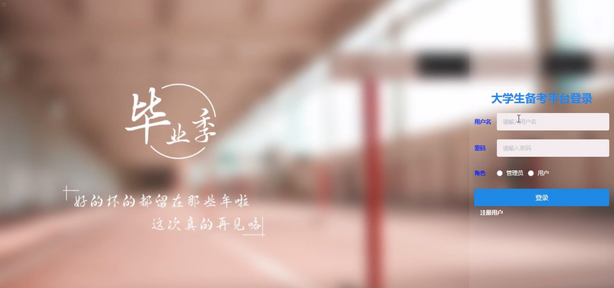
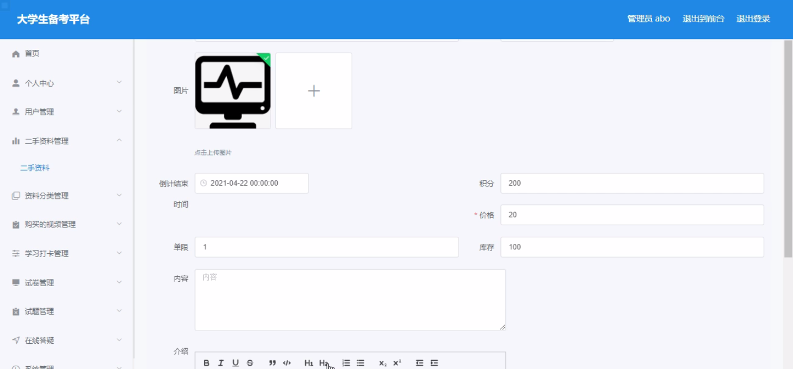
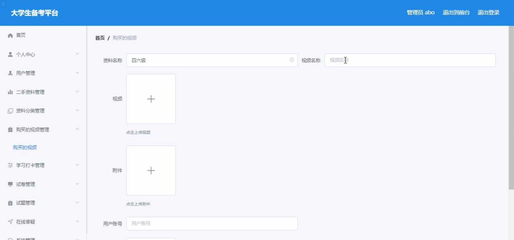
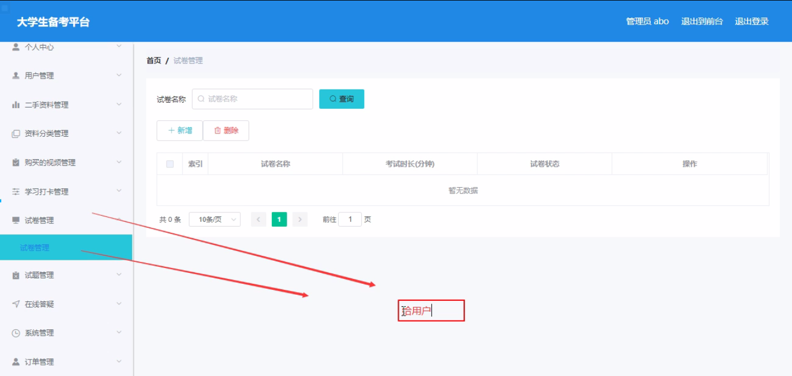
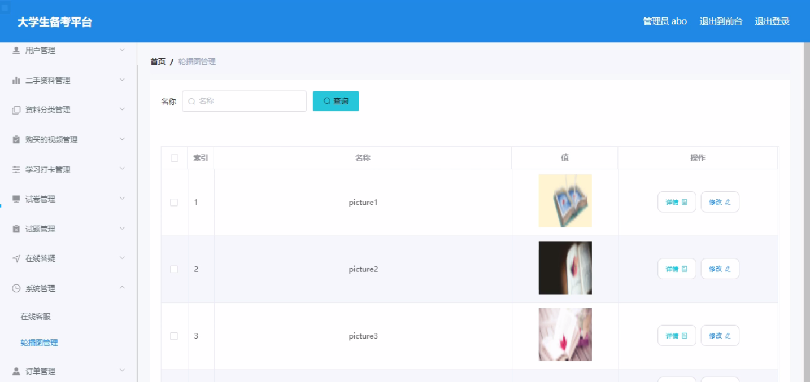
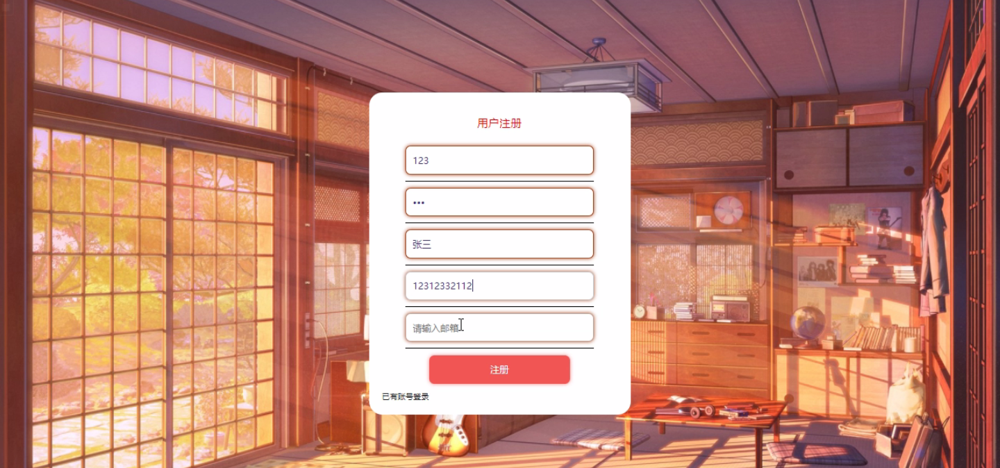
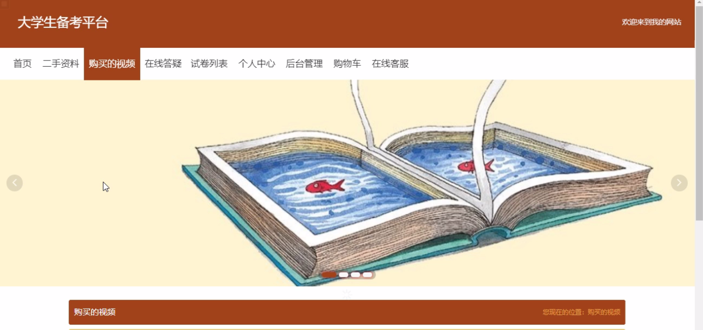
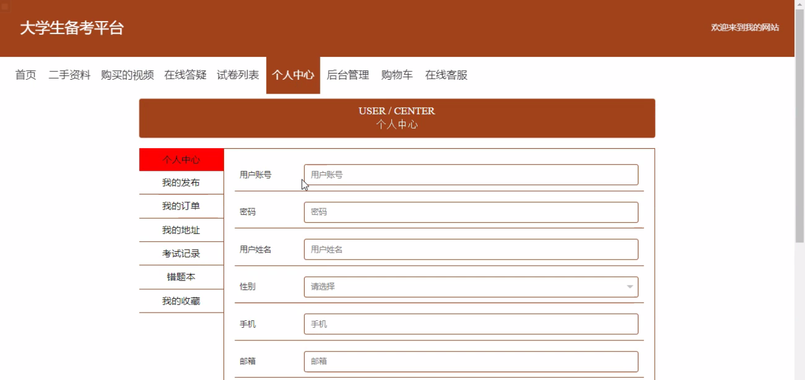

****本项目包含程序+源码+数据库+LW+调试部署环境，文末可获取一份本项目的java源码和数据库参考。****

## ******开题报告******

研究背景：
随着大学生备考的需求不断增加，传统的备考方式已经无法满足他们的需求。传统备考方式存在着信息不对称、资源有限、效率低下等问题，给大学生备考带来了很多困扰。因此，建立一个专门针对大学生备考的平台是非常必要的。

研究意义：
大学生备考平台的建立将为广大大学生提供一个便捷高效的备考工具，使他们能够更好地进行备考准备。通过该平台，大学生可以获得丰富的备考资料和学习资源，提高备考效率，提升备考成绩。同时，该平台还可以促进大学生之间的交流与合作，激发学习的兴趣和动力。

研究目的：
本研究旨在设计并开发一款适用于大学生备考的平台，以解决传统备考方式存在的问题。通过该平台，大学生可以方便地获取备考所需的各类资料和学习资源，提高备考效率和质量。同时，该平台还将提供社交功能，促进大学生之间的互动和交流，打造一个良好的备考氛围。

研究内容： 本研究的主要内容包括以下几个方面：

  1. 用户管理：设计并实现用户注册、登录、个人信息管理等功能，确保用户能够正常使用平台，并提供个性化的备考服务。

  2. 二手资料交易：建立一个二手资料交易市场，使大学生可以买卖自己的备考资料，提高资源的利用效率。

  3. 资料分类与搜索：对备考资料进行分类整理，并提供快速准确的搜索功能，方便用户查找所需资料。

  4. 购买的视频：提供备考相关的视频课程，用户可以根据自己的需求购买相应的视频进行学习。

  5. 学习打卡：设计学习打卡功能，帮助用户规划学习计划，记录学习进度，提高学习的自律性和效果。

拟解决的主要问题： 通过以上系统功能的设计和实现，本研究旨在解决以下问题：

  1. 信息不对称：传统备考方式中，大学生往往难以获取到全面准确的备考资料和学习资源。通过该平台，用户可以获得丰富的备考资料和学习资源，解决信息不对称问题。

  2. 资源有限：传统备考方式中，大学生往往面临着备考资料有限的问题。通过二手资料交易和购买视频等功能，用户可以获取更多的备考资源，解决资源有限问题。

  3. 效率低下：传统备考方式中，大学生往往需要花费大量时间和精力来查找备考资料和学习资源。通过资料分类与搜索、学习打卡等功能，用户可以提高备考效率，解决效率低下问题。

研究方案和预期成果：
本研究将采用设计开发的方法，结合用户需求进行系统功能的设计和实现。预期成果包括一款功能完善、操作便捷的大学生备考平台，并通过实际使用情况进行测试和改进，以达到提高备考效率和质量的目标

进度安排：

2022年9月至10月：需求分析和规划，进行用户需求调研和分析，确定系统功能和目标。

2022年11月至2023年1月：系统设计和开发，完成系统架构设计和技术选型，并开始编写代码。

2023年2月至3月：测试和优化，进行单元测试和集成测试，修复问题并优化系统性能。

2023年4月至5月：文档编写和培训，编写用户手册和系统文档，并进行相关人员的培训。

2023年5月：上线部署和维护，将系统部署到生产环境中，并定期进行维护和升级。

参考文献：

[1]王振华.SpringBoot在教学效果评估系统中的应用[J].电子技术,2023,(05):67-69.

[2]王明泉.基于SpringBoot远程热部署的探索和应用[J].信息与电脑(理论版),2023,(07):1-4.

[3]王亚东,李晓霞,陈强强,剡美娜.基于SpringBoot的需求发布平台设计[J].信息与电脑(理论版),2023,(01):105-107.

[4]陈新府豪.基于SpringBoot和Vue框架的创新方法推理系统的设计与实现[D].导师：黄静.浙江理工大学,2022.

[5]霍福华,韩慧.基于SpringBoot微服务架构下前后端分离的MVVM模型[J].电子技术与软件工程,2022,(01):73-76.

[6]韩策,张娜,王松亭,张凯,何方,袁峰.SpringBoot OPC客户端设计与研究[J].电子世界,2021,(19):25-26.

****以上是本项目程序开发之前开题报告内容，最终成品以下面界面为准，大家可以酌情参考使用。要源码参考请在文末进行获取！！****

## ******本项目的界面展示******

