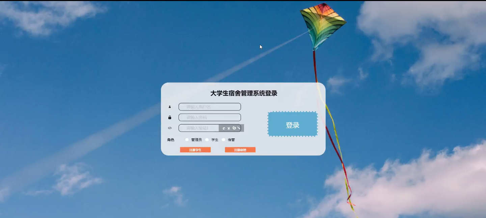

****本项目包含程序+源码+数据库+LW+调试部署环境，文末可获取一份本项目的java源码和数据库参考。****

## ******开题报告******

研究背景：
随着高等教育的普及和大学生人数的不断增加，大学生宿舍管理成为一个重要的问题。传统的手工管理方式已经无法满足大规模宿舍管理的需求，而且存在信息不透明、效率低下、数据管理困难等问题。因此，开发一套高效、智能的大学生宿舍管理系统具有重要的现实意义。

研究意义：
大学生宿舍管理系统的建立将极大地提高宿舍管理的效率和质量，为学生提供更好的居住环境，同时也能减轻宿管人员的工作压力。通过系统化的管理和信息化的手段，可以更好地保障学生的权益，提升学生宿舍管理的水平，促进学生的全面发展。

研究目的：
本研究旨在设计和开发一套大学生宿舍管理系统，以解决传统宿舍管理方式存在的问题。通过该系统，可以实现学生信息、宿舍信息、入住信息、搬出信息、更换申请、学生报修、维修状况等多个功能的集中管理，提高管理效率，优化资源配置，提升服务质量。

研究内容： 本研究的主要内容包括以下几个方面：

  1. 学生信息管理：建立学生档案，包括学生基本信息、入住信息、个人特点等，实现学生信息的录入、查询和更新功能。

  2. 宿舍信息管理：记录宿舍楼栋、房间号、床位数等相关信息，方便宿管人员进行宿舍分配和管理。

  3. 入住信息管理：记录学生的入住时间、宿舍楼栋和房间号等信息，方便宿管人员进行入住登记和统计。

  4. 搬出信息管理：记录学生的搬出时间、原因等信息，方便宿管人员进行搬出登记和统计。

  5. 更换申请管理：提供学生更换宿舍的申请功能，包括申请理由、目标宿舍楼栋和房间号等信息，方便宿管人员进行审核和处理。

  6. 学生报修管理：提供学生报修功能，记录报修时间、报修内容等信息，方便宿管人员进行维修安排和跟踪。

  7. 维修状况管理：记录维修工作的进展情况，包括维修人员、维修时间、维修结果等信息，方便宿管人员进行维修管理和评估。

拟解决的主要问题：
通过设计和开发大学生宿舍管理系统，可以解决传统宿舍管理方式存在的信息不透明、效率低下、数据管理困难等问题。通过系统化的管理和信息化的手段，提高宿舍管理的效率和质量，为学生提供更好的居住环境，促进学生的全面发展。

研究方案和预期成果：
本研究将采用软件工程的方法，包括需求分析、系统设计、编码实现和测试验证等步骤，开发一套符合大学生宿舍管理需求的系统。预期成果是一个功能完善、操作简便、稳定可靠的大学生宿舍管理系统，能够满足宿舍管理的各项需求，并提高管理效率和服务质量。

进度安排：

2022年9月至10月：需求分析和规划，明确系统功能和目标，制定项目计划。

2022年11月至2023年1月：系统设计和编码，完成详细的系统设计并开始编写代码。

2023年2月至3月：用户界面开发和数据库开发，开发用户友好的界面和设计数据库结构。

2023年4月至5月：功能测试、文档编写和上线部署，对系统进行全面的功能测试并编写用户手册。

2023年5月：维护和升级，定期对系统进行维护和升级，修复bug和添加新功能。

参考文献：

[1]邱小群,邓丽艳,陈海潮.基于B/S的信息管理系统设计和实现[J].信息与电脑(理论版),2022,(20):146-148.

[2]谢霜.基于Java技术的网络管理体系结构的应用[J].网络安全技术与应用,2022,(10):14-15.

[3]宋锦华.高职院校Java程序设计课程改革研究[J].科技视界,2022,(20):133-135.

[4]曹嵩彭,王鹏宇.浅析Java语言在软件开发中的应用[J].信息记录材料,2022,(03):114-116.

[5]朱澈,余俊达.武汉东湖学院.基于Java的软硬件信息管理系统V1.0[Z].项目立项编号.鉴定单位.鉴定日期:

****以上是本项目程序开发之前开题报告内容，最终成品以下面界面为准，大家可以酌情参考使用。要源码参考请在文末进行获取！！****

## ******本项目的界面展示******

