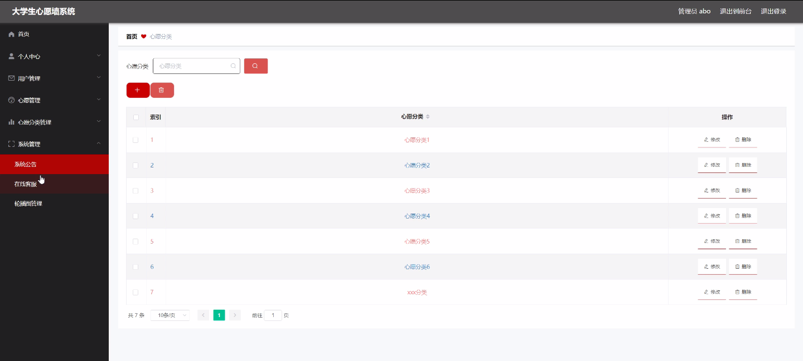

****本项目包含程序+源码+数据库+LW+调试部署环境，文末可获取一份本项目的java源码和数据库参考。****

## ******开题报告******

研究背景：
随着大学生群体的不断扩大和发展，他们的需求和心愿也日益多样化。而传统的纸质心愿墙已经无法满足大学生们表达心愿、分享想法的需求。因此，开发一种大学生心愿墙系统成为了必要且迫切的任务。

研究意义：
大学生心愿墙系统的开发与应用对于满足大学生们的需求具有重要意义。首先，该系统能够提供一个便捷的平台，让大学生们能够自由地表达自己的心愿和想法，促进信息的交流和共享。其次，通过系统的分类功能，可以更好地整理和管理大学生们的心愿，提高信息的可读性和查找效率。最后，该系统还能够激发大学生们的创造力和参与度，促进校园文化的繁荣和发展。

研究目的： 本研究旨在开发一种适用于大学生群体的心愿墙系统，以满足大学生们表达心愿、分享想法的需求。通过研究，我们希望能够实现以下目标：1.
提供一个便捷的平台，让大学生们能够自由地表达自己的心愿和想法；2. 实现心愿的分类功能，提高信息的整理和管理效率；3.
激发大学生们的创造力和参与度，促进校园文化的繁荣和发展。

研究内容：
本研究的主要内容包括以下系统功能：用户管理、心愿发布、心愿分类等。具体而言，我们将设计并开发一个用户管理模块，用于管理大学生用户的注册、登录和个人信息管理。同时，我们还将实现心愿发布功能，使大学生们能够方便地发布自己的心愿和想法，并支持文字、图片等多种形式的表达方式。此外，我们还将设计心愿分类功能，通过对心愿进行分类和标签管理，提高信息的整理和查找效率。

拟解决的主要问题： 在开发大学生心愿墙系统的过程中，我们将重点解决以下问题：1. 如何确保用户信息的安全性和隐私保护；2.
如何设计一个简洁易用的用户界面，提升用户体验；3. 如何实现心愿的分类和标签管理，提高信息的整理和查找效率；4.
如何激发大学生们的创造力和参与度，促进校园文化的繁荣和发展。

研究方案和预期成果：
我们将采用用户需求调研、系统设计与开发、功能测试等方法进行研究。通过调研大学生群体的需求和意见，设计出符合他们实际需求的心愿墙系统。在系统开发过程中，我们将注重用户界面的设计和优化，确保系统的易用性和用户体验。最终，我们预期能够开发出一款功能完善、操作简便的大学生心愿墙系统，并取得以下成果：1.
提供一个便捷的平台，让大学生们能够自由地表达自己的心愿和想法；2. 实现心愿的分类功能，提高信息的整理和管理效率；3.
激发大学生们的创造力和参与度，促进校园文化的繁荣和发展。

进度安排：

2022年9月至10月：需求分析和规划，进行用户需求调研和分析，确定系统功能和目标。

2022年11月至2023年1月：系统设计和开发，完成系统架构设计和技术选型，并开始编写代码。

2023年2月至3月：测试和优化，进行单元测试和集成测试，修复问题并优化系统性能。

2023年4月至5月：文档编写和培训，编写用户手册和系统文档，并进行相关人员的培训。

2023年5月：上线部署和维护，将系统部署到生产环境中，并定期进行维护和升级。

参考文献：

[1]王振华.SpringBoot在教学效果评估系统中的应用[J].电子技术,2023,(05):67-69.

[2]王明泉.基于SpringBoot远程热部署的探索和应用[J].信息与电脑(理论版),2023,(07):1-4.

[3]王亚东,李晓霞,陈强强,剡美娜.基于SpringBoot的需求发布平台设计[J].信息与电脑(理论版),2023,(01):105-107.

[4]陈新府豪.基于SpringBoot和Vue框架的创新方法推理系统的设计与实现[D].导师：黄静.浙江理工大学,2022.

[5]霍福华,韩慧.基于SpringBoot微服务架构下前后端分离的MVVM模型[J].电子技术与软件工程,2022,(01):73-76.

[6]韩策,张娜,王松亭,张凯,何方,袁峰.SpringBoot OPC客户端设计与研究[J].电子世界,2021,(19):25-26.

****以上是本项目程序开发之前开题报告内容，最终成品以下面界面为准，大家可以酌情参考使用。要源码参考请在文末进行获取！！****

## ******本项目的界面展示******

