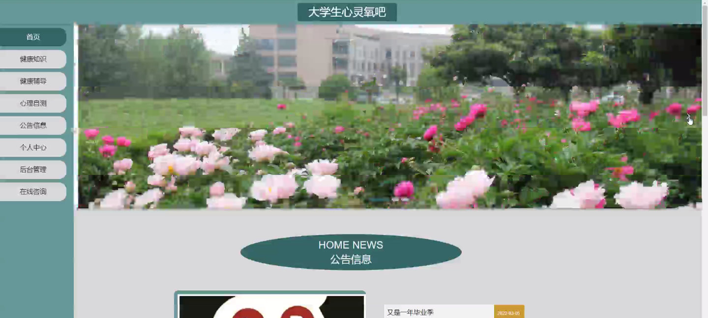
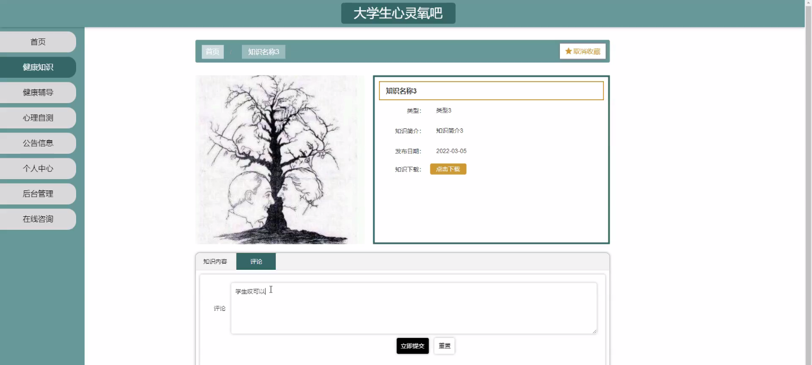
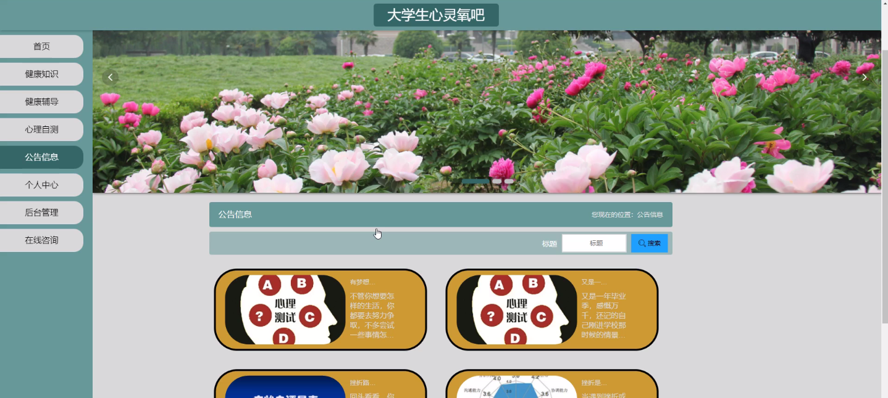
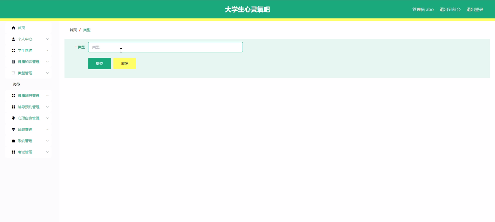
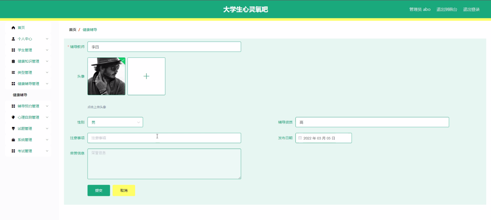
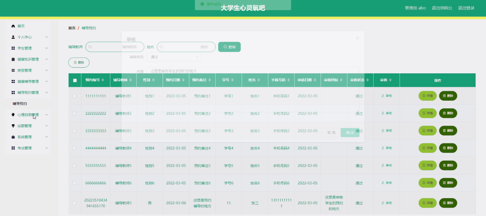
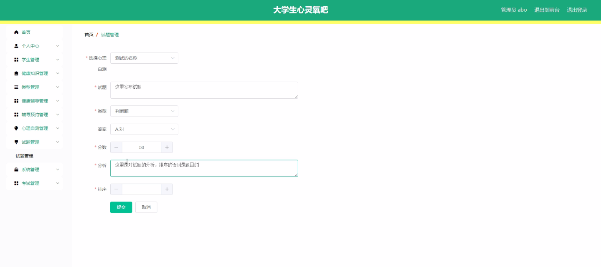
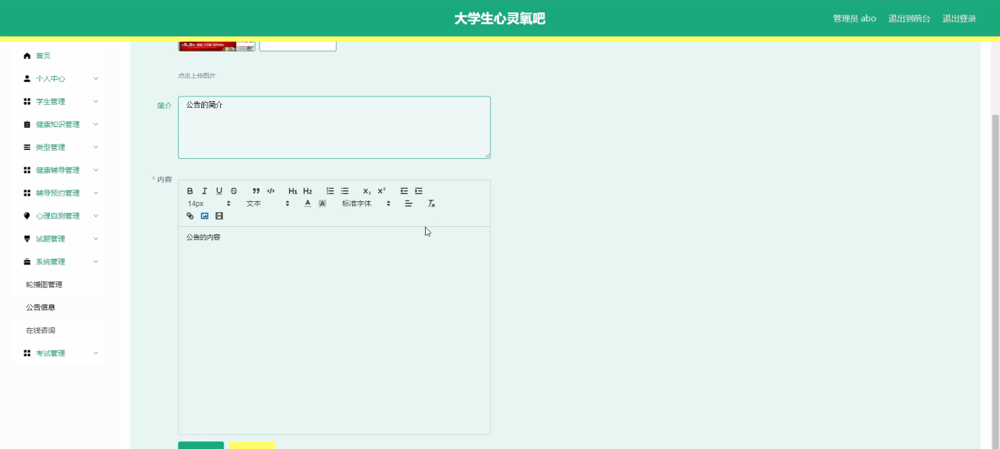

****本项目包含程序+源码+数据库+LW+调试部署环境，文末可获取一份本项目的java源码和数据库参考。****

## ******开题报告******

研究背景：
随着社会的发展和进步，大学生面临着越来越多的学业压力、心理压力和生活压力。这些压力对大学生的身心健康产生了重要影响，甚至可能导致一系列的心理问题和身体健康问题。因此，为了关注大学生的心理健康和身体健康，提高他们的生活质量和幸福感，建立一个大学生心灵氧吧是非常必要的。

研究意义：
大学生心灵氧吧作为一个综合性平台，可以为大学生提供健康知识、心理辅导、健康辅导等服务，帮助他们更好地应对压力，提升心理素质和身体健康水平。通过该平台，大学生可以获得专业的指导和支持，增强自我认知能力和解决问题的能力，促进个人成长和发展。

研究目的：
本研究旨在探索并构建一个大学生心灵氧吧系统，以满足大学生的心理健康和身体健康需求。通过提供学生信息管理、健康知识传播、健康辅导和辅导预约等功能，为大学生提供全方位的支持和帮助。通过该系统，我们希望能够促进大学生的心理健康意识，提高他们的自我调节能力，减轻心理压力，增强身体健康。

研究内容： 本研究的主要内容包括以下几个方面：学生信息管理、健康知识传播、类型分类、健康辅导和辅导预约等系统功能。

  1. 学生信息管理：建立一个学生信息数据库，包括学生的基本信息、心理健康评估结果等，以便进行个性化的健康辅导和服务。

  2. 健康知识传播：通过平台发布健康知识文章、视频等形式，向大学生传递科学、实用的健康知识，提高他们的健康素养和自我保健能力。

  3. 类型分类：根据大学生的心理特点和需求，将大学生分为不同的类型，针对不同类型的大学生提供相应的心理辅导和健康指导。

  4. 健康辅导：通过在线咨询、心理测试、心理辅导课程等方式，为大学生提供专业的心理辅导和支持，帮助他们解决心理问题、缓解压力。

  5. 辅导预约：建立一个在线预约系统，方便大学生预约心理辅导师或健康指导师的服务，提高服务效率和满意度。

拟解决的主要问题：
通过以上研究内容，我们将解决以下主要问题：大学生心理健康问题的关注和解决、大学生身体健康问题的关注和解决、大学生心理辅导和健康指导的需求与供给不匹配等问题。

研究方案和预期成果：
本研究将采用综合性的研究方法，包括文献调研、实地调查、系统设计和用户测试等。预期成果包括构建一个完善的大学生心灵氧吧系统，为大学生提供全面的心理健康和身体健康服务。同时，预计该系统能够提高大学生的心理健康意识和自我调节能力，减轻心理压力，促进个人成长和发展。

进度安排：

2022年9月至10月：需求分析和规划，明确系统功能和目标，制定项目计划。

2022年11月至2023年1月：系统设计和编码，完成详细的系统设计并开始编写代码。

2023年2月至3月：用户界面开发和数据库开发，开发用户友好的界面和设计数据库结构。

2023年4月至5月：功能测试、文档编写和上线部署，对系统进行全面的功能测试并编写用户手册。

2023年5月：维护和升级，定期对系统进行维护和升级，修复bug和添加新功能。

参考文献：

[1]邱小群,邓丽艳,陈海潮.基于B/S的信息管理系统设计和实现[J].信息与电脑(理论版),2022,(20):146-148.

[2]谢霜.基于Java技术的网络管理体系结构的应用[J].网络安全技术与应用,2022,(10):14-15.

[3]宋锦华.高职院校Java程序设计课程改革研究[J].科技视界,2022,(20):133-135.

[4]曹嵩彭,王鹏宇.浅析Java语言在软件开发中的应用[J].信息记录材料,2022,(03):114-116.

[5]朱澈,余俊达.武汉东湖学院.基于Java的软硬件信息管理系统V1.0[Z].项目立项编号.鉴定单位.鉴定日期:

****以上是本项目程序开发之前开题报告内容，最终成品以下面界面为准，大家可以酌情参考使用。要源码参考请在文末进行获取！！****

## ******本项目的界面展示******

