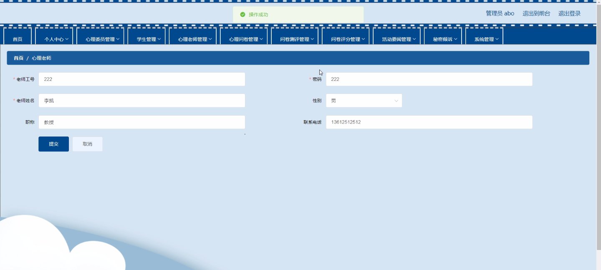
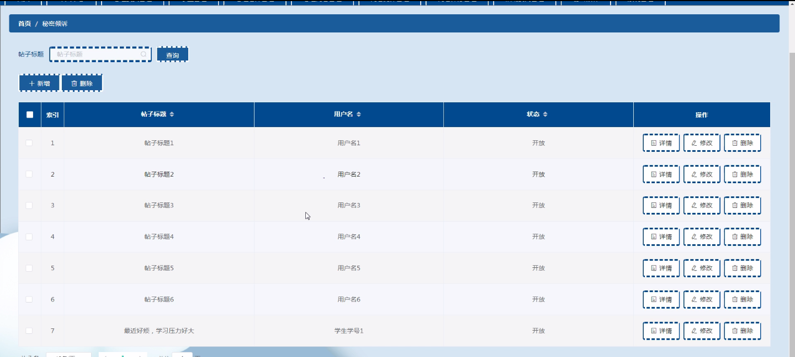
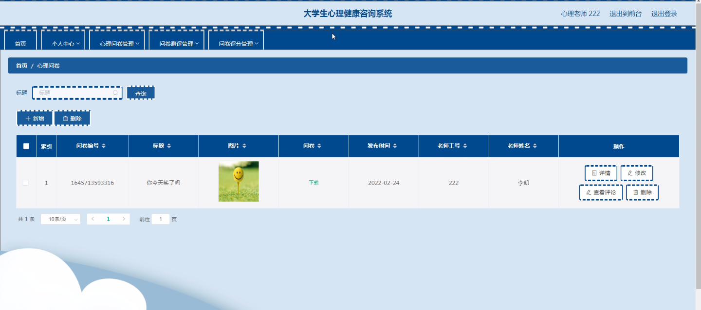

****本项目包含程序+源码+数据库+LW+调试部署环境，文末可获取一份本项目的java源码和数据库参考。****

## ******开题报告******

研究背景：
随着社会的快速发展和高等教育的普及，大学生心理健康问题日益凸显。大学生阶段是一个人成长和发展的重要时期，他们面临着诸多的学业压力、人际关系困扰以及自我认知和情绪管理等挑战。这些心理压力和问题对大学生的身心健康产生了负面影响，甚至可能导致严重的心理疾病。因此，建立一套有效的大学生心理健康咨询系统具有重要的现实意义。

研究意义：
大学生心理健康咨询系统的建立可以为大学生提供便捷、专业的心理咨询服务，帮助他们更好地应对心理问题，提升心理素质，促进全面发展。同时，该系统还可以为心理老师提供工作支持和辅助工具，提高心理咨询的效率和质量。通过引入心理问卷、测评和评分等功能，系统可以帮助心理老师更加全面地了解学生的心理状态，为他们提供个性化的心理干预和指导。此外，系统中的活动要闻和心理委员功能可以增加大学生对心理健康的关注和参与度，形成良好的心理健康氛围。

研究目的：
本研究旨在构建一套全面、高效的大学生心理健康咨询系统，为大学生提供专业的心理咨询服务，帮助他们解决心理问题，提升心理素质。同时，通过引入心理问卷、测评和评分等功能，系统可以辅助心理老师开展心理干预工作，提高心理咨询的效果和效率。通过开发这样一个系统，我们希望能够促进大学生心理健康的全面发展，为他们的成长和学业成功提供有力的支持。

研究内容： 根据系统功能，本研究将包括以下内容：

  1. 学生功能：学生可以通过系统进行心理咨询预约、在线咨询和心理资讯获取等操作。
  2. 心理老师功能：心理老师可以通过系统管理学生咨询预约、进行在线咨询和提供心理指导等工作。
  3. 心理问卷功能：系统将提供一系列心理问卷，用于评估学生的心理状态和问题，为心理咨询提供依据。
  4. 问卷测评功能：系统将根据学生填写的心理问卷结果，进行个性化的心理测评，帮助学生了解自己的心理特点和问题。
  5. 问卷评分功能：系统将根据心理问卷的评分标准，对学生的心理状态进行评估和反馈，为心理干预提供参考。
  6. 活动要闻功能：系统将发布与心理健康相关的活动信息和新闻资讯，增加大学生对心理健康的关注和参与度。
  7. 心理委员功能：系统将设立心理委员角色，负责组织心理健康宣传活动和提供同学间的心理支持。

拟解决的主要问题：

  1. 大学生心理健康问题的及时发现和干预；
  2. 提供全面、专业的心理咨询服务，满足学生的个性化需求；
  3. 提高心理咨询的效率和质量，辅助心理老师开展工作；
  4. 增加大学生对心理健康的关注和参与度，形成良好的心理健康氛围。

研究方案和预期成果：
本研究将采用系统开发和实验研究相结合的方法，通过需求分析、系统设计、功能开发和用户测试等步骤，构建一套完整的大学生心理健康咨询系统。预期成果包括：系统功能完善、界面友好、操作便捷；心理咨询服务的提供更加个性化和专业化；心理干预效果的提升；大学生心理健康意识和素养的提高。这些成果将为大学生心理健康问题的解决提供有力支持，促进大学生全面发展和学业成功。

进度安排：

2022年9月至10月：需求分析和规划，明确系统功能和目标，制定项目计划。

2022年11月至2023年1月：系统设计和编码，完成详细的系统设计并开始编写代码。

2023年2月至3月：用户界面开发和数据库开发，开发用户友好的界面和设计数据库结构。

2023年4月至5月：功能测试、文档编写和上线部署，对系统进行全面的功能测试并编写用户手册。

2023年5月：维护和升级，定期对系统进行维护和升级，修复bug和添加新功能。

参考文献：

[1]邱小群,邓丽艳,陈海潮.基于B/S的信息管理系统设计和实现[J].信息与电脑(理论版),2022,(20):146-148.

[2]谢霜.基于Java技术的网络管理体系结构的应用[J].网络安全技术与应用,2022,(10):14-15.

[3]宋锦华.高职院校Java程序设计课程改革研究[J].科技视界,2022,(20):133-135.

[4]曹嵩彭,王鹏宇.浅析Java语言在软件开发中的应用[J].信息记录材料,2022,(03):114-116.

[5]朱澈,余俊达.武汉东湖学院.基于Java的软硬件信息管理系统V1.0[Z].项目立项编号.鉴定单位.鉴定日期:

****以上是本项目程序开发之前开题报告内容，最终成品以下面界面为准，大家可以酌情参考使用。要源码参考请在文末进行获取！！****

## ******本项目的界面展示******

