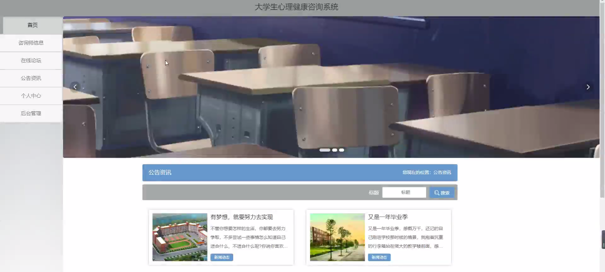
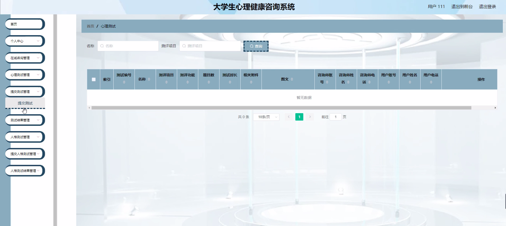
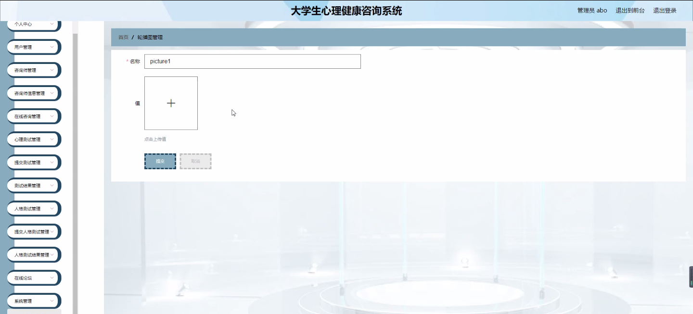
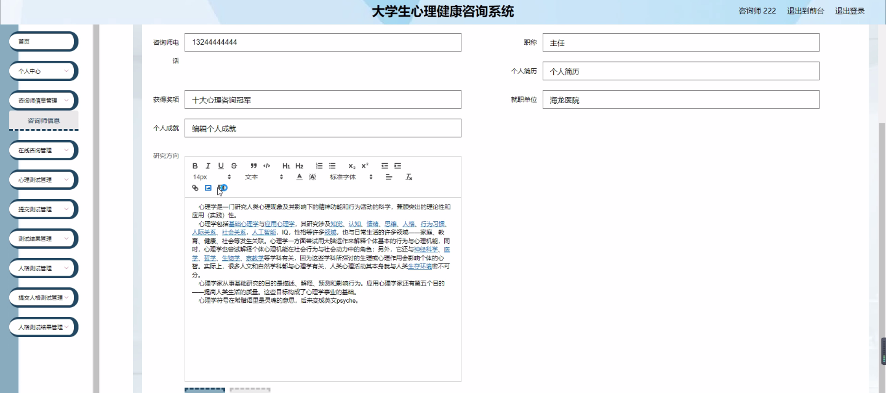
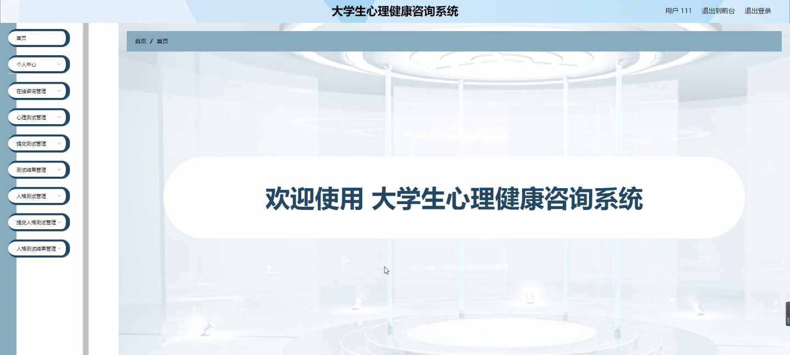
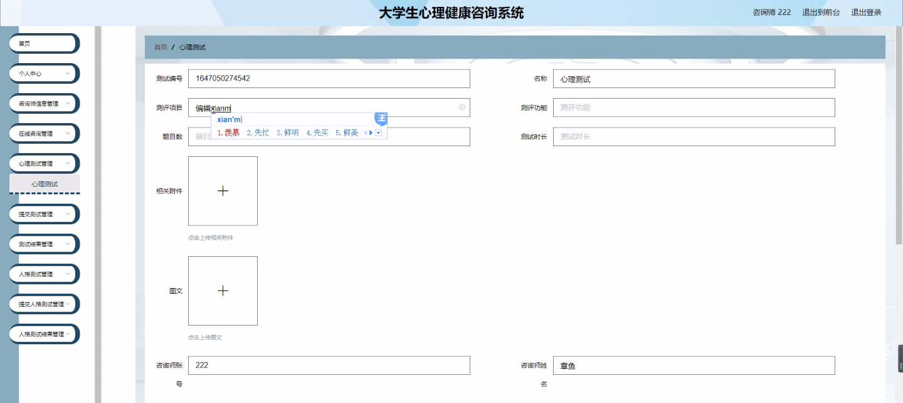
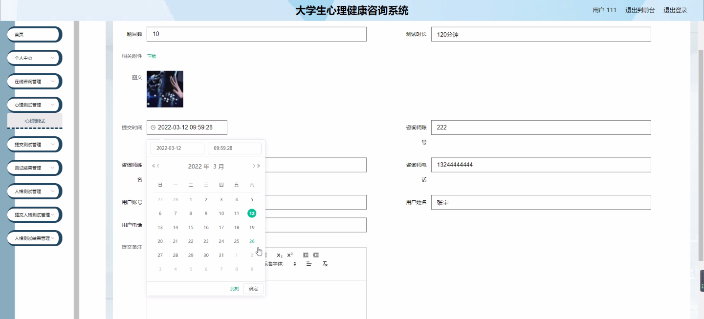
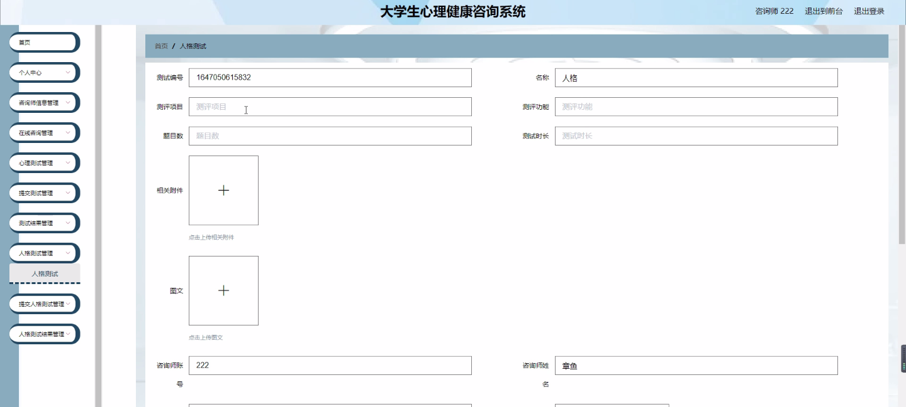

****本项目包含程序+源码+数据库+LW+调试部署环境，文末可获取一份本项目的java源码和数据库参考。****

## ******开题报告******

研究背景：
随着社会的快速发展和竞争的加剧，大学生心理健康问题日益突出。他们面临着学业压力、人际关系困扰、职业选择困惑等各种挑战，心理健康问题逐渐成为影响他们全面发展的重要因素。然而，传统的心理咨询方式存在诸多限制，如时间和空间的限制，以及对个人隐私的担忧。因此，开发一种大学生心理健康咨询系统具有重要意义。

研究意义：
大学生心理健康咨询系统的开发可以提供一个安全、便捷、高效的平台，帮助大学生解决心理问题，促进他们的身心健康发展。通过在线咨询和心理测试等功能，该系统能够为大学生提供专业的心理支持和指导，减轻他们的心理负担，增强自我认知和情绪管理能力，提高学习和生活质量。

研究目的：
本研究旨在开发一种大学生心理健康咨询系统，通过整合用户、咨询师、咨询师信息、在线咨询、心理测试等功能，为大学生提供全方位的心理支持和服务。通过系统的建立和应用，旨在解决大学生心理健康问题的主要挑战，促进他们的心理健康发展。

研究内容：
本研究的主要内容包括以下系统功能：用户管理模块，用于注册和管理用户账号；咨询师管理模块，用于管理咨询师的基本信息和资质；在线咨询模块，提供实时的在线咨询服务；心理测试模块，提供各类心理测试题目，并记录用户提交的测试答案；人格测试模块，提供专业的人格测试，并分析用户的人格特征；测试结果模块，展示用户的测试结果和相关建议。

拟解决的主要问题：

  1. 大学生心理健康问题的传统咨询方式存在时间和空间限制，无法满足大学生随时随地的需求。
  2. 传统咨询方式对个人隐私的保护不够完善，存在一定的尴尬和顾虑。
  3. 大学生心理健康问题多样化，需要针对性的咨询和测试工具来解决。

研究方案：

  1. 设计和开发大学生心理健康咨询系统，包括用户管理、咨询师管理、在线咨询、心理测试、人格测试等功能模块。
  2. 收集和整理大学生心理健康问题的相关数据和资料，为系统提供专业的咨询和测试内容。
  3. 进行系统的测试和优化，确保系统的稳定性和用户体验。
  4. 推广和应用研究成果，让更多的大学生受益于该系统。

预期成果：
通过本研究，预期可以开发出一种功能完善、易于使用的大学生心理健康咨询系统。该系统将为大学生提供便捷的心理咨询服务和个性化的心理测试工具，帮助他们解决心理问题，提升心理健康水平。同时，该系统的推广和应用也有望在全国范围内推动大学生心理健康工作的发展，促进大学生全面发展和成长。

进度安排：

2022年9月至10月：需求分析和规划，进行用户需求调研和分析，确定系统功能和目标。

2022年11月至2023年1月：系统设计和开发，完成系统架构设计和技术选型，并开始编写代码。

2023年2月至3月：测试和优化，进行单元测试和集成测试，修复问题并优化系统性能。

2023年4月至5月：文档编写和培训，编写用户手册和系统文档，并进行相关人员的培训。

2023年5月：上线部署和维护，将系统部署到生产环境中，并定期进行维护和升级。

参考文献：

[1]王振华.SpringBoot在教学效果评估系统中的应用[J].电子技术,2023,(05):67-69.

[2]王明泉.基于SpringBoot远程热部署的探索和应用[J].信息与电脑(理论版),2023,(07):1-4.

[3]王亚东,李晓霞,陈强强,剡美娜.基于SpringBoot的需求发布平台设计[J].信息与电脑(理论版),2023,(01):105-107.

[4]陈新府豪.基于SpringBoot和Vue框架的创新方法推理系统的设计与实现[D].导师：黄静.浙江理工大学,2022.

[5]霍福华,韩慧.基于SpringBoot微服务架构下前后端分离的MVVM模型[J].电子技术与软件工程,2022,(01):73-76.

[6]韩策,张娜,王松亭,张凯,何方,袁峰.SpringBoot OPC客户端设计与研究[J].电子世界,2021,(19):25-26.

****以上是本项目程序开发之前开题报告内容，最终成品以下面界面为准，大家可以酌情参考使用。要源码参考请在文末进行获取！！****

## ******本项目的界面展示******

