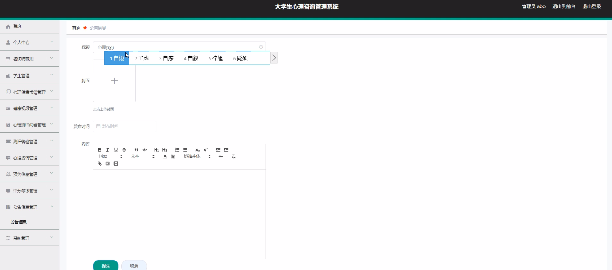
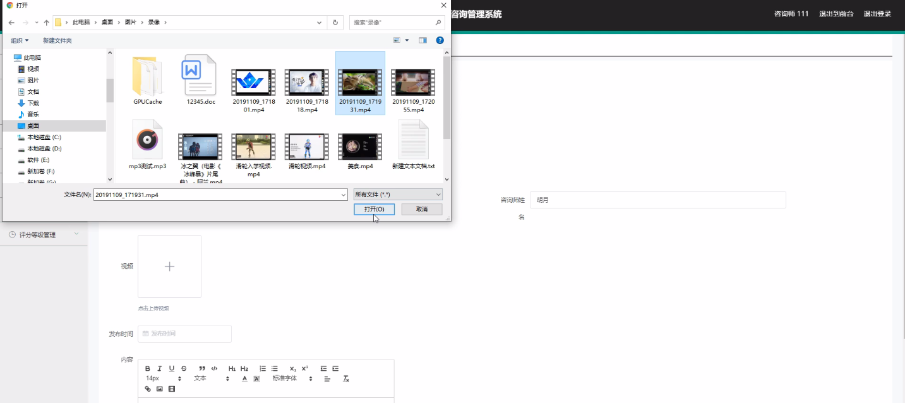
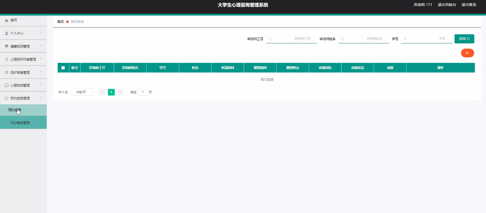
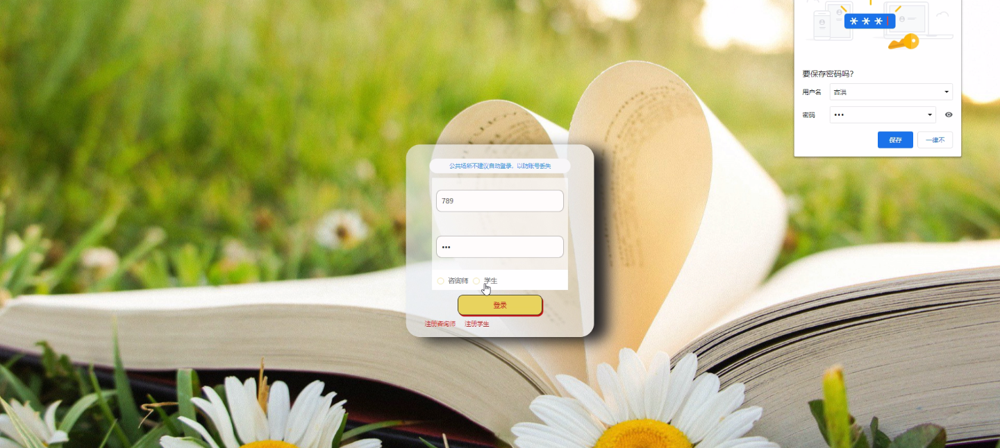
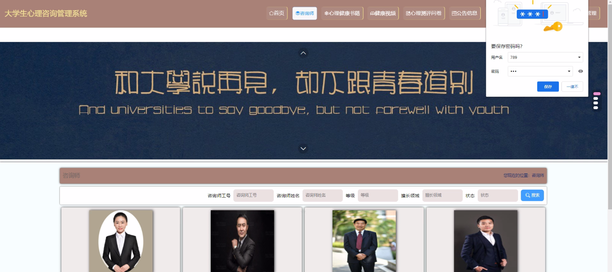
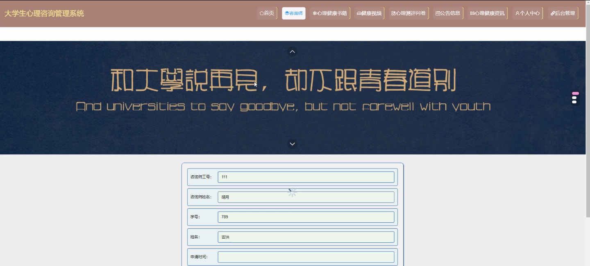
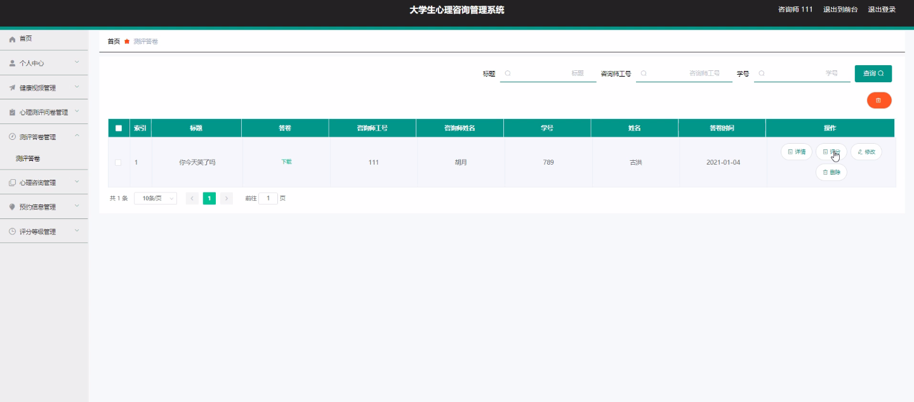

****本项目包含程序+源码+数据库+LW+调试部署环境，文末可获取一份本项目的java源码和数据库参考。****

## ******开题报告******

研究背景：
随着社会的快速发展和人们生活节奏的加快，大学生心理健康问题日益突出。大学生作为一个特殊群体，面临着诸多压力和挑战，如学业压力、人际关系困扰、职业规划等。这些问题对大学生的身心健康产生了负面影响，甚至可能导致一些严重的心理问题。因此，建立一种有效的大学生心理咨询管理系统具有重要的现实意义。

研究意义：
大学生心理咨询管理系统的建立可以提供给大学生一个便捷、高效、专业的心理咨询平台，帮助他们及时解决心理问题，提升心理健康水平。通过该系统，大学生可以得到专业的心理咨询服务，获取相关的心理健康书籍和健康视频，参与心理测评问卷，预约心理咨询，了解公告信息等。这将有助于改善大学生的心理健康状况，提高他们的学习效果和生活质量。

研究目的：
本研究旨在构建一个全面、高效的大学生心理咨询管理系统，为大学生提供全方位的心理支持和服务。通过该系统，大学生可以获得专业的心理咨询师的指导和帮助，获取相关的心理健康资源，进行心理测评和答卷，预约心理咨询，并了解最新的公告信息。通过这些功能的整合和优化，旨在提升大学生的心理健康水平，促进他们的全面发展。

研究内容：
本研究的主要内容包括以下系统功能：咨询师、学生、心理健康书籍、健康视频、心理测评问卷、测评答卷、心理咨询、预约信息、评分等。其中，咨询师是系统中的核心角色，负责提供专业的心理咨询服务；学生是系统的用户，可以通过系统获取相关的心理健康资源和服务；心理健康书籍和健康视频提供了丰富的心理知识和教育资源；心理测评问卷和测评答卷用于评估学生的心理健康状况；心理咨询模块提供在线咨询服务；预约信息用于安排咨询师和学生的咨询时间；评分功能用于学生对咨询师的服务进行评价。

拟解决的主要问题：
本研究旨在解决大学生心理健康问题管理中存在的一系列问题，包括：心理咨询资源不足、心理咨询服务不便捷、心理测评和答卷流程繁琐、预约信息不透明、评估和反馈机制不完善等。通过建立一个综合性的大学生心理咨询管理系统，可以有效地解决这些问题，提供更好的心理支持和服务。

研究方案和预期成果：
本研究将采用系统开发方法，结合用户需求和技术实现，构建一个功能完善、易用性强的大学生心理咨询管理系统。通过系统的设计和开发，预计可以提高大学生心理咨询的效率和质量，增加心理健康资源的可及性，改善心理测评和答卷的流程，优化预约信息的管理，完善评估和反馈机制。预期成果包括一个可用的大学生心理咨询管理系统，并通过实际应用验证其有效性和可行性。

进度安排：

2022年9月至10月：开题报告编写和提交，完成开题报告的撰写并提交给指导教师进行审核。

2022年11月至2023年1月：系统设计和开发，根据开题报告的要求，进行系统设计和编码工作。

2023年2月至3月：论文撰写和初稿完成，开始撰写论文，并在这个阶段完成论文的初稿。

2023年4月至5月：论文修改和最终定稿，根据指导教师的意见对论文进行修改，并完成最终的定稿。

2023年5月：论文答辩和提交，参加论文答辩并根据答辩结果进行修改，最后将论文提交给学院或学校。

参考文献：

[1]喻佳,吴丹新.基于SpringBoot的Web快速开发框架[J].电脑编程技巧与维护,2021,(09):31-33.

[2]李鹏.基于SpringBoot快速开发平台的实现[J].电子技术与软件工程,2021,(12):36-37.

[3]叶开平,蔡维晟,陈家敏,邓斯妮.基于SpringBoot的综测可视化管理系统的研究与设计[J].电脑知识与技术,2021,(12):100-104.

[4]江健锋,徐振平.Springboot最小系统的设计与实现[J].电脑知识与技术,2021,(04):62-63.

[5]赵炯,司圣杰,周奇才,熊肖磊.通用信息获取系统设计与实现[J].起重运输机械,2020,(16):89-97.

[6]吴英宾.一种内外网数据交互系统的设计与实现[J].软件工程,2020,(08):25-27.

****以上是本项目程序开发之前开题报告内容，最终成品以下面界面为准，大家可以酌情参考使用。要源码参考请在文末进行获取！！****

## ******本项目的界面展示******

