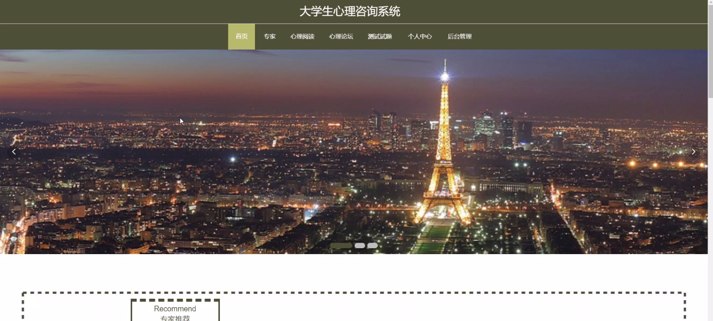
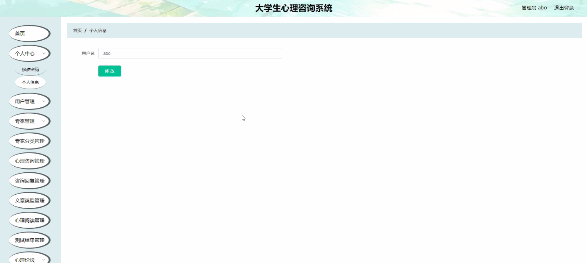
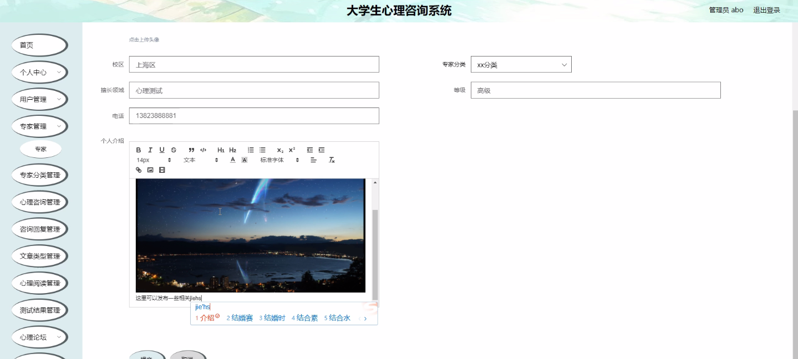
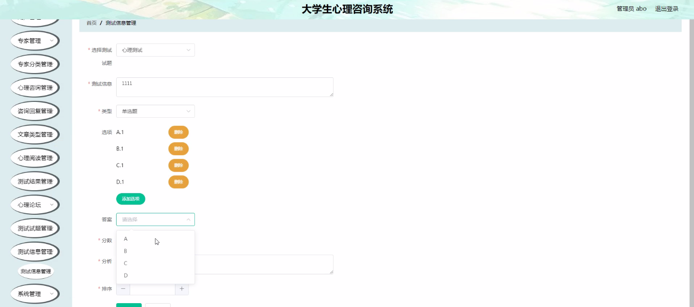
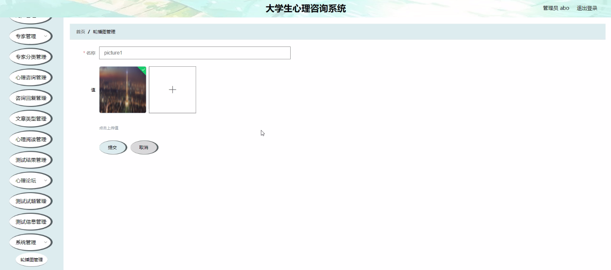
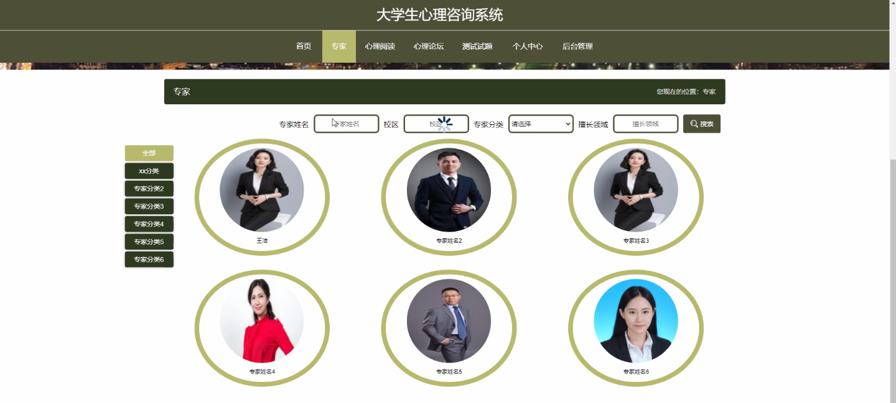
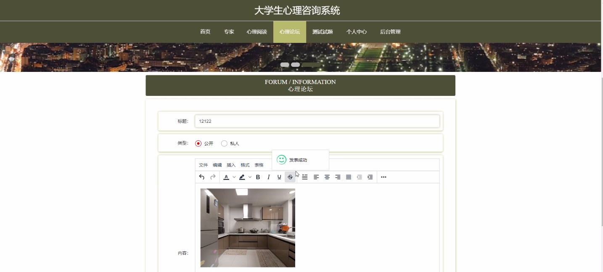
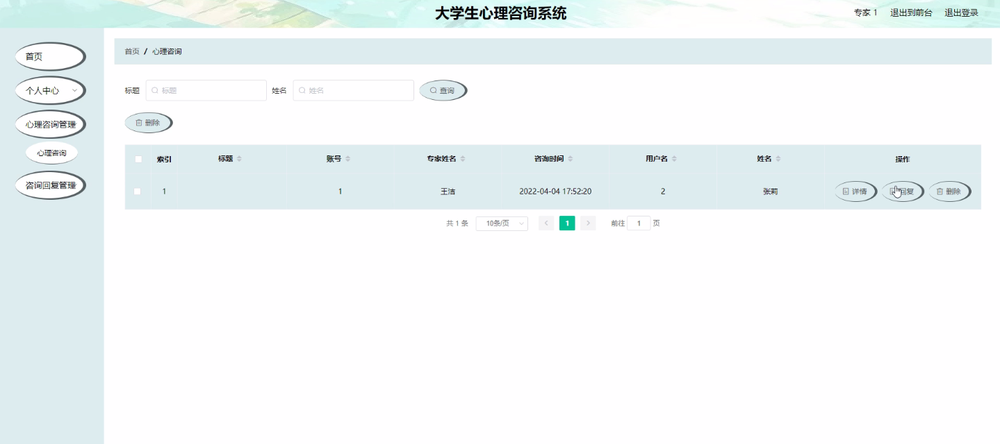

****本项目包含程序+源码+数据库+LW+调试部署环境，文末可获取一份本项目的java源码和数据库参考。****

## ******开题报告******

研究背景：
随着社会的快速发展和生活节奏的加快，大学生面临着越来越多的压力和挑战。心理问题在大学生群体中日益突出，给他们的身心健康带来了巨大的威胁。因此，建立一种高效、便捷的大学生心理咨询系统势在必行。

研究意义：
大学生心理咨询系统的建立具有重要的现实意义和社会价值。首先，它可以为大学生提供一个安全、私密的心理咨询平台，使他们能够及时得到专业的心理支持和指导。其次，该系统还可以为大学生提供心理阅读和测试等功能，帮助他们更好地了解自己的心理状态和需求。最后，通过对用户和专家进行分类管理，系统可以提供个性化的咨询服务，满足不同用户的需求。

研究目的：
本研究旨在构建一种大学生心理咨询系统，通过整合用户、专家、心理咨询、心理阅读、测试结果等功能，为大学生提供全方位、个性化的心理支持和服务。通过该系统，大学生可以随时随地进行心理咨询，获得专业的回复和指导，提高心理健康水平，增强应对压力的能力。

研究内容： 本研究将围绕大学生心理咨询系统的功能展开研究。具体包括以下内容：

  1. 用户管理：设计用户注册、登录、个人信息管理等功能，确保用户的身份安全和信息私密性。
  2. 专家管理：建立专家数据库，包括专家的资质认证、分类管理等，以便为用户提供准确、专业的咨询服务。
  3. 专家分类：根据专家的专业领域和经验进行分类，使用户可以选择适合自己需求的专家进行咨询。
  4. 心理咨询：构建在线咨询平台，实现用户与专家之间的即时沟通和咨询回复，提供个性化的心理支持。
  5. 文章类型：提供丰富多样的心理阅读材料，包括心理健康知识、案例分析、心理技巧等，帮助用户更好地了解和调节自己的心理状态。
  6. 心理阅读：根据用户的兴趣和需求，推荐相关的心理阅读内容，促进用户的心理成长和发展。
  7. 测试结果：设计心理测试功能，根据用户的测试结果提供个性化的建议和指导，帮助用户更好地认识自己并解决心理问题。

拟解决的主要问题： 通过建立大学生心理咨询系统，本研究旨在解决以下主要问题：

  1. 大学生心理问题的及时发现和干预机制不完善；
  2. 大学生心理咨询服务的专业性和个性化程度有待提高；
  3. 大学生心理健康教育和宣传工作的不足。

研究方案和预期成果：
本研究将采用文献研究、问卷调查、系统设计与开发等方法进行实施。预期成果包括构建一个完善的大学生心理咨询系统，并对其进行测试和评估，验证其可行性和有效性。同时，预计通过该系统的使用，能够提高大学生的心理健康水平，减少心理问题的发生和加重，促进大学生全面发展和成长。

进度安排：

2022年9月至10月：需求分析和规划，明确系统功能和目标，制定项目计划。

2022年11月至2023年1月：系统设计和编码，完成详细的系统设计并开始编写代码。

2023年2月至3月：用户界面开发和数据库开发，开发用户友好的界面和设计数据库结构。

2023年4月至5月：功能测试、文档编写和上线部署，对系统进行全面的功能测试并编写用户手册。

2023年5月：维护和升级，定期对系统进行维护和升级，修复bug和添加新功能。

参考文献：

[1]邱小群,邓丽艳,陈海潮.基于B/S的信息管理系统设计和实现[J].信息与电脑(理论版),2022,(20):146-148.

[2]谢霜.基于Java技术的网络管理体系结构的应用[J].网络安全技术与应用,2022,(10):14-15.

[3]宋锦华.高职院校Java程序设计课程改革研究[J].科技视界,2022,(20):133-135.

[4]曹嵩彭,王鹏宇.浅析Java语言在软件开发中的应用[J].信息记录材料,2022,(03):114-116.

[5]朱澈,余俊达.武汉东湖学院.基于Java的软硬件信息管理系统V1.0[Z].项目立项编号.鉴定单位.鉴定日期:

****以上是本项目程序开发之前开题报告内容，最终成品以下面界面为准，大家可以酌情参考使用。要源码参考请在文末进行获取！！****

## ******本项目的界面展示******

