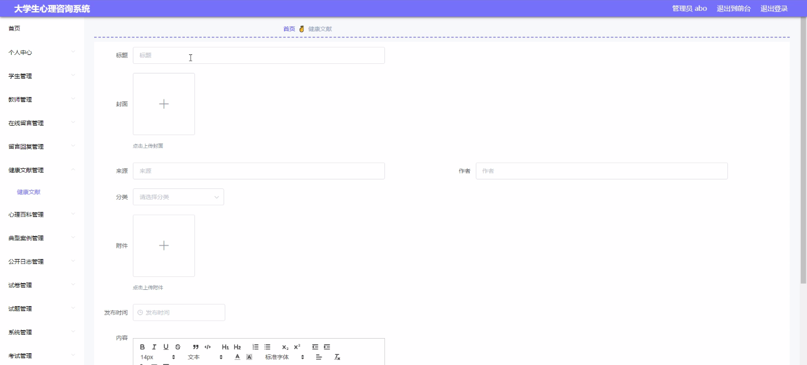
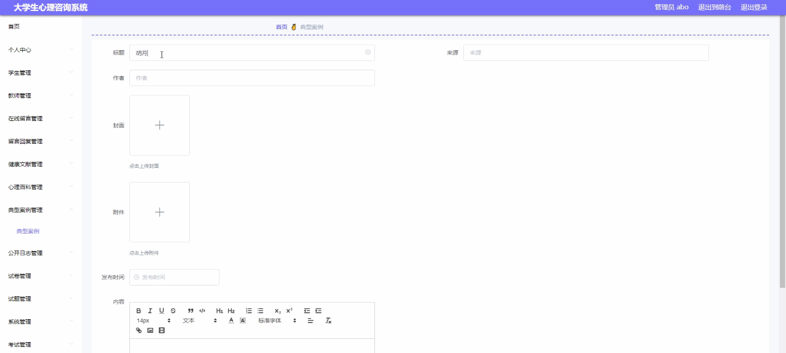
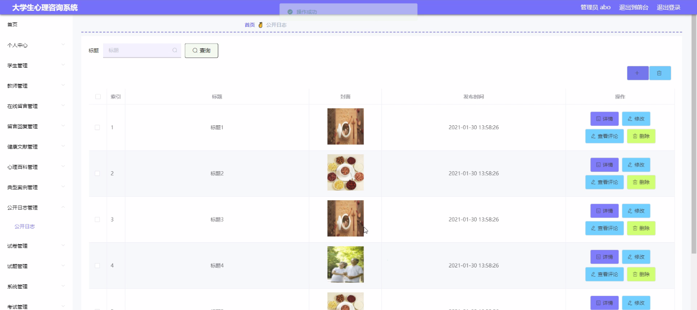
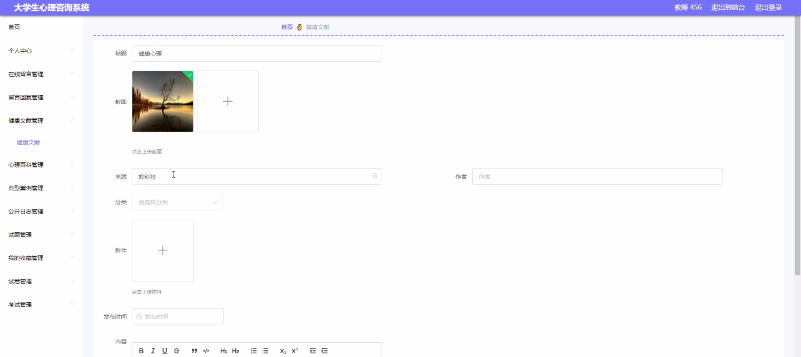
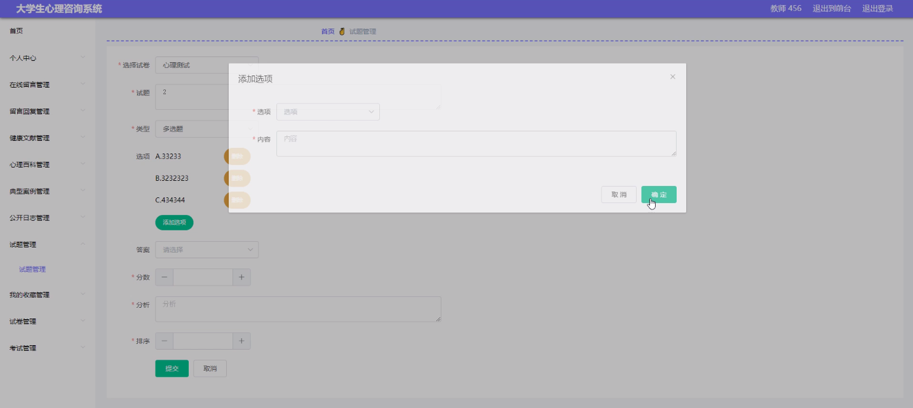
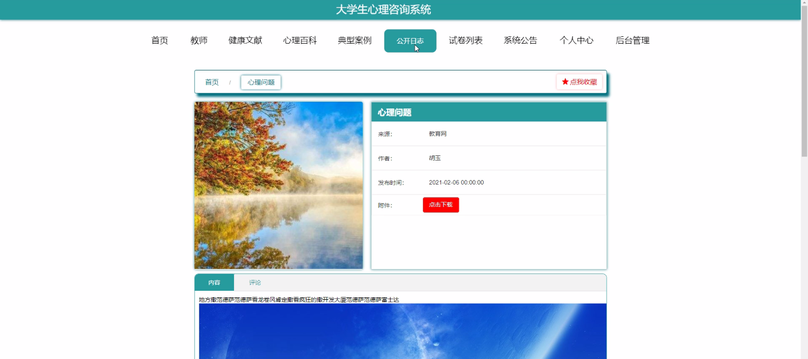

****本项目包含程序+源码+数据库+LW+调试部署环境，文末可获取一份本项目的java源码和数据库参考。****

## ******开题报告******

研究背景：
随着社会的发展和教育水平的提高，大学生心理健康问题日益突出。面对学业压力、人际关系困扰、情绪波动等各种挑战，大学生心理健康问题已成为一个亟待解决的社会问题。传统的心理咨询方式存在诸多限制，如时间和地点的限制，使得许多大学生无法及时获得有效的心理支持和帮助。因此，开发一种大学生心理咨询系统具有重要的现实意义。

研究意义：
大学生心理咨询系统的建立将为大学生提供一个方便、快捷、隐私保护的心理健康服务平台。通过该系统，大学生可以随时随地获取专业的心理咨询和支持，减轻他们的心理压力，提高心理健康水平。同时，该系统还可以为心理咨询师提供更好的工作环境和工具，提高心理咨询服务的效率和质量。

研究目的：
本研究旨在开发一种大学生心理咨询系统，以满足大学生心理健康需求的同时，提高心理咨询服务的效率和质量。通过该系统，大学生可以方便地获取心理咨询服务，心理咨询师可以更好地了解和辅导大学生的心理问题，从而促进大学生的心理健康发展。

研究内容：
本研究的主要内容包括以下系统功能：学生功能、教师功能、在线留言功能、留言回复功能、健康文献功能、心理百科功能、典型案例功能和公开日志功能。学生功能是指为大学生提供心理咨询和支持的功能；教师功能是指为心理咨询师提供管理和辅助工具的功能；在线留言功能是指大学生可以通过系统向心理咨询师留言咨询问题；留言回复功能是指心理咨询师可以通过系统回复大学生的留言；健康文献功能是指提供心理健康相关的专业文献和资料；心理百科功能是指提供心理学知识和常见问题的解答；典型案例功能是指提供心理咨询的典型案例分析；公开日志功能是指心理咨询师可以公开发布一些心理健康相关的日志和文章。

拟解决的主要问题： 通过开发大学生心理咨询系统，我们希望解决以下问题：1. 大学生心理健康问题得不到及时有效的解决；2.
传统心理咨询方式存在时间和地点限制；3. 心理咨询服务效率和质量有待提高。

研究方案和预期成果：
本研究将采用软件开发方法，设计并开发一款适用于大学生的心理咨询系统。通过用户需求调研、系统设计和功能开发等步骤，实现系统的基本功能和特色功能。预期成果包括一个稳定可靠、易于使用的大学生心理咨询系统，并进行测试和评估以验证其效果和可行性。该系统的成功开发和应用将为大学生心理健康问题的解决提供新的途径和手段，促进大学生的全面发展和成长。

进度安排：

2022年9月至10月：需求分析和规划，进行用户需求调研和分析，确定系统功能和目标。

2022年11月至2023年1月：系统设计和开发，完成系统架构设计和技术选型，并开始编写代码。

2023年2月至3月：测试和优化，进行单元测试和集成测试，修复问题并优化系统性能。

2023年4月至5月：文档编写和培训，编写用户手册和系统文档，并进行相关人员的培训。

2023年5月：上线部署和维护，将系统部署到生产环境中，并定期进行维护和升级。

参考文献：

[1]王振华.SpringBoot在教学效果评估系统中的应用[J].电子技术,2023,(05):67-69.

[2]王明泉.基于SpringBoot远程热部署的探索和应用[J].信息与电脑(理论版),2023,(07):1-4.

[3]王亚东,李晓霞,陈强强,剡美娜.基于SpringBoot的需求发布平台设计[J].信息与电脑(理论版),2023,(01):105-107.

[4]陈新府豪.基于SpringBoot和Vue框架的创新方法推理系统的设计与实现[D].导师：黄静.浙江理工大学,2022.

[5]霍福华,韩慧.基于SpringBoot微服务架构下前后端分离的MVVM模型[J].电子技术与软件工程,2022,(01):73-76.

[6]韩策,张娜,王松亭,张凯,何方,袁峰.SpringBoot OPC客户端设计与研究[J].电子世界,2021,(19):25-26.

****以上是本项目程序开发之前开题报告内容，最终成品以下面界面为准，大家可以酌情参考使用。要源码参考请在文末进行获取！！****

## ******本项目的界面展示******

