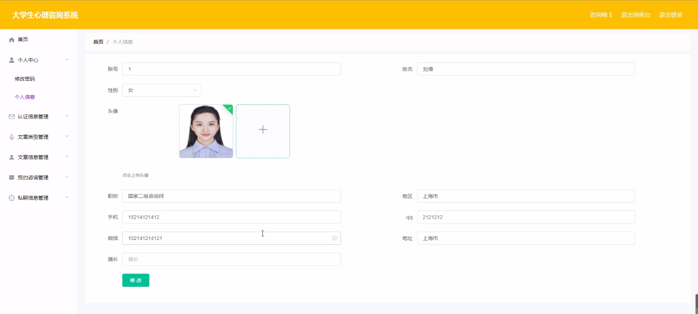
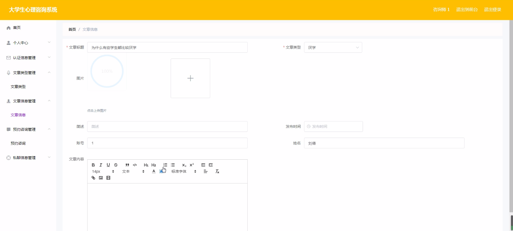
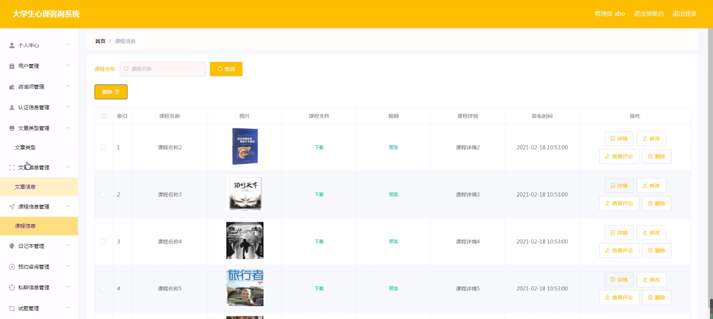
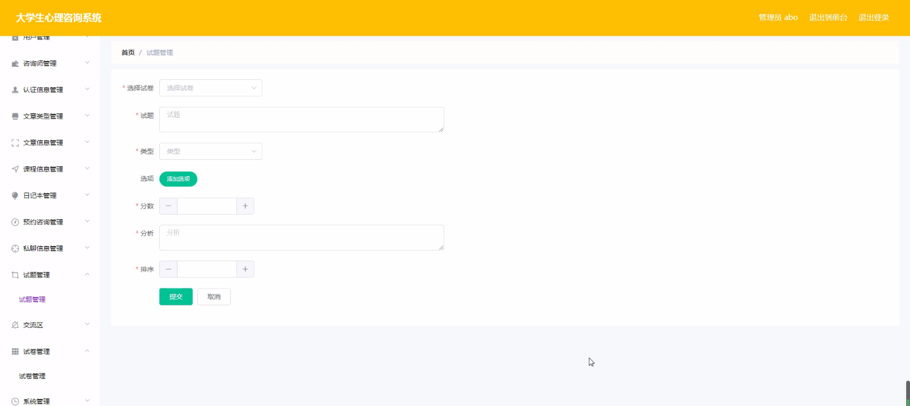
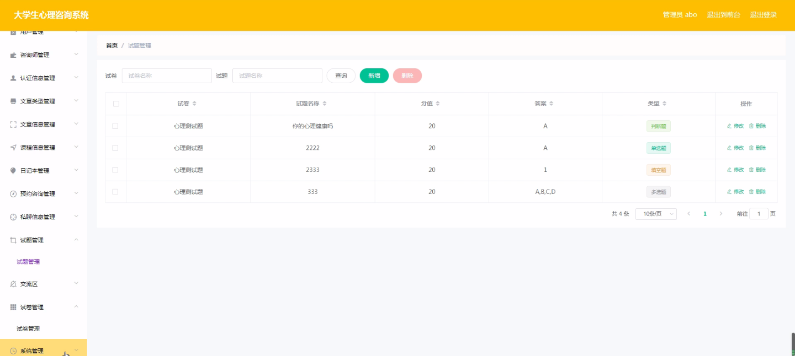
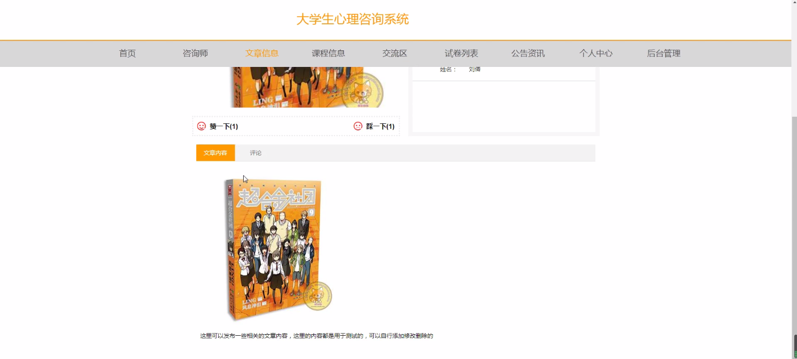
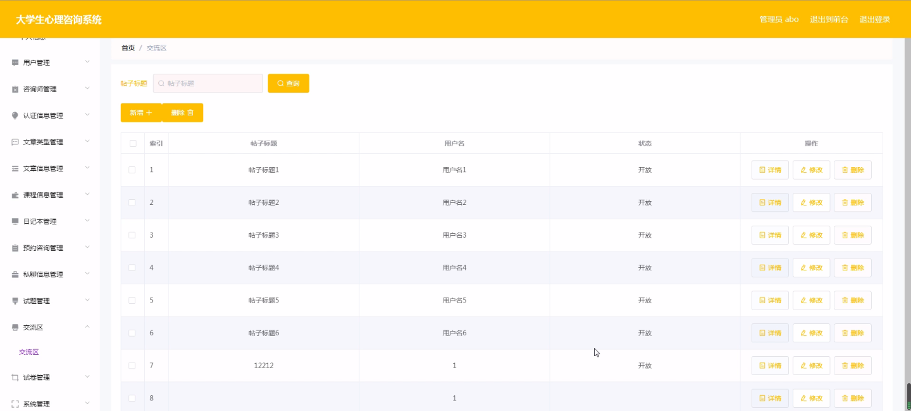

****本项目包含程序+源码+数据库+LW+调试部署环境，文末可获取一份本项目的java源码和数据库参考。****

## ******开题报告******

研究背景：
随着社会的快速发展和生活节奏的加快，大学生面临着越来越多的心理压力和困扰。他们常常面临学业压力、人际关系问题、情绪管理困难等各种挑战。这些问题如果得不到及时有效的解决，可能会对大学生的身心健康产生负面影响，甚至导致心理疾病的发生。因此，建立一套适合大学生的心理咨询系统具有重要的现实意义。

研究意义：
大学生心理咨询系统的建立可以为大学生提供便捷、专业的心理支持和帮助。通过该系统，大学生可以在任何时间、任何地点获得心理咨询服务，解决自己的心理问题。同时，心理咨询师也可以通过系统更好地了解大学生的需求，并针对性地提供个性化的咨询服务。这将有助于提高大学生的心理健康水平，促进他们全面发展。

研究目的：
本研究旨在设计和开发一款大学生心理咨询系统，以满足大学生心理需求的多样性和个性化。通过该系统，大学生可以方便地获取心理咨询服务，心理咨询师可以更好地了解大学生的问题，并提供针对性的解决方案。同时，研究还旨在探索如何利用现代信息技术手段提升心理咨询服务的效率和质量，为大学生提供更好的心理支持。

研究内容： 本研究将围绕以下系统功能展开研究：

  1. 用户：研究用户的特点、需求和心理健康状况，为系统设计提供参考和依据。
  2. 心理咨询师：研究心理咨询师的专业背景、经验和技能要求，建立合适的心理咨询师数据库。
  3. 认证信息：研究认证机制和标准，确保心理咨询师的资质和信誉。
  4. 文章类型：研究不同类型的心理文章，包括心理知识科普、心理调适方法等，为用户提供相关信息。
  5. 文章信息：研究文章的编写、审核和发布流程，确保文章的准确性和可靠性。
  6. 课程信息：研究心理课程的设置和开展方式，为用户提供在线学习机会。
  7. 日记本：研究用户心理日记的记录和分析方法，帮助用户更好地了解自己的情绪和需求。
  8. 预约咨询：研究预约咨询的流程和管理方式，提高咨询服务的效率和质量。
  9. 私聊信息：研究私聊功能的设计和实现，保护用户隐私并提供个性化的咨询服务。

拟解决的主要问题：

  1. 如何建立一个适合大学生的心理咨询系统，满足他们多样化的心理需求？
  2. 如何确保心理咨询师的专业素养和服务质量？
  3. 如何保证文章的准确性和可靠性，提供有价值的心理知识？
  4. 如何提供个性化的心理课程和学习机会，促进大学生的心理成长？
  5. 如何保护用户隐私，提供安全可靠的私聊咨询服务？

研究方案和预期成果：
本研究将采用文献研究、问卷调查、实地访谈等方法进行数据收集和分析。通过对现有心理咨询系统的调研和分析，结合大学生心理需求的特点，设计和开发一套适合大学生的心理咨询系统。预期成果包括系统的设计方案、功能实现、用户满意度评估等。通过该系统的应用和推广，预期能够提高大学生的心理健康水平，促进他们全面发展。

进度安排：

2022年9月至10月：开题报告编写和提交，完成开题报告的撰写并提交给指导教师进行审核。

2022年11月至2023年1月：系统设计和开发，根据开题报告的要求，进行系统设计和编码工作。

2023年2月至3月：论文撰写和初稿完成，开始撰写论文，并在这个阶段完成论文的初稿。

2023年4月至5月：论文修改和最终定稿，根据指导教师的意见对论文进行修改，并完成最终的定稿。

2023年5月：论文答辩和提交，参加论文答辩并根据答辩结果进行修改，最后将论文提交给学院或学校。

参考文献：

[1]喻佳,吴丹新.基于SpringBoot的Web快速开发框架[J].电脑编程技巧与维护,2021,(09):31-33.

[2]李鹏.基于SpringBoot快速开发平台的实现[J].电子技术与软件工程,2021,(12):36-37.

[3]叶开平,蔡维晟,陈家敏,邓斯妮.基于SpringBoot的综测可视化管理系统的研究与设计[J].电脑知识与技术,2021,(12):100-104.

[4]江健锋,徐振平.Springboot最小系统的设计与实现[J].电脑知识与技术,2021,(04):62-63.

[5]赵炯,司圣杰,周奇才,熊肖磊.通用信息获取系统设计与实现[J].起重运输机械,2020,(16):89-97.

[6]吴英宾.一种内外网数据交互系统的设计与实现[J].软件工程,2020,(08):25-27.

****以上是本项目程序开发之前开题报告内容，最终成品以下面界面为准，大家可以酌情参考使用。要源码参考请在文末进行获取！！****

## ******本项目的界面展示******

