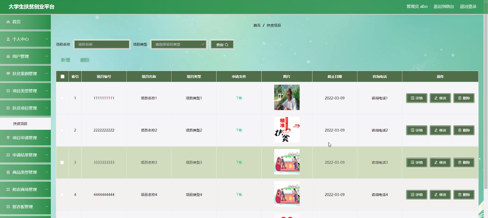

****本项目包含程序+源码+数据库+LW+调试部署环境，文末可获取一份本项目的java源码和数据库参考。****

## ******开题报告******

研究背景：
随着我国经济的快速发展，贫困问题逐渐凸显出来。尽管政府采取了一系列扶贫政策和措施，但是由于资源分配不均、信息不对称等问题，仍然存在一定程度的贫困现象。特别是在大学生群体中，由于缺乏创业经验和资源，他们面临着更大的就业压力和创业困难。因此，建立一个大学生扶贫创业平台具有重要的现实意义。

研究意义：
大学生扶贫创业平台的建立可以为大学生提供一个创业的机会和平台，帮助他们实现自身价值的同时，也能够促进贫困地区的经济发展和脱贫致富。通过这个平台，大学生可以获取到相关的扶贫案例和项目类型，了解到各种扶贫项目，并且可以申请参与其中。同时，该平台还提供了商品类型和助农商场等功能，使得大学生创业者能够将自己的产品推广到市场上，从而实现双赢的局面。

研究目的：
本研究旨在通过建立大学生扶贫创业平台，为大学生提供一个全面的创业支持系统，帮助他们更好地了解和参与到扶贫项目中。具体目的包括：提供扶贫案例和项目类型的信息，方便大学生了解和选择适合自己的创业项目；提供项目申请和申请结果的功能，使得大学生能够更加便捷地参与到扶贫项目中；提供商品类型和助农商场等功能，促进大学生创业者的产品推广和销售。

研究内容： 本研究的主要内容包括以下系统功能：

  1. 用户管理：建立用户注册、登录和个人信息管理等功能，确保平台的安全性和用户的个性化体验。
  2. 扶贫案例：收集和整理各种扶贫案例，为大学生提供参考和借鉴。
  3. 项目类型：分类整理各类扶贫项目，方便大学生选择适合自己的创业项目。
  4. 扶贫项目：提供扶贫项目的详细信息，包括项目介绍、资金需求、合作方式等，方便大学生了解和参与其中。
  5. 项目申请：建立项目申请流程，使得大学生能够便捷地提交申请材料。
  6. 申请结果：及时反馈项目申请的结果，方便大学生了解自己的申请进展。
  7. 商品类型：提供各类商品的分类和展示功能，方便大学生创业者推广自己的产品。
  8. 助农商场：建立一个线上销售平台，促进大学生创业者的产品销售。

拟解决的主要问题： 通过建立大学生扶贫创业平台，我们希望解决以下问题：

  1. 大学生创业资源匮乏的问题，为他们提供一个全面的创业支持系统。
  2. 贫困地区经济发展缓慢的问题，通过引入大学生创业者的力量，促进当地经济的发展。
  3. 扶贫项目信息不对称的问题，使得大学生能够更加了解和参与到扶贫项目中。
  4. 大学生创业产品推广困难的问题，通过助农商场等功能，帮助他们将产品推广到市场上。

进度安排：

2022年9月至10月：开题报告编写和提交，完成开题报告的撰写并提交给指导教师进行审核。

2022年11月至2023年1月：系统设计和开发，根据开题报告的要求，进行系统设计和编码工作。

2023年2月至3月：论文撰写和初稿完成，开始撰写论文，并在这个阶段完成论文的初稿。

2023年4月至5月：论文修改和最终定稿，根据指导教师的意见对论文进行修改，并完成最终的定稿。

2023年5月：论文答辩和提交，参加论文答辩并根据答辩结果进行修改，最后将论文提交给学院或学校。

参考文献：

[1]喻佳,吴丹新.基于SpringBoot的Web快速开发框架[J].电脑编程技巧与维护,2021,(09):31-33.

[2]李鹏.基于SpringBoot快速开发平台的实现[J].电子技术与软件工程,2021,(12):36-37.

[3]叶开平,蔡维晟,陈家敏,邓斯妮.基于SpringBoot的综测可视化管理系统的研究与设计[J].电脑知识与技术,2021,(12):100-104.

[4]江健锋,徐振平.Springboot最小系统的设计与实现[J].电脑知识与技术,2021,(04):62-63.

[5]赵炯,司圣杰,周奇才,熊肖磊.通用信息获取系统设计与实现[J].起重运输机械,2020,(16):89-97.

[6]吴英宾.一种内外网数据交互系统的设计与实现[J].软件工程,2020,(08):25-27.

****以上是本项目程序开发之前开题报告内容，最终成品以下面界面为准，大家可以酌情参考使用。要源码参考请在文末进行获取！！****

## ******本项目的界面展示******

