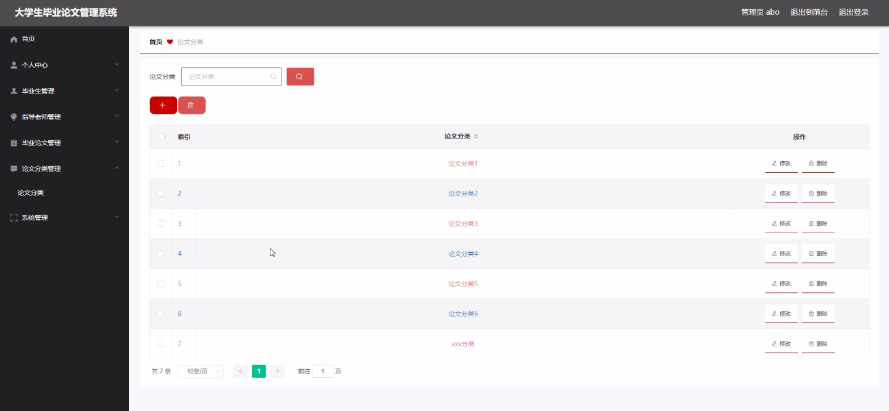

****本项目包含程序+源码+数据库+LW+调试部署环境，文末可获取一份本项目的java源码和数据库参考。****

## ******开题报告******

研究背景、意义和目的：
在当今高等教育中，大学生毕业论文是评价学生综合能力和专业水平的重要标准之一。然而，传统的毕业论文管理方式存在诸多问题，如信息不透明、流程繁琐、效率低下等。因此，设计一个高效的大学生毕业论文管理系统具有重要的现实意义。

该系统旨在解决传统管理方式所面临的问题，提供便捷、高效的论文管理服务。通过引入现代化的信息技术手段，该系统将实现毕业生、指导老师、毕业论文以及论文分类等功能的集成与优化，为学生和教师提供更好的支持和服务。

研究内容： 本研究将围绕大学生毕业论文管理系统的功能展开研究，主要包括以下内容：

  1. 毕业生功能：设计并实现毕业生信息录入、选题申报、进度管理等功能，使毕业生能够方便地提交论文相关信息，并实时了解自己的论文进展情况。

  2. 指导老师功能：建立指导老师信息库，实现指导老师与毕业生的匹配，提供在线指导和评审功能，促进指导老师与学生之间的有效沟通与互动。

  3. 毕业论文功能：建立毕业论文库，实现论文的存储、检索和管理，为学生提供参考资料，并方便教师进行评审和查阅。

  4. 论文分类功能：设计并实现论文分类体系，将论文按照学科、题材等进行分类，方便学生和教师进行查找和筛选。

预期成果： 通过本研究，预期实现以下成果：

  1. 提高大学生毕业论文管理的效率和质量，减少信息不对称和流程繁琐等问题，提升管理水平和服务质量。

  2. 优化学生和教师之间的交流与互动，加强指导过程中的沟通与反馈，提升指导质量和学术水平。

  3. 建立完善的毕业论文库和分类体系，为学生提供更多的学术资源和参考资料，提升学术研究能力。

  4. 推动高校毕业论文管理模式的创新和改革，为高等教育质量提升做出积极贡献。

进度安排：

2022年9月至10月：开题报告编写和提交，完成开题报告的撰写并提交给指导教师进行审核。

2022年11月至2023年1月：系统设计和开发，根据开题报告的要求，进行系统设计和编码工作。

2023年2月至3月：论文撰写和初稿完成，开始撰写论文，并在这个阶段完成论文的初稿。

2023年4月至5月：论文修改和最终定稿，根据指导教师的意见对论文进行修改，并完成最终的定稿。

2023年5月：论文答辩和提交，参加论文答辩并根据答辩结果进行修改，最后将论文提交给学院或学校。

参考文献：

[1]喻佳,吴丹新.基于SpringBoot的Web快速开发框架[J].电脑编程技巧与维护,2021,(09):31-33.

[2]李鹏.基于SpringBoot快速开发平台的实现[J].电子技术与软件工程,2021,(12):36-37.

[3]叶开平,蔡维晟,陈家敏,邓斯妮.基于SpringBoot的综测可视化管理系统的研究与设计[J].电脑知识与技术,2021,(12):100-104.

[4]江健锋,徐振平.Springboot最小系统的设计与实现[J].电脑知识与技术,2021,(04):62-63.

[5]赵炯,司圣杰,周奇才,熊肖磊.通用信息获取系统设计与实现[J].起重运输机械,2020,(16):89-97.

[6]吴英宾.一种内外网数据交互系统的设计与实现[J].软件工程,2020,(08):25-27.

****以上是本项目程序开发之前开题报告内容，最终成品以下面界面为准，大家可以酌情参考使用。要源码参考请在文末进行获取！！****

## ******本项目的界面展示******

