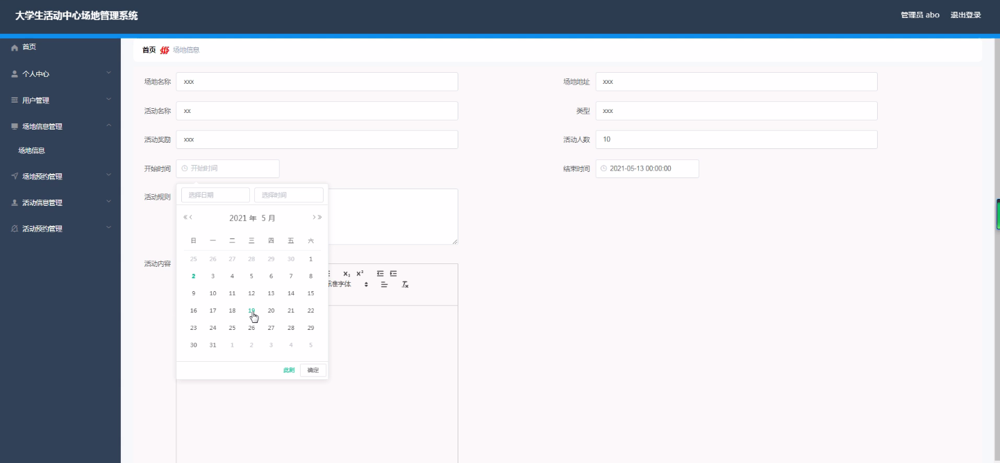

****本项目包含程序+源码+数据库+LW+调试部署环境，文末可获取一份本项目的java源码和数据库参考。****

## ******开题报告******

研究背景：
随着大学生活动的日益丰富多样，校园内各类活动频繁开展，对于场地资源的需求也越来越大。然而，传统的场地管理方式往往存在一些问题，如信息不透明、预约流程繁琐等，给学生和组织方带来了不便。因此，开发一个高效的大学生活动中心场地管理系统具有重要的现实意义。

研究意义：
该系统的开发将为大学生活动提供更加便捷、高效的场地管理服务，有助于提升学生参与活动的积极性和满意度。同时，通过对场地资源的合理规划和利用，可以最大程度地满足学生和组织方的需求，提高场地利用率，优化校园资源配置，进一步促进学校活动的多样化发展。

研究目的：
本研究旨在设计和开发一套大学生活动中心场地管理系统，通过引入信息技术手段，实现对场地资源的全面管理和优化利用。具体目标包括提供用户注册和登录功能、场地信息的录入和查询、场地预约和取消预约、活动信息的发布和查询、活动预约和取消预约等功能，以满足学生和组织方对场地资源的需求。

研究内容：
本研究的主要内容包括以下系统功能：用户管理模块，用于注册、登录和个人信息管理；场地信息管理模块，用于录入和查询各个场地的基本信息；场地预约管理模块，用于学生和组织方进行场地预约和取消预约操作；活动信息管理模块，用于发布和查询校园内各类活动的相关信息；活动预约管理模块，用于学生和组织方进行活动预约和取消预约操作。

拟解决的主要问题：
通过该系统的开发，将解决传统场地管理方式存在的一些问题，如信息不透明、预约流程繁琐等。系统将提供便捷的用户注册和登录功能，实现场地信息的全面录入和查询，简化场地预约和取消预约的操作流程，方便学生和组织方进行活动信息的发布和查询，以及活动预约和取消预约的操作。

研究方案和预期成果：
本研究将采用软件工程的开发方法，结合数据库技术和Web开发技术，设计和实现大学生活动中心场地管理系统。预期成果包括一个功能完善、界面友好、操作简便的系统，能够满足学生和组织方对场地资源管理的需求。通过该系统的应用，预期能够提高场地利用率，优化校园资源配置，促进学校活动的多样化发展

进度安排：

2022年9月至10月：需求分析和规划，明确系统功能和目标，制定项目计划。

2022年11月至2023年1月：系统设计和编码，完成详细的系统设计并开始编写代码。

2023年2月至3月：用户界面开发和数据库开发，开发用户友好的界面和设计数据库结构。

2023年4月至5月：功能测试、文档编写和上线部署，对系统进行全面的功能测试并编写用户手册。

2023年5月：维护和升级，定期对系统进行维护和升级，修复bug和添加新功能。

参考文献：

[1]邱小群,邓丽艳,陈海潮.基于B/S的信息管理系统设计和实现[J].信息与电脑(理论版),2022,(20):146-148.

[2]谢霜.基于Java技术的网络管理体系结构的应用[J].网络安全技术与应用,2022,(10):14-15.

[3]宋锦华.高职院校Java程序设计课程改革研究[J].科技视界,2022,(20):133-135.

[4]曹嵩彭,王鹏宇.浅析Java语言在软件开发中的应用[J].信息记录材料,2022,(03):114-116.

[5]朱澈,余俊达.武汉东湖学院.基于Java的软硬件信息管理系统V1.0[Z].项目立项编号.鉴定单位.鉴定日期:

****以上是本项目程序开发之前开题报告内容，最终成品以下面界面为准，大家可以酌情参考使用。要源码参考请在文末进行获取！！****

## ******本项目的界面展示******

