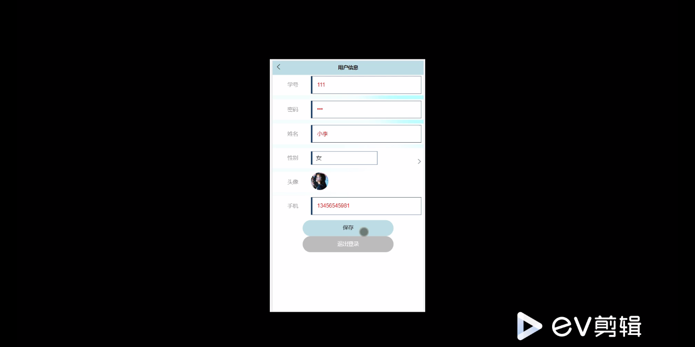
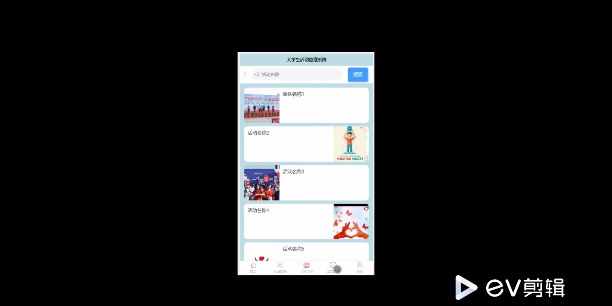
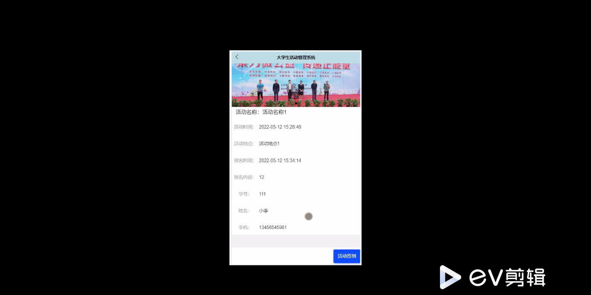
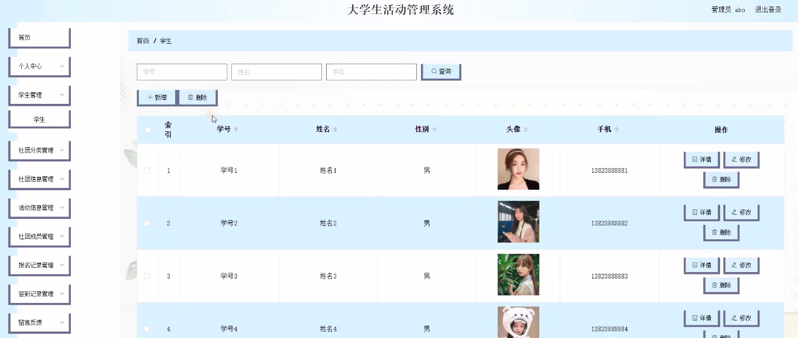
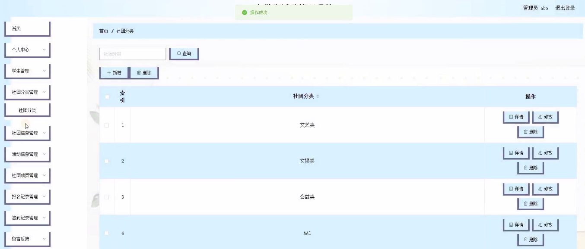
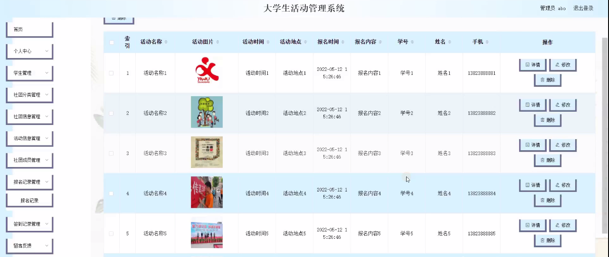
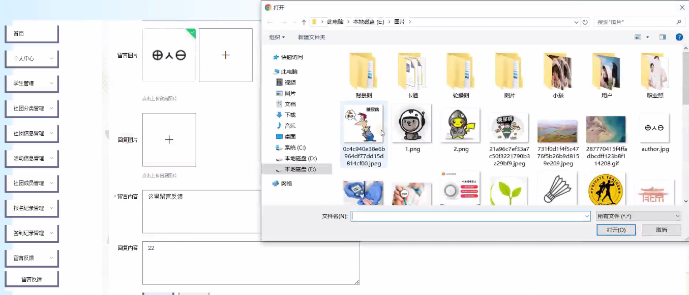

****本项目包含程序+源码+数据库+LW+调试部署环境，文末可获取一份本项目的java源码和数据库参考。****

## ******开题报告******

研究背景：
随着大学生活动的日益丰富多样，传统的手工管理方式已经无法满足高效、便捷的管理需求。因此，开发一款适用于大学生活动管理的系统势在必行。该系统将通过整合学生、社团分类、社团信息、活动信息、社团成员、报名记录、签到记录等功能，实现对大学生活动的全面管理和优化。

研究意义：
大学生活动是培养学生综合素质和创新能力的重要途径，也是促进学生交流与合作的平台。然而，目前大学生活动管理存在诸多问题，如信息不透明、流程繁琐、效率低下等。因此，开发一款高效、智能的大学生活动管理系统具有重要的现实意义和应用价值。

研究目的：
本研究旨在设计和开发一款基于大数据和人工智能技术的大学生活动管理系统，以提升大学生活动管理的效率和质量。通过该系统，可以实现活动信息的快速发布、学生参与的便捷报名、签到记录的自动化管理等功能，从而提高大学生活动的组织和管理水平。

研究内容：
本研究的主要内容包括以下系统功能：学生管理模块、社团分类模块、社团信息模块、活动信息模块、社团成员模块、报名记录模块和签到记录模块。其中，学生管理模块用于对学生信息进行管理和维护；社团分类模块用于对不同类型的社团进行分类和管理；社团信息模块用于展示社团的基本信息和活动情况；活动信息模块用于发布和管理各类活动；社团成员模块用于管理社团成员的信息和权限；报名记录模块用于记录学生的报名情况；签到记录模块用于自动化管理学生的签到情况。

拟解决的主要问题： 通过开发该系统，将解决以下主要问题：

  1. 传统的手工管理方式效率低下，无法满足大规模活动的管理需求；
  2. 活动信息发布和参与报名流程繁琐，导致信息不透明和参与率低下；
  3. 社团成员管理和活动签到记录难以统一管理，容易出现数据丢失和混乱；
  4. 学生对于社团和活动的了解有限，缺乏便捷的查询和浏览渠道。

研究方案：
本研究将采用软件工程的开发方法，结合大数据和人工智能技术，设计和开发一款基于Web平台的大学生活动管理系统。通过需求分析、系统设计、编码实现和测试验证等步骤，逐步完成系统的开发和优化。同时，将充分考虑用户体验和界面友好性，提供简洁明了的操作界面和功能模块，以便用户能够轻松上手并高效地使用该系统。

预期成果： 本研究预期将开发出一款功能完善、性能稳定的大学生活动管理系统。该系统将具备以下特点和优势：

  1. 提供全面的活动管理功能，包括信息发布、报名管理、签到记录等；
  2. 实现学生、社团和活动信息的集中管理和快速查询；
  3. 支持多种用户角色和权限设置，保证信息安全和管理规范；
  4. 借助大数据和人工智能技术，提供个性化推荐和智能化管理功能；
  5. 提升大学生活动管理的效率和质量，促进学生交流与合作的平台。

进度安排：

2022年9月至10月：开题报告编写和提交，完成开题报告的撰写并提交给指导教师进行审核。

2022年11月至2023年1月：系统设计和开发，根据开题报告的要求，进行系统设计和编码工作。

2023年2月至3月：论文撰写和初稿完成，开始撰写论文，并在这个阶段完成论文的初稿。

2023年4月至5月：论文修改和最终定稿，根据指导教师的意见对论文进行修改，并完成最终的定稿。

2023年5月：论文答辩和提交，参加论文答辩并根据答辩结果进行修改，最后将论文提交给学院或学校。

参考文献：

[1]喻佳,吴丹新.基于SpringBoot的Web快速开发框架[J].电脑编程技巧与维护,2021,(09):31-33.

[2]李鹏.基于SpringBoot快速开发平台的实现[J].电子技术与软件工程,2021,(12):36-37.

[3]叶开平,蔡维晟,陈家敏,邓斯妮.基于SpringBoot的综测可视化管理系统的研究与设计[J].电脑知识与技术,2021,(12):100-104.

[4]江健锋,徐振平.Springboot最小系统的设计与实现[J].电脑知识与技术,2021,(04):62-63.

[5]赵炯,司圣杰,周奇才,熊肖磊.通用信息获取系统设计与实现[J].起重运输机械,2020,(16):89-97.

[6]吴英宾.一种内外网数据交互系统的设计与实现[J].软件工程,2020,(08):25-27.

****以上是本项目程序开发之前开题报告内容，最终成品以下面界面为准，大家可以酌情参考使用。要源码参考请在文末进行获取！！****

## ******本项目的界面展示******

