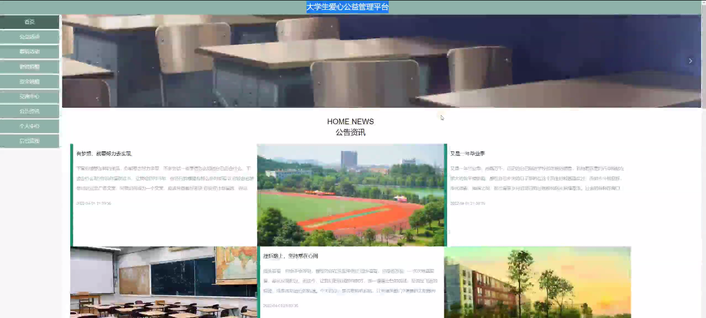
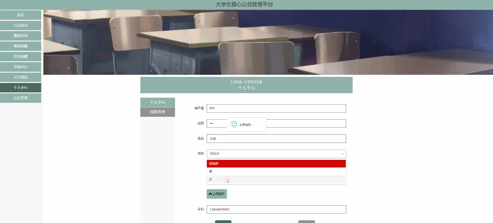
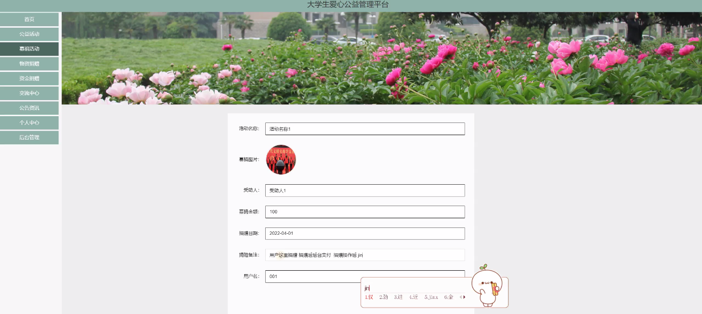
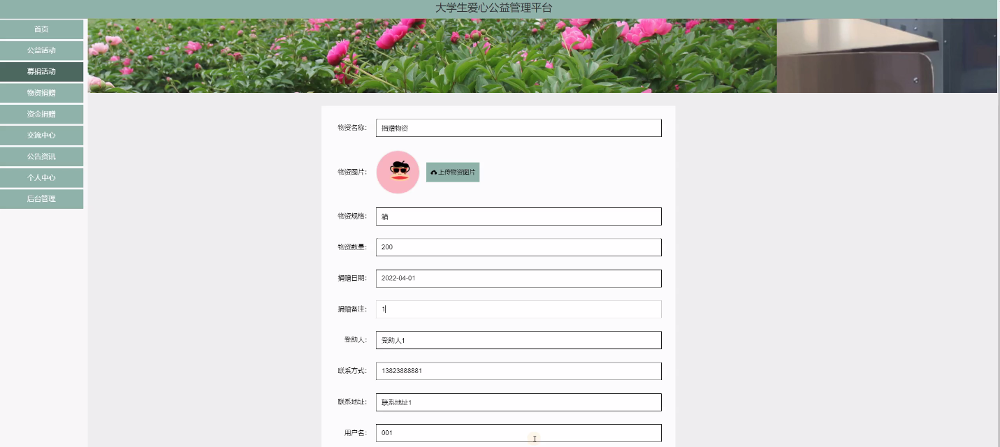
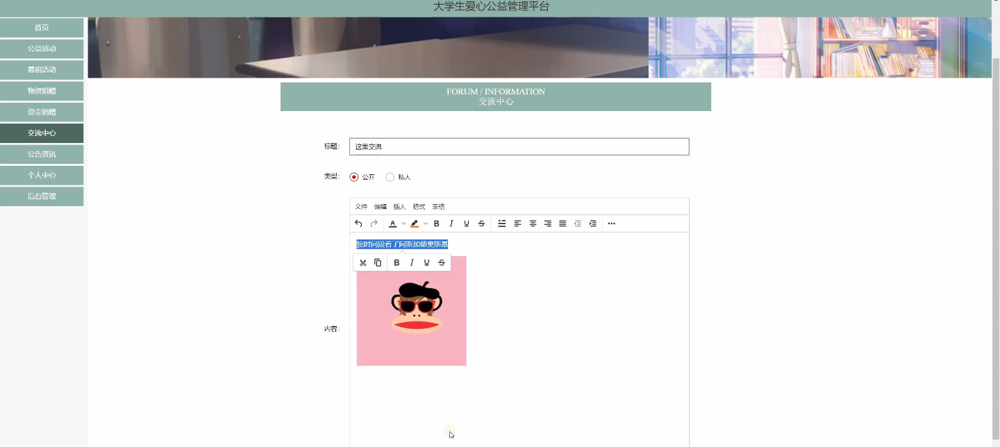
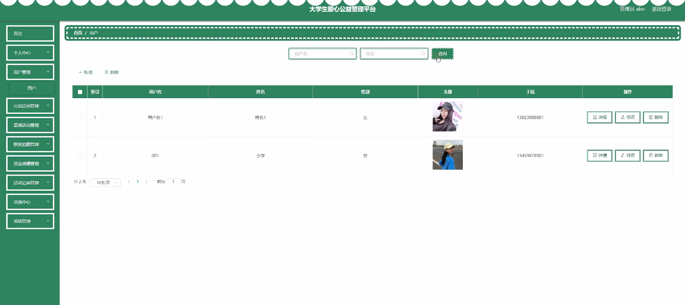
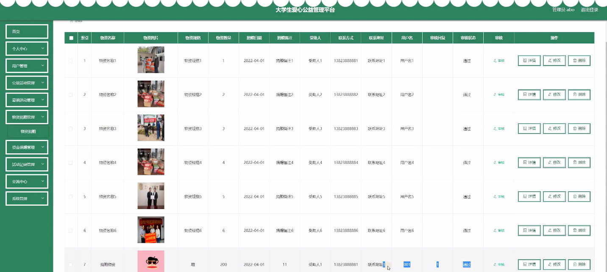
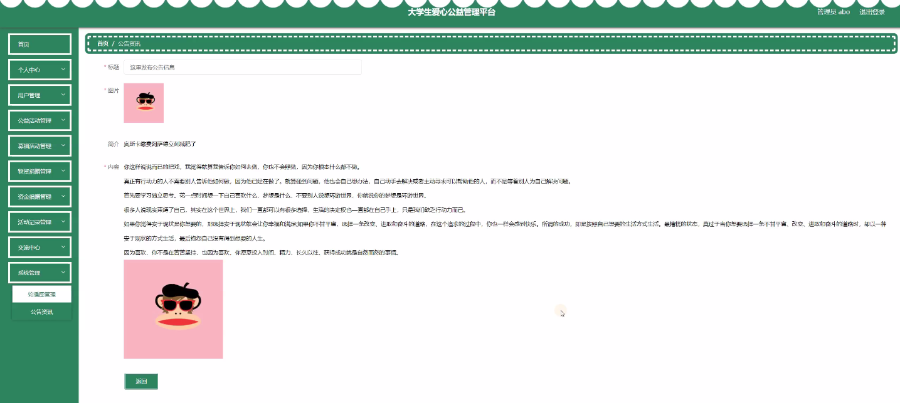

****本项目包含程序+源码+数据库+LW+调试部署环境，文末可获取一份本项目的java源码和数据库参考。****

## ******开题报告******

研究背景：
随着社会的发展和进步，大学生群体逐渐成为社会公益活动的积极参与者和推动者。然而，在当前的公益管理中存在一些问题，如信息不对称、资源分配不均等，这给大学生参与公益活动带来了一定的困扰。因此，建立一个专门针对大学生的爱心公益管理平台具有重要的现实意义。

研究意义：
该平台的建立旨在提供一个便捷、高效的管理工具，以促进大学生参与公益活动的积极性和主动性，同时也能更好地满足社会公益事业的需求。通过该平台，大学生可以更方便地获取公益活动的信息、参与志愿服务、进行募捐和物资捐赠等，从而更好地发挥自身的力量，为社会做出贡献。

研究目的：
本研究旨在探索和设计一种大学生爱心公益管理平台，通过整合各类公益资源和优化管理流程，提高大学生参与公益活动的便利性和参与度，同时提升公益活动的组织效率和社会影响力。

研究内容： 本研究的主要内容包括以下系统功能：

  1. 用户管理：建立用户注册、登录、个人信息管理等功能，实现用户身份验证和个性化服务。

  2. 公益活动管理：提供公益活动发布、报名、签到等功能，方便大学生了解和参与各类公益活动。

  3. 募捐活动管理：设立募捐项目发布、捐款记录、募捐进度展示等功能，方便大学生参与募捐活动并了解募捐情况。

  4. 物资捐赠管理：提供物资捐赠发布、领取、物资库存管理等功能，方便大学生进行物资捐赠和领取。

  5. 资金捐赠管理：建立资金捐赠渠道、捐款记录、资金使用透明等功能，确保资金捐赠的安全和有效使用。

  6. 活动记录管理：记录大学生参与公益活动的历史记录，为评价和奖励提供依据。

拟解决的主要问题：
通过该平台，我们希望解决以下问题：信息不对称导致大学生无法及时获取公益活动信息；资源分配不均导致公益活动参与度低下；募捐和物资捐赠流程繁琐、不透明等问题。

研究方案和预期成果：
我们将采用用户需求调研、系统设计与开发、功能测试等方法，设计并实现一个符合大学生需求的爱心公益管理平台。预期成果包括：提高大学生参与公益活动的积极性和主动性；优化公益资源的分配和利用效率；提升公益活动的组织效率和社会影响力。通过该平台的建立，我们期望能够激发更多大学生的公益意识，推动社会公益事业的可持续发展。

进度安排：

2022年9月至10月：需求分析和规划，明确系统功能和目标，制定项目计划。

2022年11月至2023年1月：系统设计和编码，完成详细的系统设计并开始编写代码。

2023年2月至3月：用户界面开发和数据库开发，开发用户友好的界面和设计数据库结构。

2023年4月至5月：功能测试、文档编写和上线部署，对系统进行全面的功能测试并编写用户手册。

2023年5月：维护和升级，定期对系统进行维护和升级，修复bug和添加新功能。

参考文献：

[1]邱小群,邓丽艳,陈海潮.基于B/S的信息管理系统设计和实现[J].信息与电脑(理论版),2022,(20):146-148.

[2]谢霜.基于Java技术的网络管理体系结构的应用[J].网络安全技术与应用,2022,(10):14-15.

[3]宋锦华.高职院校Java程序设计课程改革研究[J].科技视界,2022,(20):133-135.

[4]曹嵩彭,王鹏宇.浅析Java语言在软件开发中的应用[J].信息记录材料,2022,(03):114-116.

[5]朱澈,余俊达.武汉东湖学院.基于Java的软硬件信息管理系统V1.0[Z].项目立项编号.鉴定单位.鉴定日期:

****以上是本项目程序开发之前开题报告内容，最终成品以下面界面为准，大家可以酌情参考使用。要源码参考请在文末进行获取！！****

## ******本项目的界面展示******

