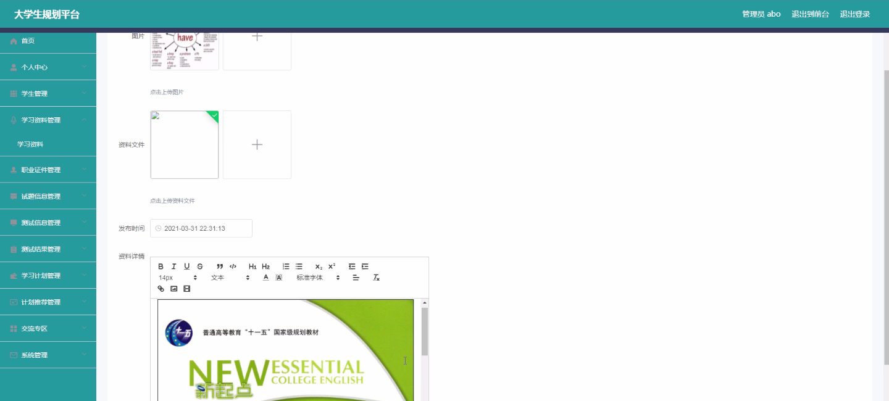
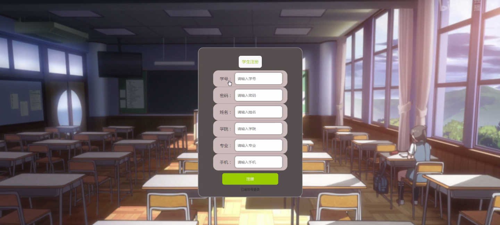
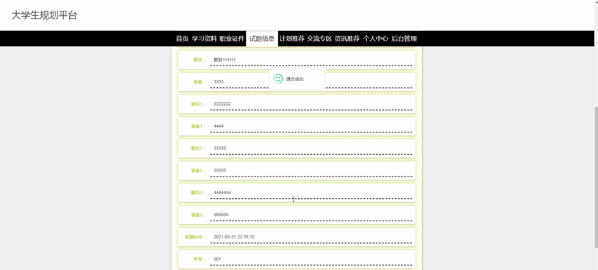
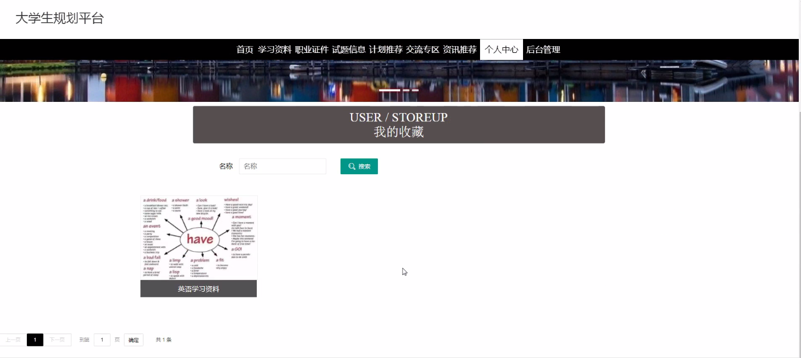
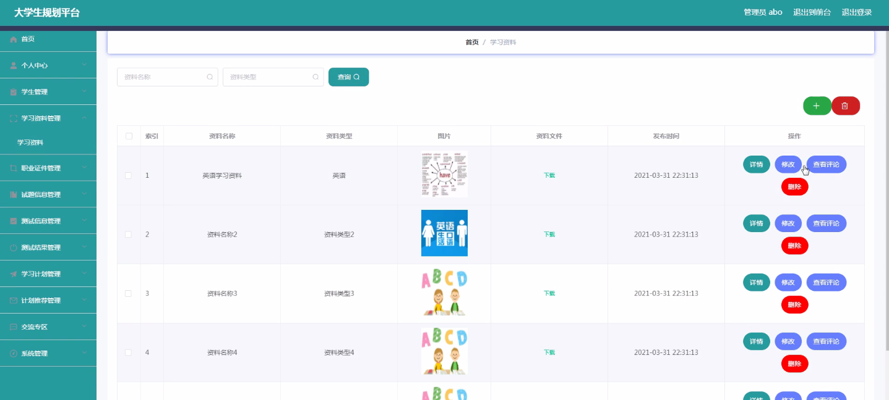

****本项目包含程序+源码+数据库+LW+调试部署环境，文末可获取一份本项目的java源码和数据库参考。****

## ******开题报告******

研究背景：
随着社会的发展和教育水平的提高，大学生群体日益庞大。然而，当前大学生在规划自己的未来方向、选择适合自己的职业道路时面临着诸多困惑和挑战。因此，建立一个专门为大学生提供规划指导和资源支持的平台显得尤为重要。

研究意义：
大学生规划平台的建立对于促进大学生个人成长和职业发展具有重要意义。通过该平台，大学生可以获取到全面的学习资料、职业证件信息、试题信息等，同时还能够制定个性化的学习计划并获得推荐，从而更好地规划自己的学习和职业发展道路。

研究目的：
本研究旨在设计和开发一种大学生规划平台，以满足大学生在学习和职业规划方面的需求。通过该平台，大学生可以便捷地获取相关信息和资源，并根据自身情况进行个性化的规划和决策，从而提升自己的学习效果和职业竞争力。

研究内容：
本研究的主要内容是基于系统功能设计一个大学生规划平台。根据系统功能，该平台将包括以下模块：学生信息管理模块、学习资料管理模块、职业证件管理模块、试题信息管理模块、测试信息管理模块、测试结果管理模块、学习计划管理模块和计划推荐模块。

拟解决的主要问题：

  1. 如何实现学生信息的全面管理和个性化展示？
  2. 如何提供丰富多样的学习资料，并确保其准确性和可靠性？
  3. 如何管理和更新职业证件信息，以满足大学生对职业认证的需求？
  4. 如何收集和整理试题信息，并提供给大学生进行练习和测试？
  5. 如何分析和展示测试结果，帮助大学生评估自己的学习情况和水平？

研究方案：
本研究将采用软件开发的方法，结合用户需求调研和系统功能设计，设计并开发一个大学生规划平台。通过前期的需求分析和系统设计，确定各个模块的功能和交互方式，并进行系统开发和测试。最后，通过用户反馈和评估，不断优化和改进平台的功能和用户体验。

预期成果：
通过本研究，预期可以开发出一款功能完善、易于使用的大学生规划平台。该平台将为大学生提供全面的学习和职业规划支持，帮助他们更好地制定个人发展计划、获取相关资源，并提升自己的学习效果和职业竞争力。

进度安排：

2022年9月至10月：需求分析和规划，进行用户需求调研和分析，确定系统功能和目标。

2022年11月至2023年1月：系统设计和开发，完成系统架构设计和技术选型，并开始编写代码。

2023年2月至3月：测试和优化，进行单元测试和集成测试，修复问题并优化系统性能。

2023年4月至5月：文档编写和培训，编写用户手册和系统文档，并进行相关人员的培训。

2023年5月：上线部署和维护，将系统部署到生产环境中，并定期进行维护和升级。

参考文献：

[1]王振华.SpringBoot在教学效果评估系统中的应用[J].电子技术,2023,(05):67-69.

[2]王明泉.基于SpringBoot远程热部署的探索和应用[J].信息与电脑(理论版),2023,(07):1-4.

[3]王亚东,李晓霞,陈强强,剡美娜.基于SpringBoot的需求发布平台设计[J].信息与电脑(理论版),2023,(01):105-107.

[4]陈新府豪.基于SpringBoot和Vue框架的创新方法推理系统的设计与实现[D].导师：黄静.浙江理工大学,2022.

[5]霍福华,韩慧.基于SpringBoot微服务架构下前后端分离的MVVM模型[J].电子技术与软件工程,2022,(01):73-76.

[6]韩策,张娜,王松亭,张凯,何方,袁峰.SpringBoot OPC客户端设计与研究[J].电子世界,2021,(19):25-26.

****以上是本项目程序开发之前开题报告内容，最终成品以下面界面为准，大家可以酌情参考使用。要源码参考请在文末进行获取！！****

## ******本项目的界面展示******

