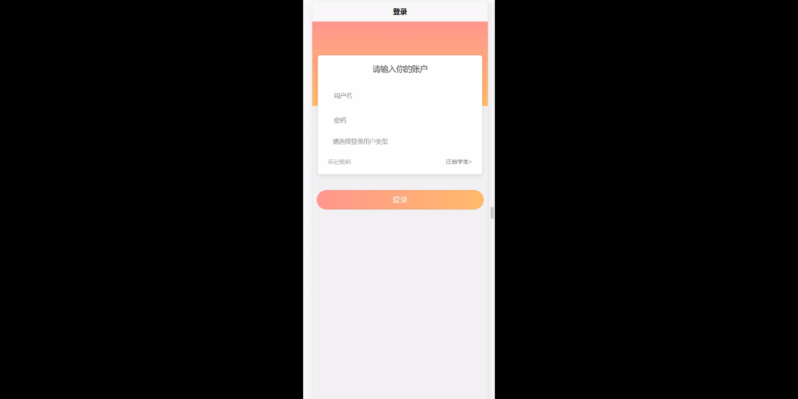
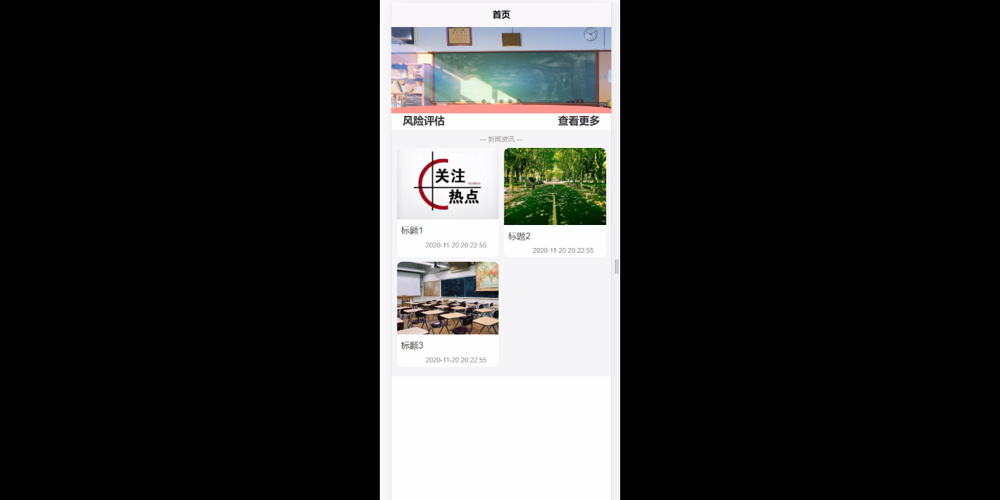
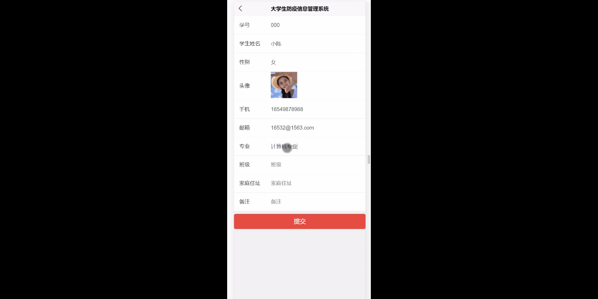
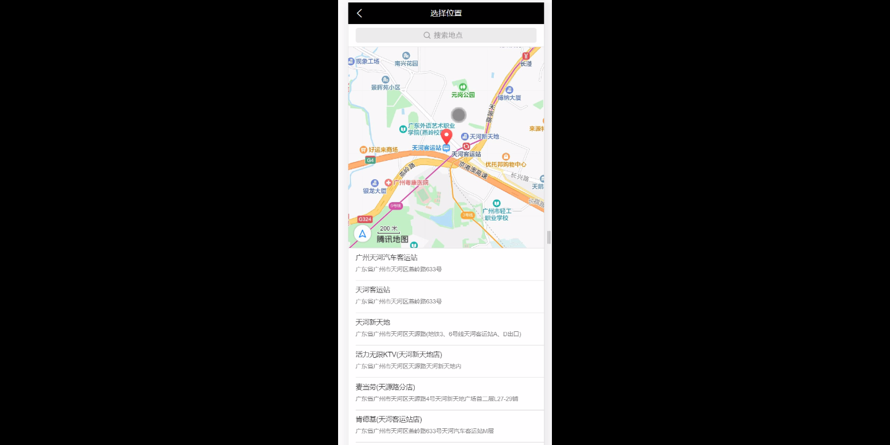
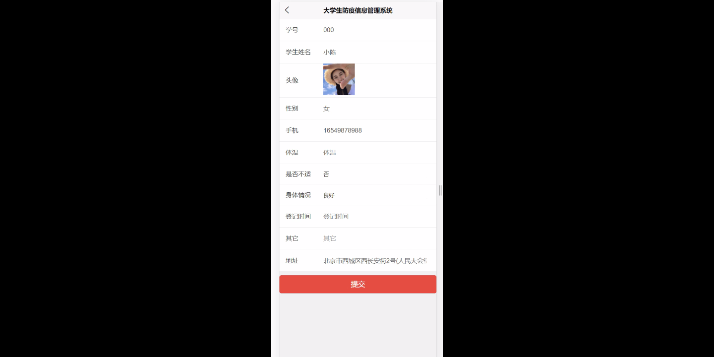
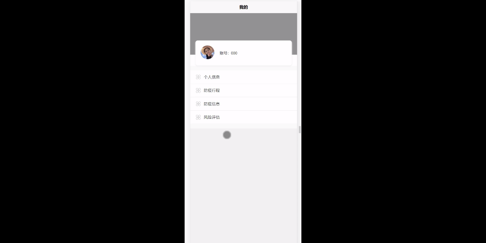
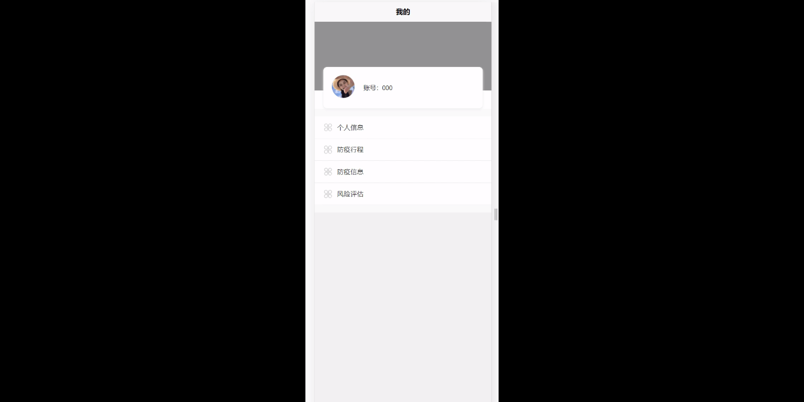

****本项目包含程序+源码+数据库+LW+调试部署环境，文末可获取一份本项目的java源码和数据库参考。****

## ******开题报告******

研究背景：
随着新冠疫情的全球爆发，大学校园成为了防控疫情的重点区域。为了有效管理和监测大学生的防疫信息，许多高校纷纷推出了大学生防疫信息管理系统。这一系统通过整合学生、教师、个人信息、防疫行程、防疫信息以及风险评估等功能，旨在提供一个集中管理和实时监测的平台，以确保校园内的疫情防控工作能够高效有序地进行。

研究意义：
大学生防疫信息管理系统的建立对于加强校园疫情防控具有重要意义。首先，它可以提高疫情信息的准确性和时效性，帮助学校及时掌握学生的健康状况和行动轨迹，从而及时采取相应的防控措施。其次，该系统可以提供数据支持，为学校制定科学合理的防疫策略提供依据。此外，通过系统的使用，可以提高学生和教职工的防疫意识，增强他们的主动参与和责任感，形成全员参与的防疫合力。

研究目的：
本研究旨在探索大学生防疫信息管理系统的设计与实施，以提高校园疫情防控工作的效率和精确度。具体目标包括：1.构建一个集中管理和实时监测的大学生防疫信息管理系统；2.优化系统功能，提高数据采集和处理的准确性和时效性；3.加强用户培训和宣传，提高系统的使用率和参与度；4.评估系统的实际应用效果，为进一步完善和推广提供经验和建议。

研究内容： 本研究将围绕大学生防疫信息管理系统的功能展开，主要包括以下内容：

  1. 学生信息管理：包括学生基本信息、健康状况、行程轨迹等信息的录入、更新和查询。
  2. 教师信息管理：包括教师基本信息、健康状况等信息的录入、更新和查询。
  3. 个人信息管理：包括个人基本信息、健康状况等信息的录入、更新和查询。
  4. 防疫行程管理：记录学生和教职工的出行轨迹，实时监测可能的风险区域和接触人员。
  5. 防疫信息管理：包括疫情通报、防控政策、健康宣教等信息的发布和传达。
  6. 风险评估：根据学生和教职工的健康状况和行程轨迹，进行风险评估和预警。

拟解决的主要问题：

  1. 如何确保系统数据的准确性和时效性？
  2. 如何提高学生和教职工的参与度和使用率？
  3. 如何保护个人隐私和信息安全？
  4. 如何有效整合和利用系统数据，为疫情防控决策提供支持？
  5. 如何评估系统的实际应用效果和社会影响？

研究方案和预期成果：
本研究将采用文献研究、案例分析、问卷调查等方法，结合实际情况，设计并实施大学生防疫信息管理系统。预期成果包括：1.建立一个功能完善、操作简便的系统；2.提出相应的数据采集和处理方法，确保数据的准确性和时效性；3.制定用户培训和宣传计划，提高系统的使用率和参与度；4.评估系统的实际应用效果，为进一步完善和推广提供经验和建议。通过这些成果，期望能够为大学校园疫情防控工作提供有力支持，保障师生的健康安全。

进度安排：

2022年9月至10月：需求分析和规划，明确系统功能和目标，制定项目计划。

2022年11月至2023年1月：系统设计和编码，完成详细的系统设计并开始编写代码。

2023年2月至3月：用户界面开发和数据库开发，开发用户友好的界面和设计数据库结构。

2023年4月至5月：功能测试、文档编写和上线部署，对系统进行全面的功能测试并编写用户手册。

2023年5月：维护和升级，定期对系统进行维护和升级，修复bug和添加新功能。

参考文献：

[1]邱小群,邓丽艳,陈海潮.基于B/S的信息管理系统设计和实现[J].信息与电脑(理论版),2022,(20):146-148.

[2]谢霜.基于Java技术的网络管理体系结构的应用[J].网络安全技术与应用,2022,(10):14-15.

[3]宋锦华.高职院校Java程序设计课程改革研究[J].科技视界,2022,(20):133-135.

[4]曹嵩彭,王鹏宇.浅析Java语言在软件开发中的应用[J].信息记录材料,2022,(03):114-116.

[5]朱澈,余俊达.武汉东湖学院.基于Java的软硬件信息管理系统V1.0[Z].项目立项编号.鉴定单位.鉴定日期:

****以上是本项目程序开发之前开题报告内容，最终成品以下面界面为准，大家可以酌情参考使用。要源码参考请在文末进行获取！！****

## ******本项目的界面展示******

