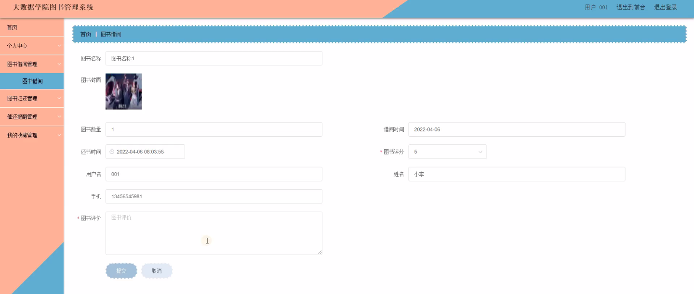

****本项目包含程序+源码+数据库+LW+调试部署环境，文末可获取一份本项目的java源码和数据库参考。****

## ******开题报告******

研究背景：
随着社会的不断发展和信息技术的快速进步，大数据技术在各个领域得到了广泛应用。图书管理系统作为大数据技术在教育领域的一种应用，对于高校图书馆的管理具有重要意义。传统的图书管理方式已经无法满足日益增长的图书馆资源和读者需求之间的平衡，因此，开发一个高效、智能的大数据学院图书管理系统势在必行。

研究意义：
大数据学院图书管理系统的建立将有效提升图书馆的管理效率和服务质量。通过利用大数据技术，系统可以实现对图书分类、图书信息、图书借阅、图书归还等功能的全面监控和自动化处理，从而减轻图书管理员的工作负担，提高工作效率。同时，该系统还可以为读者提供更加便捷的借阅和归还服务，提升用户体验，促进图书馆的数字化转型。

研究目的：
本研究旨在设计和开发一套基于大数据技术的学院图书管理系统，以解决传统图书管理方式存在的问题。通过引入大数据分析和智能算法，系统可以对图书馆资源进行有效管理和优化配置，提高图书利用率；同时，通过用户行为分析和个性化推荐等功能，系统可以提供更加精准的服务，满足读者的个性化需求。

研究内容：
本研究的主要内容包括以下系统功能：用户管理、图书分类管理、图书信息管理、图书借阅管理、图书归还管理和催还提醒管理。具体而言，用户管理功能包括用户注册、登录、权限管理等；图书分类管理功能包括图书分类的建立、修改和删除等；图书信息管理功能包括图书信息的录入、查询和更新等；图书借阅管理功能包括借阅记录的生成、查询和统计等；图书归还管理功能包括归还记录的处理和归档等；催还提醒管理功能包括逾期催还通知的发送和处理等。

拟解决的主要问题：
通过该系统的设计和开发，将解决传统图书管理方式存在的一系列问题，如人工操作繁琐、效率低下、数据管理不规范等。系统通过引入大数据技术和智能算法，实现对图书馆资源的全面监控和自动化处理，提高管理效率和服务质量，满足读者的个性化需求。

研究方案和预期成果：
本研究将采用软件工程的开发方法，结合大数据技术和智能算法，设计和开发一套高效、智能的大数据学院图书管理系统。通过系统的实施和应用，预期可以提升图书馆的管理效率和服务质量，减轻图书管理员的工作负担，提高读者的借阅体验。同时，系统还将为图书馆的数字化转型提供有力支持，推动图书馆的信息化建设。

进度安排：

2022年9月至10月：需求分析和规划，明确系统功能和目标，制定项目计划。

2022年11月至2023年1月：系统设计和编码，完成详细的系统设计并开始编写代码。

2023年2月至3月：用户界面开发和数据库开发，开发用户友好的界面和设计数据库结构。

2023年4月至5月：功能测试、文档编写和上线部署，对系统进行全面的功能测试并编写用户手册。

2023年5月：维护和升级，定期对系统进行维护和升级，修复bug和添加新功能。

参考文献：

[1]邱小群,邓丽艳,陈海潮.基于B/S的信息管理系统设计和实现[J].信息与电脑(理论版),2022,(20):146-148.

[2]谢霜.基于Java技术的网络管理体系结构的应用[J].网络安全技术与应用,2022,(10):14-15.

[3]宋锦华.高职院校Java程序设计课程改革研究[J].科技视界,2022,(20):133-135.

[4]曹嵩彭,王鹏宇.浅析Java语言在软件开发中的应用[J].信息记录材料,2022,(03):114-116.

[5]朱澈,余俊达.武汉东湖学院.基于Java的软硬件信息管理系统V1.0[Z].项目立项编号.鉴定单位.鉴定日期:

****以上是本项目程序开发之前开题报告内容，最终成品以下面界面为准，大家可以酌情参考使用。要源码参考请在文末进行获取！！****

## ******本项目的界面展示******

