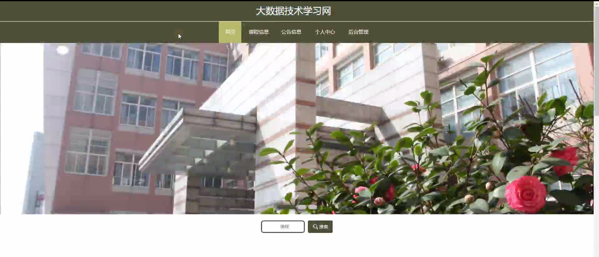
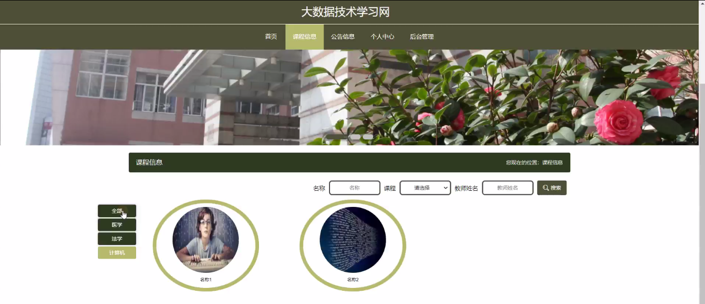
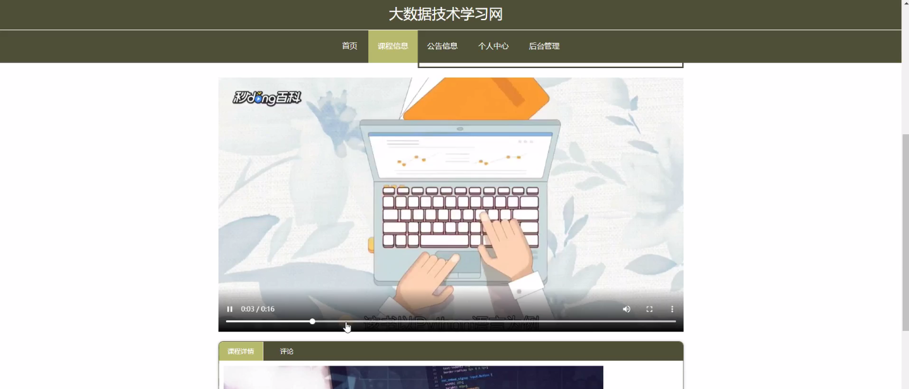
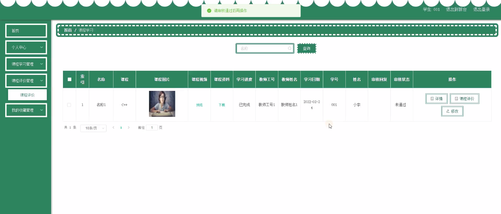
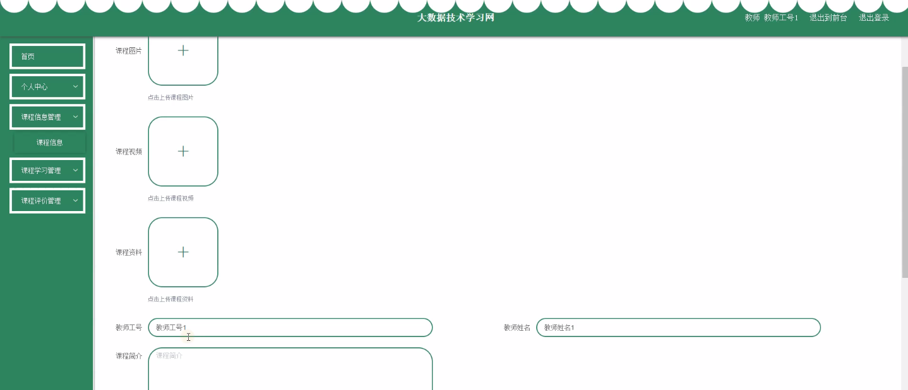
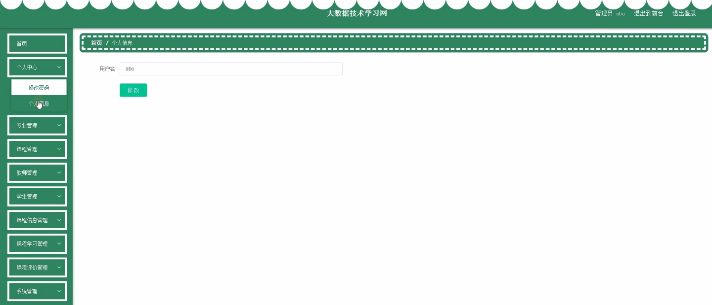
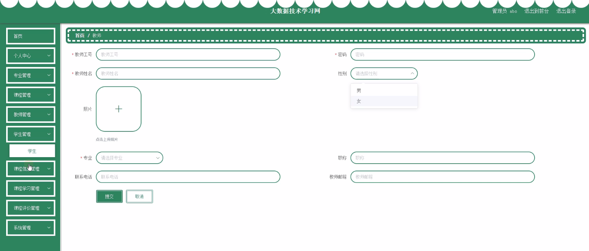
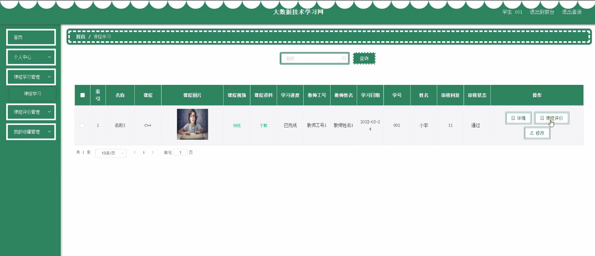

****本项目包含程序+源码+数据库+LW+调试部署环境，文末可获取一份本项目的java源码和数据库参考。****

## ******开题报告******

研究背景：
随着信息技术的快速发展和互联网的普及，大数据技术在各个领域中得到了广泛应用。大数据技术以其强大的数据处理能力和深度分析能力，为企业、政府和学术界带来了巨大的机遇和挑战。在教育领域，大数据技术也逐渐引起了人们的关注。通过对教育系统中的各种数据进行收集、整理和分析，可以帮助学校和教育机构更好地了解学生的学习情况和需求，提供个性化的教育服务，优化教学过程，提高教学质量。

研究意义：
大数据技术在教育领域的应用具有重要的意义。首先，通过对学生的学习数据进行分析，可以更好地了解学生的学习习惯、学习进度和学习困难，从而为学生提供个性化的学习指导和资源推荐，提高学生的学习效果。其次，通过对教师的教学数据进行分析，可以评估教师的教学水平和教学效果，为教师提供针对性的培训和支持，提高教师的教学能力。此外，通过对课程数据和课程评价数据进行分析，可以优化课程设置和教学内容，提高课程的质量和吸引力。

研究目的：
本研究旨在探索大数据技术在教育领域中的应用，以提高教育教学的效果和质量。具体目标包括：1.建立一个基于大数据技术的教育信息管理系统，实现对教育系统中各种数据的收集、整理和分析；2.通过对学生、教师和课程等数据的分析，提供个性化的学习指导和资源推荐，优化教学过程和课程设置；3.评估教师的教学水平和教学效果，为教师提供针对性的培训和支持；4.通过对课程评价数据的分析，改进课程的设计和教学内容，提高课程的质量和吸引力。

研究内容：
本研究的主要内容包括以下几个方面：1.专业信息管理：建立专业信息数据库，包括专业的课程设置、教师队伍、学生人数等信息，为教育管理部门提供决策支持；2.课程信息管理：建立课程信息数据库，包括课程的教学目标、教学内容、教材使用等信息，为教师和学生提供参考；3.教师信息管理：建立教师信息数据库，包括教师的个人信息、教学经验、教学评价等信息，为教师的职业发展和培训提供支持；4.学生信息管理：建立学生信息数据库，包括学生的个人信息、学习成绩、学习进度等信息，为学生的学习指导和个性化服务提供支持；5.课程学习管理：通过对学生的学习数据进行分析，提供个性化的学习指导和资源推荐，优化学生的学习过程；6.课程评价管理：通过对课程评价数据的分析，改进课程的设计和教学内容，提高课程的质量和吸引力。

拟解决的主要问题：
本研究拟解决的主要问题包括：1.如何有效地收集、整理和分析教育系统中的各种数据；2.如何通过大数据技术实现对学生的个性化学习指导和资源推荐；3.如何评估教师的教学水平和教学效果，并为教师提供针对性的培训和支持；4.如何通过对课程评价数据的分析，改进课程的设计和教学内容，提高课程的质量和吸引力。

研究方案和预期成果：
本研究将采用实证研究方法，通过建立教育信息管理系统，收集、整理和分析教育系统中的各种数据。预期成果包括：1.建立一个基于大数据技术的教育信息管理系统，实现对教育系统中各种数据的收集、整理和分析；2.提供个性化的学习指导和资源推荐，优化教学过程和课程设置；3.评估教师的教学水平和教学效果，为教师提供针对性的培训和支持；4.改进课程的设计和教学内容，提高课程的质量和吸引力。

进度安排：

2022年9月至10月：开题报告编写和提交，完成开题报告的撰写并提交给指导教师进行审核。

2022年11月至2023年1月：系统设计和开发，根据开题报告的要求，进行系统设计和编码工作。

2023年2月至3月：论文撰写和初稿完成，开始撰写论文，并在这个阶段完成论文的初稿。

2023年4月至5月：论文修改和最终定稿，根据指导教师的意见对论文进行修改，并完成最终的定稿。

2023年5月：论文答辩和提交，参加论文答辩并根据答辩结果进行修改，最后将论文提交给学院或学校。

参考文献：

[1]喻佳,吴丹新.基于SpringBoot的Web快速开发框架[J].电脑编程技巧与维护,2021,(09):31-33.

[2]李鹏.基于SpringBoot快速开发平台的实现[J].电子技术与软件工程,2021,(12):36-37.

[3]叶开平,蔡维晟,陈家敏,邓斯妮.基于SpringBoot的综测可视化管理系统的研究与设计[J].电脑知识与技术,2021,(12):100-104.

[4]江健锋,徐振平.Springboot最小系统的设计与实现[J].电脑知识与技术,2021,(04):62-63.

[5]赵炯,司圣杰,周奇才,熊肖磊.通用信息获取系统设计与实现[J].起重运输机械,2020,(16):89-97.

[6]吴英宾.一种内外网数据交互系统的设计与实现[J].软件工程,2020,(08):25-27.

****以上是本项目程序开发之前开题报告内容，最终成品以下面界面为准，大家可以酌情参考使用。要源码参考请在文末进行获取！！****

## ******本项目的界面展示******

