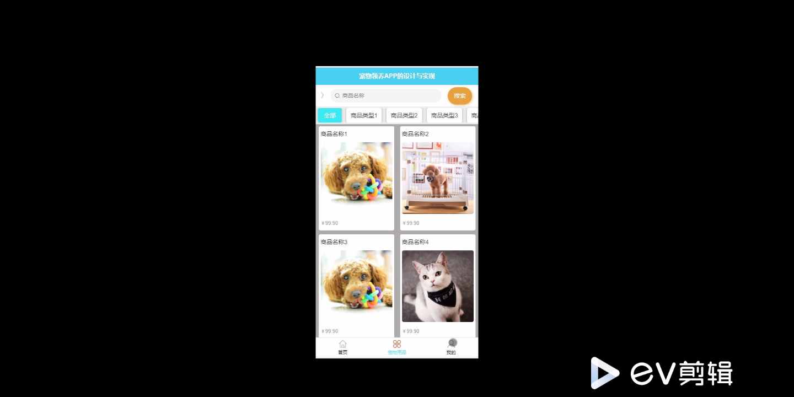
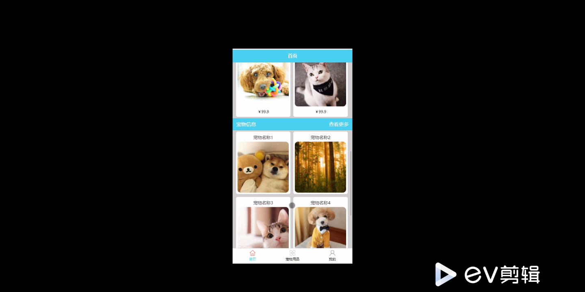
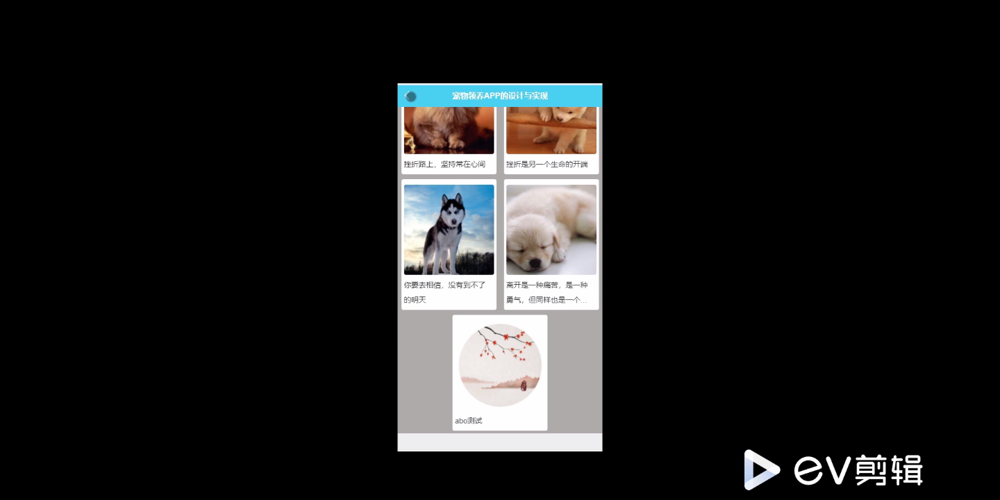
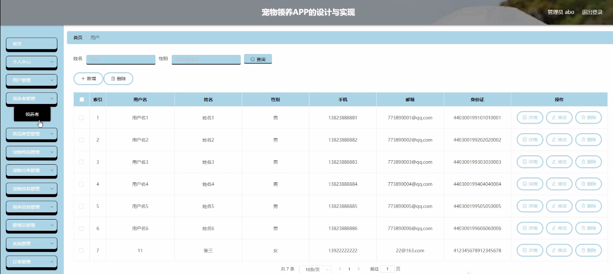
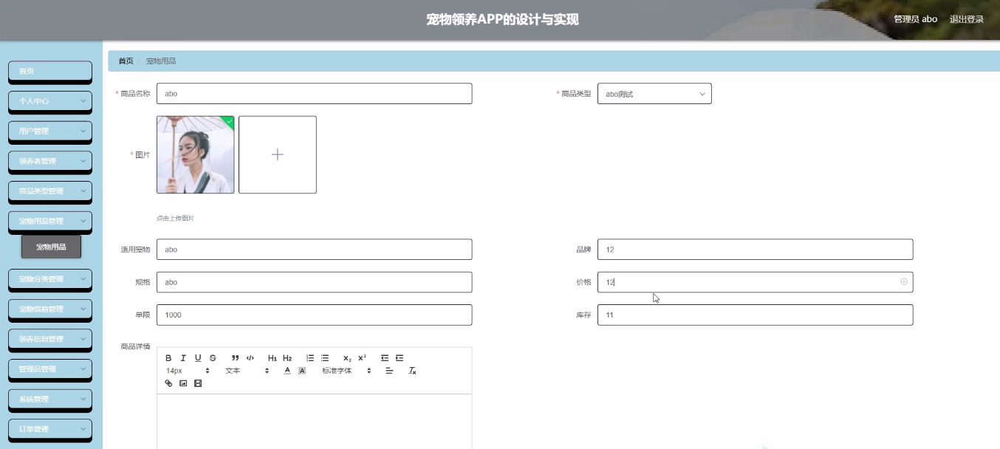

****本项目包含程序+源码+数据库+LW+调试部署环境，文末可获取一份本项目的java源码和数据库参考。****

## ******开题报告******

研究背景：
随着社会的发展和人们生活水平的提高，宠物在现代社会中扮演着越来越重要的角色。宠物不仅是人们的伴侣和家庭成员，还能给人们带来快乐、减轻压力，并且对于一些特殊群体（如老年人、残疾人等）来说，宠物更是他们生活中不可或缺的精神支持。然而，随之而来的问题也逐渐显现出来，比如宠物领养、宠物用品选择、宠物健康知识等方面的需求与供给之间存在着信息不对称的情况。

研究意义：
针对宠物领域的问题，建立一个全面、便捷、可靠的宠物信息平台具有重要的意义。这样的平台可以为用户提供宠物领养、宠物用品购买、宠物分类等方面的信息，帮助用户更好地了解宠物的需求和养护知识，同时也能够促进宠物市场的规范化和健康发展。

研究目的：
本研究旨在构建一个名为“宠物之家”的系统，通过整合用户、宠物用品、商品类型、领养者、宠物分类、宠物领养、领养信息、宠物知识等系统功能，为用户提供全方位的宠物相关信息和服务。具体目的包括但不限于：提供宠物领养平台，方便有意愿领养宠物的人群寻找合适的宠物；提供宠物用品购买平台，满足用户对宠物用品的需求；提供宠物分类和宠物健康知识，帮助用户更好地了解宠物的特点和养护方法。

研究内容： 本研究的主要内容是基于“宠物之家”系统的构建和功能实现。根据系统的功能需求，研究内容包括但不限于以下几个方面：

  1. 用户管理：设计用户注册、登录、个人信息管理等功能，确保用户能够方便地使用系统，并保障用户信息的安全性。

  2. 宠物用品管理：建立宠物用品的数据库，包括商品类型、价格、品牌等信息，并提供用户浏览、搜索、购买等功能。

  3. 宠物领养管理：建立宠物领养信息的数据库，包括宠物种类、年龄、性别、健康状况等信息，并提供用户发布、浏览、筛选等功能。

  4. 宠物分类和宠物知识：整理宠物的分类信息和相关的养护知识，为用户提供全面的宠物了解和养护指导。

拟解决的主要问题：
本研究旨在解决宠物领域存在的信息不对称问题，通过构建“宠物之家”系统，提供全方位的宠物相关信息和服务，帮助用户更好地了解宠物的需求和养护知识，同时也促进宠物市场的规范化和健康发展。

研究方案和预期成果：
本研究将采用软件开发的方法，结合数据库技术和网络技术，构建一个名为“宠物之家”的系统。预期成果包括但不限于：用户能够方便地注册、登录、使用系统；用户能够浏览、搜索、购买宠物用品；用户能够发布、浏览、筛选宠物领养信息；用户能够获取宠物分类和养护知识等。通过这些成果，我们期望能够满足用户对宠物相关信息和服务的需求，促进宠物市场的健康发展。

进度安排：

2022年9月至10月：需求分析和规划，进行用户需求调研和分析，确定系统功能和目标。

2022年11月至2023年1月：系统设计和开发，完成系统架构设计和技术选型，并开始编写代码。

2023年2月至3月：测试和优化，进行单元测试和集成测试，修复问题并优化系统性能。

2023年4月至5月：文档编写和培训，编写用户手册和系统文档，并进行相关人员的培训。

2023年5月：上线部署和维护，将系统部署到生产环境中，并定期进行维护和升级。

参考文献：

[1]王振华.SpringBoot在教学效果评估系统中的应用[J].电子技术,2023,(05):67-69.

[2]王明泉.基于SpringBoot远程热部署的探索和应用[J].信息与电脑(理论版),2023,(07):1-4.

[3]王亚东,李晓霞,陈强强,剡美娜.基于SpringBoot的需求发布平台设计[J].信息与电脑(理论版),2023,(01):105-107.

[4]陈新府豪.基于SpringBoot和Vue框架的创新方法推理系统的设计与实现[D].导师：黄静.浙江理工大学,2022.

[5]霍福华,韩慧.基于SpringBoot微服务架构下前后端分离的MVVM模型[J].电子技术与软件工程,2022,(01):73-76.

[6]韩策,张娜,王松亭,张凯,何方,袁峰.SpringBoot OPC客户端设计与研究[J].电子世界,2021,(19):25-26.

****以上是本项目程序开发之前开题报告内容，最终成品以下面界面为准，大家可以酌情参考使用。要源码参考请在文末进行获取！！****

## ******本项目的界面展示******

