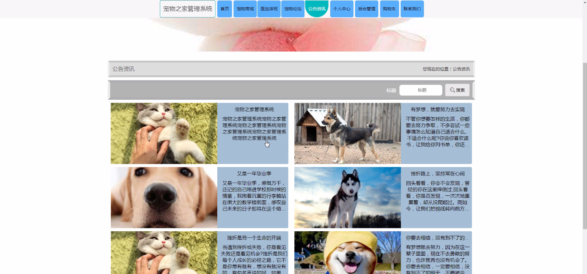

****本项目包含程序+源码+数据库+LW+调试部署环境，文末可获取一份本项目的java源码和数据库参考。****

## ******开题报告******

研究背景：
随着人们对宠物的关注和养殖需求的增加，宠物之家管理系统应运而生。传统的宠物管理方式已经无法满足人们的需求，因此需要一个全面、高效、智能化的系统来管理宠物的各项信息和服务。该系统将整合用户、医生、商品分类、宠物商城等功能，为宠物主人和相关从业人员提供便捷的服务。

研究意义：
宠物之家管理系统的研究具有重要的现实意义。首先，该系统可以提高宠物管理的效率和准确性，减少人工操作的错误和繁琐程度。其次，通过系统的智能化设计，可以为宠物主人提供个性化的服务和建议，提升宠物的健康和幸福感。此外，该系统还可以促进宠物行业的发展，推动相关从业人员的专业化和规范化。

研究目的：
本研究旨在开发一款功能完善、易于使用的宠物之家管理系统，以满足宠物主人和相关从业人员的需求。通过系统的设计和实施，旨在提高宠物管理的效率和质量，为宠物主人提供更好的服务体验，促进宠物行业的发展。

研究内容： 本研究将围绕以下系统功能展开研究：

  1. 用户管理：包括用户注册、登录、个人信息管理等功能，为宠物主人提供个性化的服务和建议。

  2. 医生管理：包括医生信息录入、排班管理等功能，方便宠物主人预约就诊并获取专业的医疗服务。

  3. 商品分类：对宠物商城中的商品进行分类管理，方便宠物主人浏览和购买所需的宠物用品。

  4. 宠物商城：提供宠物用品的在线购买平台，方便宠物主人获取所需的商品。

  5. 预约信息：宠物主人可以通过系统预约医生就诊，系统会自动记录预约信息并提醒相关人员。

  6. 取消预约：宠物主人可以在系统中取消已经预约的就诊，方便管理和调整就诊计划。

  7. 就诊信息：记录宠物的就诊信息，包括就诊时间、医生建议等，方便宠物主人了解宠物的健康状况。

拟解决的主要问题：
本研究旨在解决传统宠物管理方式效率低下、信息不准确等问题。通过开发宠物之家管理系统，可以提高宠物管理的效率和质量，为宠物主人提供更好的服务体验。

研究方案： 本研究将采用软件开发的方法，结合用户需求分析和系统设计原则，进行系统功能的开发和实施。同时，还将进行系统的测试和优化，确保系统的稳定性和可靠性。

预期成果：
预计本研究将开发出一款功能完善、易于使用的宠物之家管理系统。该系统将提高宠物管理的效率和准确性，为宠物主人提供个性化的服务和建议，促进宠物行业的发展。同时，本研究的成果还将为相关从业人员提供参考和借鉴，推动宠物管理的专业化和规范化。

进度安排：

2022年9月至10月：开题报告编写和提交，完成开题报告的撰写并提交给指导教师进行审核。

2022年11月至2023年1月：系统设计和开发，根据开题报告的要求，进行系统设计和编码工作。

2023年2月至3月：论文撰写和初稿完成，开始撰写论文，并在这个阶段完成论文的初稿。

2023年4月至5月：论文修改和最终定稿，根据指导教师的意见对论文进行修改，并完成最终的定稿。

2023年5月：论文答辩和提交，参加论文答辩并根据答辩结果进行修改，最后将论文提交给学院或学校。

参考文献：

[1]喻佳,吴丹新.基于SpringBoot的Web快速开发框架[J].电脑编程技巧与维护,2021,(09):31-33.

[2]李鹏.基于SpringBoot快速开发平台的实现[J].电子技术与软件工程,2021,(12):36-37.

[3]叶开平,蔡维晟,陈家敏,邓斯妮.基于SpringBoot的综测可视化管理系统的研究与设计[J].电脑知识与技术,2021,(12):100-104.

[4]江健锋,徐振平.Springboot最小系统的设计与实现[J].电脑知识与技术,2021,(04):62-63.

[5]赵炯,司圣杰,周奇才,熊肖磊.通用信息获取系统设计与实现[J].起重运输机械,2020,(16):89-97.

[6]吴英宾.一种内外网数据交互系统的设计与实现[J].软件工程,2020,(08):25-27.

****以上是本项目程序开发之前开题报告内容，最终成品以下面界面为准，大家可以酌情参考使用。要源码参考请在文末进行获取！！****

## ******本项目的界面展示******

