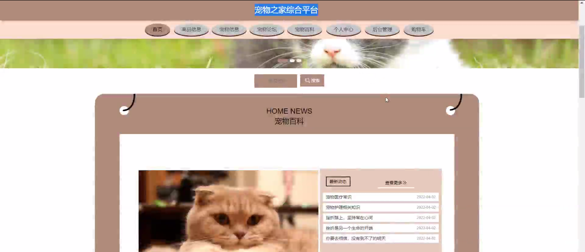
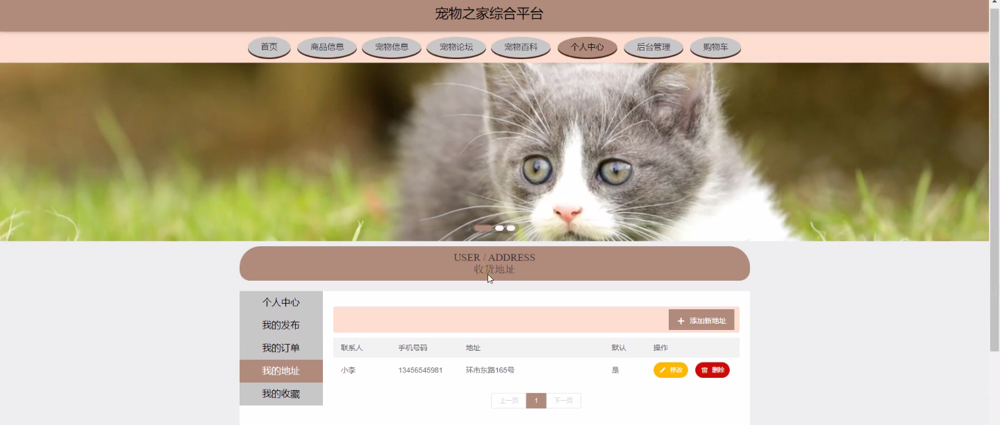
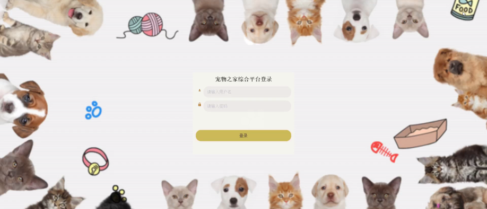
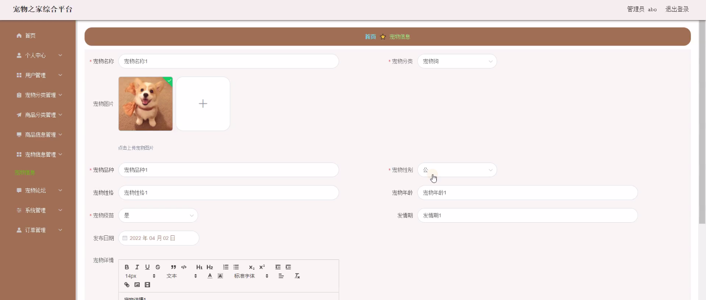
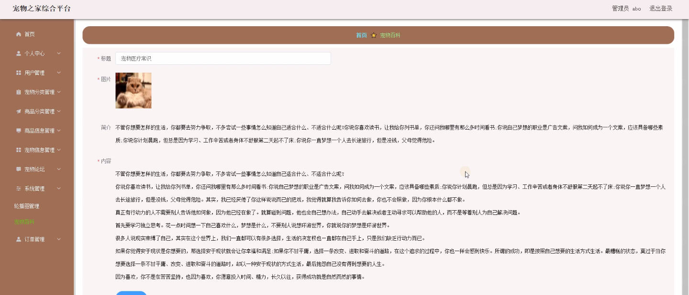

****本项目包含程序+源码+数据库+LW+调试部署环境，文末可获取一份本项目的java源码和数据库参考。****

## ******开题报告******

研究背景：
随着社会的发展和人们生活水平的提高，宠物已经成为越来越多家庭的一部分。宠物不仅能给人们带来快乐和陪伴，还有助于缓解压力、促进健康等方面的好处。然而，随之而来的是宠物市场的蓬勃发展和宠物相关服务的日益增多，这也给宠物主人和潜在宠物主人带来了一些问题和困扰。因此，建立一个综合平台来满足宠物主人和潜在宠物主人的需求，具有重要的现实意义。

研究意义：
宠物之家综合平台的建立将为宠物主人和潜在宠物主人提供一个便捷、全面的信息交流和服务平台。通过该平台，用户可以方便地获取宠物分类、商品分类、商品信息、宠物婚介等系统功能，从而更好地了解和管理自己的宠物。同时，该平台还可以促进宠物市场的规范化和健康发展，提升宠物行业的整体形象和服务质量。

研究目的：
本研究旨在设计和开发一个宠物之家综合平台，通过整合用户、宠物分类、商品分类、商品信息、宠物婚介等系统功能，为宠物主人和潜在宠物主人提供全面、便捷的服务。具体目标包括：提供准确、详尽的宠物分类信息，方便用户选择适合自己的宠物；提供丰富多样的商品分类和商品信息，满足用户对宠物用品的需求；提供宠物婚介服务，帮助用户寻找合适的伴侣给自己的宠物。

研究内容： 本研究的主要内容包括以下系统功能：

  1. 用户功能：设计用户注册、登录、个人信息管理等功能，实现用户身份验证和个性化服务。
  2. 宠物分类功能：建立宠物分类数据库，提供准确、详尽的宠物分类信息，包括不同种类、品种的宠物特点、饲养要求等。
  3. 商品分类功能：建立商品分类数据库，将宠物用品按照不同的类别进行分类，方便用户查找和购买。
  4. 商品信息功能：提供商品的详细信息，包括商品名称、价格、规格、使用说明等，帮助用户做出购买决策。
  5. 宠物婚介功能：建立宠物婚介数据库，提供宠物主人发布宠物婚介信息和查找合适伴侣的功能。

拟解决的主要问题：
通过宠物之家综合平台的设计和开发，将解决以下主要问题：用户在选择宠物时缺乏准确、全面的信息；用户在购买宠物用品时难以找到合适的商品；宠物主人想为自己的宠物寻找合适的伴侣时缺乏渠道和平台。

研究方案和预期成果：
本研究将采用软件工程的方法，包括需求分析、系统设计、编码实现和测试等步骤，设计和开发宠物之家综合平台。预期成果包括一个功能完善、界面友好的宠物之家综合平台，能够满足用户对宠物分类、商品分类、商品信息、宠物婚介等系统功能的需求。同时，该平台还将提供良好的用户体验和便捷的服务，促进宠物市场的规范化和健康发展。

进度安排：

2022年9月至10月：需求分析和规划，明确系统功能和目标，制定项目计划。

2022年11月至2023年1月：系统设计和编码，完成详细的系统设计并开始编写代码。

2023年2月至3月：用户界面开发和数据库开发，开发用户友好的界面和设计数据库结构。

2023年4月至5月：功能测试、文档编写和上线部署，对系统进行全面的功能测试并编写用户手册。

2023年5月：维护和升级，定期对系统进行维护和升级，修复bug和添加新功能。

参考文献：

[1]邱小群,邓丽艳,陈海潮.基于B/S的信息管理系统设计和实现[J].信息与电脑(理论版),2022,(20):146-148.

[2]谢霜.基于Java技术的网络管理体系结构的应用[J].网络安全技术与应用,2022,(10):14-15.

[3]宋锦华.高职院校Java程序设计课程改革研究[J].科技视界,2022,(20):133-135.

[4]曹嵩彭,王鹏宇.浅析Java语言在软件开发中的应用[J].信息记录材料,2022,(03):114-116.

[5]朱澈,余俊达.武汉东湖学院.基于Java的软硬件信息管理系统V1.0[Z].项目立项编号.鉴定单位.鉴定日期:

****以上是本项目程序开发之前开题报告内容，最终成品以下面界面为准，大家可以酌情参考使用。要源码参考请在文末进行获取！！****

## ******本项目的界面展示******

