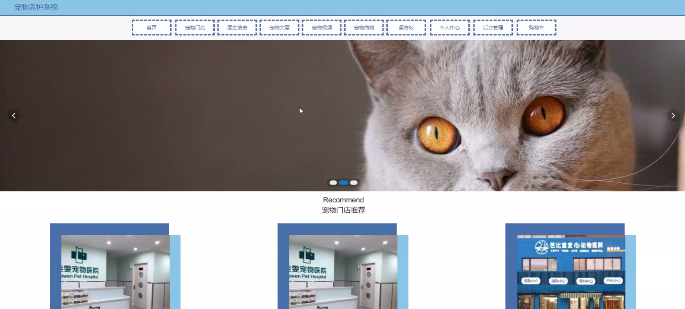
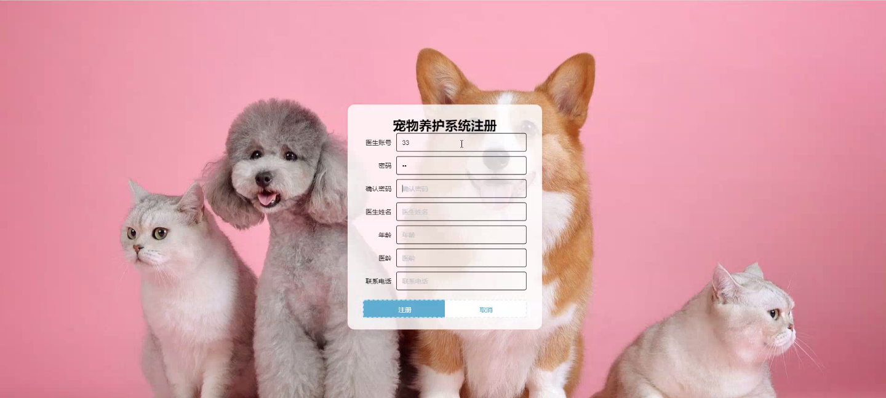
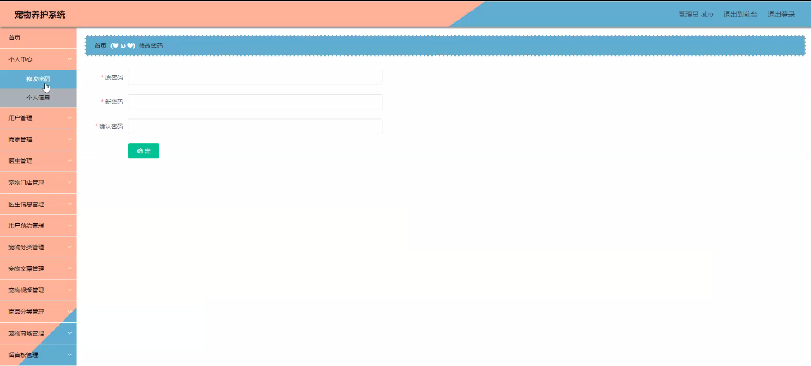
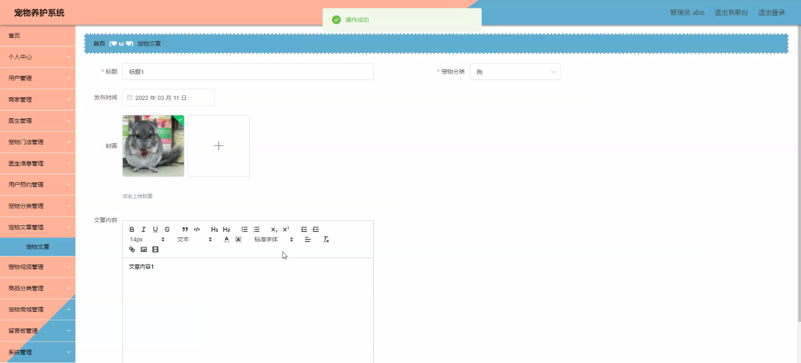
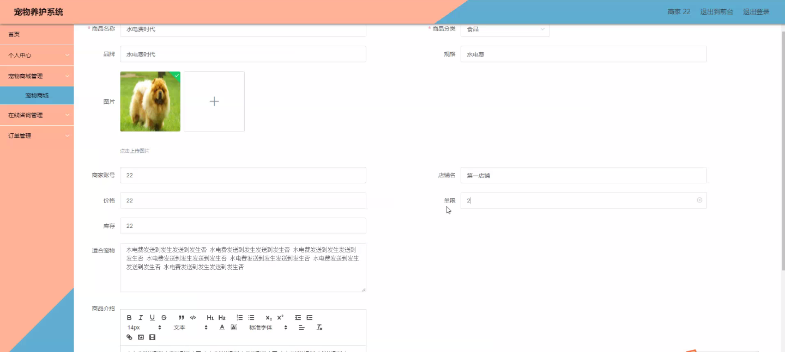
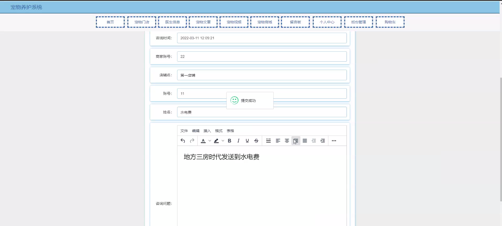
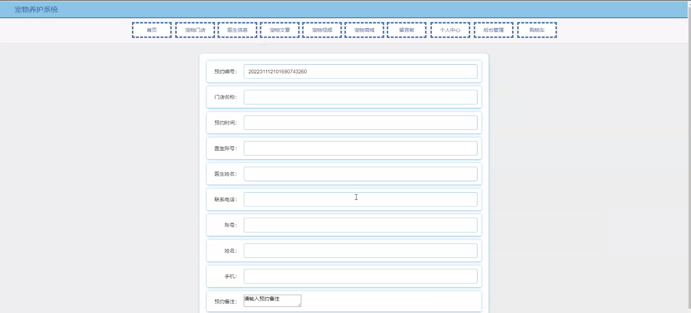
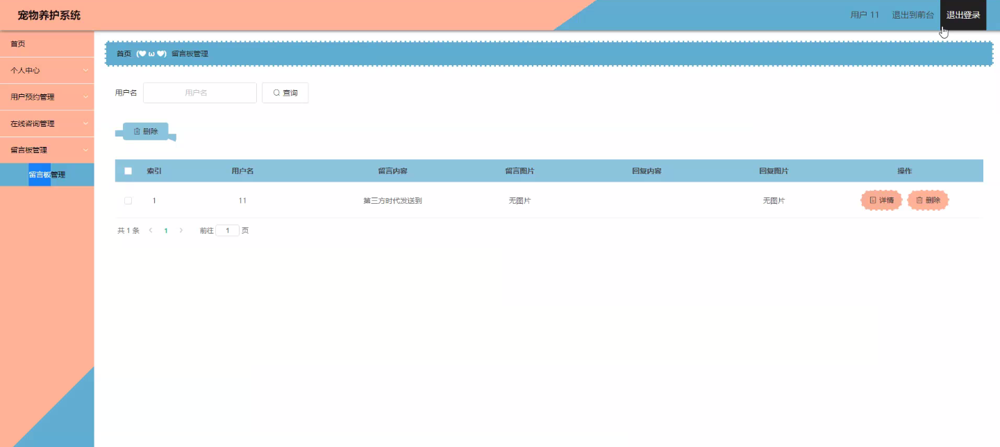

****本项目包含程序+源码+数据库+LW+调试部署环境，文末可获取一份本项目的java源码和数据库参考。****

## ******开题报告******

研究背景：
随着人们生活水平的提高和生活方式的改变，宠物在现代社会中扮演着越来越重要的角色。越来越多的人选择养宠物作为伴侣和家庭成员，而宠物的健康和幸福也成为人们关注的焦点。然而，目前存在着宠物养护领域的一些问题，如信息不对称、服务不规范等，这给宠物主人和商家带来了困扰。

研究意义：
宠物养护系统的建立和研究对于解决上述问题具有重要意义。通过建立一个全面的宠物养护系统，可以提供准确、及时的宠物健康信息和专业的养护指导，帮助宠物主人更好地照顾自己的宠物。同时，该系统还可以促进宠物行业的发展，提升宠物商家和医生的服务质量，推动整个行业向着规范化和专业化方向发展。

研究目的：
本研究旨在设计和开发一套完善的宠物养护系统，以满足宠物主人和商家的需求。通过该系统，宠物主人可以方便地获取宠物健康信息、预约医生、购买宠物用品等；商家和医生可以提供专业的服务和产品，与宠物主人建立良好的互动关系。通过研究，我们希望能够解决宠物养护领域存在的问题，提升宠物养护水平，促进宠物行业的可持续发展。

研究内容：
本研究的主要内容包括以下系统功能：用户管理、商家管理、医生管理、商品分类、宠物商城、宠物门店、宠物分类、宠物文章、医生信息、用户预约、宠物视频、在线咨询等。通过对这些功能的设计和开发，我们将实现宠物主人和商家之间的信息共享和交流，提供全方位的宠物养护服务。

拟解决的主要问题：

  1. 信息不对称：宠物主人往往难以获取到准确、及时的宠物健康信息，导致养护不当。
  2. 服务不规范：宠物商家和医生的服务质量参差不齐，缺乏统一的标准和规范。
  3. 资源分散：宠物主人需要花费大量时间和精力在不同的平台上寻找宠物用品和服务。

研究方案：
本研究将采用软件工程的方法，通过需求分析、系统设计、开发和测试等步骤，构建一个完善的宠物养护系统。在系统设计阶段，我们将充分考虑用户体验和功能实现的可行性，确保系统能够满足用户和商家的需求。在开发过程中，我们将采用先进的技术和工具，保证系统的稳定性和安全性。

进度安排：

2022年9月至10月：需求分析和规划，进行用户需求调研和分析，确定系统功能和目标。

2022年11月至2023年1月：系统设计和开发，完成系统架构设计和技术选型，并开始编写代码。

2023年2月至3月：测试和优化，进行单元测试和集成测试，修复问题并优化系统性能。

2023年4月至5月：文档编写和培训，编写用户手册和系统文档，并进行相关人员的培训。

2023年5月：上线部署和维护，将系统部署到生产环境中，并定期进行维护和升级。

参考文献：

[1]王振华.SpringBoot在教学效果评估系统中的应用[J].电子技术,2023,(05):67-69.

[2]王明泉.基于SpringBoot远程热部署的探索和应用[J].信息与电脑(理论版),2023,(07):1-4.

[3]王亚东,李晓霞,陈强强,剡美娜.基于SpringBoot的需求发布平台设计[J].信息与电脑(理论版),2023,(01):105-107.

[4]陈新府豪.基于SpringBoot和Vue框架的创新方法推理系统的设计与实现[D].导师：黄静.浙江理工大学,2022.

[5]霍福华,韩慧.基于SpringBoot微服务架构下前后端分离的MVVM模型[J].电子技术与软件工程,2022,(01):73-76.

[6]韩策,张娜,王松亭,张凯,何方,袁峰.SpringBoot OPC客户端设计与研究[J].电子世界,2021,(19):25-26.

****以上是本项目程序开发之前开题报告内容，最终成品以下面界面为准，大家可以酌情参考使用。要源码参考请在文末进行获取！！****

## ******本项目的界面展示******

