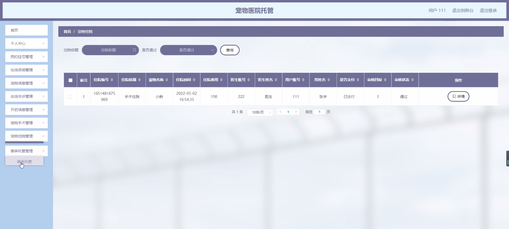

****本项目包含程序+源码+数据库+LW+调试部署环境，文末可获取一份本项目的java源码和数据库参考。****

## ******开题报告******

研究背景：
随着人们对宠物的关注和养育意识的提高，宠物医疗服务的需求也日益增长。然而，由于工作繁忙、旅行等原因，宠物主人无法时刻照顾自己的宠物，特别是在宠物需要医疗护理或住院治疗期间。因此，宠物医院托管成为了一种受欢迎的选择，可以为宠物提供全天候的医疗护理和住宿环境。

研究意义：
宠物医院托管作为一种新兴的宠物医疗服务模式，对于满足宠物主人的需求、提高宠物医疗服务质量具有重要意义。通过深入研究宠物医院托管的系统功能和运营模式，可以为宠物主人提供更便捷、高效的宠物医疗服务，同时也能够促进宠物医疗行业的发展和进步。

研究目的：
本研究旨在探索宠物医院托管的系统功能和运营模式，以及其在提供宠物医疗服务方面的应用。通过分析和研究，旨在解决宠物主人在选择宠物医院托管时面临的问题，并提出相应的解决方案，以提高宠物医疗服务的质量和效率。

研究内容：
本研究将重点关注以下系统功能：用户管理、医生管理、医生信息管理、预约挂号、在线咨询、宠物信息管理、在线会诊、开药信息管理、宠物手术、宠物住院和寄养托管等。通过对这些系统功能的深入研究，可以建立一个完善的宠物医院托管系统，为宠物主人提供全方位的宠物医疗服务。

拟解决的主要问题：
在宠物医院托管的过程中，可能存在一些问题，如预约不便、医生信息不透明、宠物住院环境不舒适等。本研究将针对这些问题进行分析和解决，通过优化系统功能和改进运营模式，提供更好的宠物医疗服务体验。

研究方案：
本研究将采用文献研究、实地调研和数据分析等方法，收集和整理相关的宠物医院托管信息和运营数据。通过对现有宠物医院托管系统的分析和比较，提出改进方案，并进行系统设计和开发。同时，将结合用户调研和反馈，不断优化和完善系统功能，以提高宠物医疗服务的质量和效率。

预期成果：
本研究的预期成果包括建立一个完善的宠物医院托管系统，提供全方位的宠物医疗服务。通过优化系统功能和改进运营模式，预计可以解决宠物主人在选择宠物医院托管时面临的问题，提高宠物医疗服务的质量和效率。同时，本研究的成果还可为宠物医疗行业的发展和进步提供参考和借鉴。

进度安排：

2022年9月至10月：需求分析和规划，进行用户需求调研和分析，确定系统功能和目标。

2022年11月至2023年1月：系统设计和开发，完成系统架构设计和技术选型，并开始编写代码。

2023年2月至3月：测试和优化，进行单元测试和集成测试，修复问题并优化系统性能。

2023年4月至5月：文档编写和培训，编写用户手册和系统文档，并进行相关人员的培训。

2023年5月：上线部署和维护，将系统部署到生产环境中，并定期进行维护和升级。

参考文献：

[1]王振华.SpringBoot在教学效果评估系统中的应用[J].电子技术,2023,(05):67-69.

[2]王明泉.基于SpringBoot远程热部署的探索和应用[J].信息与电脑(理论版),2023,(07):1-4.

[3]王亚东,李晓霞,陈强强,剡美娜.基于SpringBoot的需求发布平台设计[J].信息与电脑(理论版),2023,(01):105-107.

[4]陈新府豪.基于SpringBoot和Vue框架的创新方法推理系统的设计与实现[D].导师：黄静.浙江理工大学,2022.

[5]霍福华,韩慧.基于SpringBoot微服务架构下前后端分离的MVVM模型[J].电子技术与软件工程,2022,(01):73-76.

[6]韩策,张娜,王松亭,张凯,何方,袁峰.SpringBoot OPC客户端设计与研究[J].电子世界,2021,(19):25-26.

****以上是本项目程序开发之前开题报告内容，最终成品以下面界面为准，大家可以酌情参考使用。要源码参考请在文末进行获取！！****

## ******本项目的界面展示******

