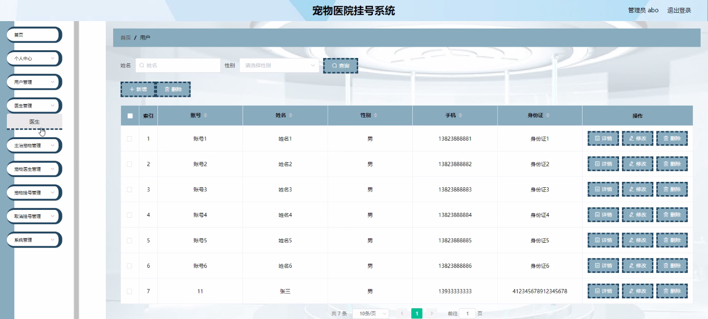
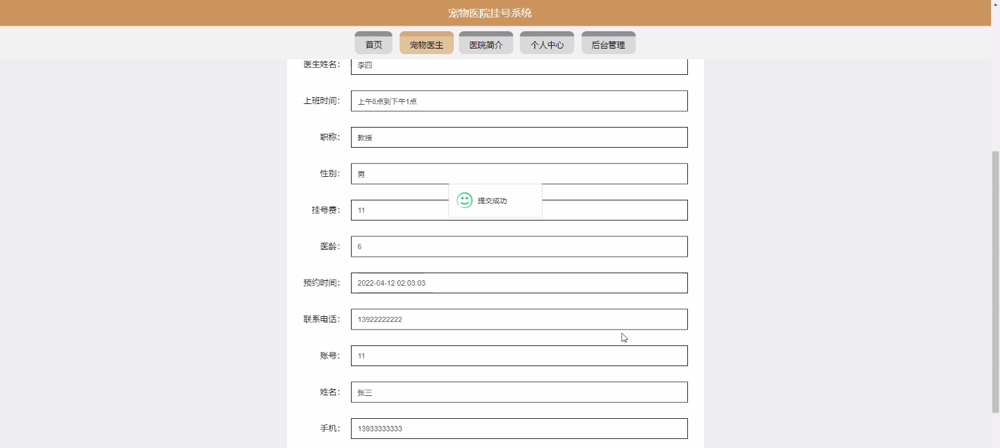

****本项目包含程序+源码+数据库+LW+调试部署环境，文末可获取一份本项目的java源码和数据库参考。****

## ******开题报告******

研究背景：
随着人们对宠物的关注度不断提高，宠物医疗服务的需求也日益增长。然而，传统的宠物医院挂号系统存在一些问题，如排队时间长、信息传递不畅等，给用户和医生带来了不便。因此，开发一个高效、便捷的宠物医院挂号系统具有重要的现实意义。

研究意义：
通过建立一个先进的宠物医院挂号系统，可以提高宠物医疗服务的质量和效率，为宠物主人和医生提供更好的体验。同时，该系统还能够优化资源分配，减少人力物力的浪费，提高宠物医疗行业的整体水平。

研究目的：
本研究旨在设计和开发一种基于宠物医院挂号系统的解决方案，以解决传统挂号系统存在的问题。通过引入先进的技术手段，提高宠物医疗服务的效率和质量，提升用户和医生的满意度，促进宠物医疗行业的发展。

研究内容： 本研究将围绕以下系统功能展开研究：

  1. 用户管理：设计用户注册、登录和个人信息管理功能，方便宠物主人进行挂号和查询相关信息。

  2. 医生管理：建立医生信息数据库，包括医生的专业领域、工作经验等，以便宠物主人选择合适的医生。

  3. 主治宠物管理：记录宠物的基本信息、病历和就诊记录，为医生提供参考依据，并方便宠物主人随时查看宠物的健康情况。

  4. 宠物医生管理：实现医生的排班管理、就诊记录管理等功能，确保医生资源的合理利用。

  5. 宠物挂号与取消挂号：设计宠物挂号和取消挂号的流程，简化操作步骤，提高挂号效率。

拟解决的主要问题：
本研究旨在解决传统宠物医院挂号系统存在的排队时间长、信息传递不畅等问题。通过引入先进的技术手段和优化系统功能，提高宠物医疗服务的效率和质量，提升用户和医生的满意度。

研究方案：
本研究将采用软件开发方法，结合用户需求分析和系统设计原则，设计和开发一套完整的宠物医院挂号系统。在系统开发过程中，将充分考虑用户体验、数据安全和系统稳定性等因素，并进行相应的测试和优化。

预期成果：
通过本研究，预期可以开发出一套高效、便捷的宠物医院挂号系统，提高宠物医疗服务的质量和效率。该系统将为宠物主人提供更好的就诊体验，为医生提供更好的工作环境，促进宠物医疗行业的发展。同时，本研究的成果还可为其他相关领域的研究和实践提供参考和借鉴。

进度安排：

2022年9月至10月：开题报告编写和提交，完成开题报告的撰写并提交给指导教师进行审核。

2022年11月至2023年1月：系统设计和开发，根据开题报告的要求，进行系统设计和编码工作。

2023年2月至3月：论文撰写和初稿完成，开始撰写论文，并在这个阶段完成论文的初稿。

2023年4月至5月：论文修改和最终定稿，根据指导教师的意见对论文进行修改，并完成最终的定稿。

2023年5月：论文答辩和提交，参加论文答辩并根据答辩结果进行修改，最后将论文提交给学院或学校。

参考文献：

[1]喻佳,吴丹新.基于SpringBoot的Web快速开发框架[J].电脑编程技巧与维护,2021,(09):31-33.

[2]李鹏.基于SpringBoot快速开发平台的实现[J].电子技术与软件工程,2021,(12):36-37.

[3]叶开平,蔡维晟,陈家敏,邓斯妮.基于SpringBoot的综测可视化管理系统的研究与设计[J].电脑知识与技术,2021,(12):100-104.

[4]江健锋,徐振平.Springboot最小系统的设计与实现[J].电脑知识与技术,2021,(04):62-63.

[5]赵炯,司圣杰,周奇才,熊肖磊.通用信息获取系统设计与实现[J].起重运输机械,2020,(16):89-97.

[6]吴英宾.一种内外网数据交互系统的设计与实现[J].软件工程,2020,(08):25-27.

****以上是本项目程序开发之前开题报告内容，最终成品以下面界面为准，大家可以酌情参考使用。要源码参考请在文末进行获取！！****

## ******本项目的界面展示******

