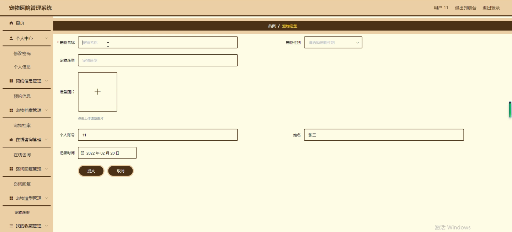

****本项目包含程序+源码+数据库+LW+调试部署环境，文末可获取一份本项目的java源码和数据库参考。****

## ******开题报告******

研究背景：
随着人们对宠物的关注度不断提高，宠物医院的数量也在逐年增加。然而，传统的宠物医院管理方式存在一些问题，如信息管理不便、预约排队时间长、咨询回复效率低等。为了提高宠物医院的管理效率和服务质量，开发一个高效的宠物医院管理系统变得尤为重要。

研究意义：
宠物医院管理系统的开发将极大地提升宠物医院的运营效率和服务水平。通过该系统，用户可以方便地预约就诊、查询宠物档案、获取宠物资讯等功能，医生可以更好地管理就诊信息、进行在线咨询和咨询回复，从而提高工作效率和准确性。这将有助于改善宠物医疗行业的整体服务质量，提升人们对宠物医疗的信任度和满意度。

研究目的：
本研究旨在设计和开发一款全面且高效的宠物医院管理系统，以解决传统宠物医院管理方式存在的问题。通过引入现代化的信息技术手段，提供便捷的预约、查询、咨询等功能，实现宠物医院的数字化管理和智能化服务，提升宠物医疗行业的整体水平。

研究内容： 本研究将围绕以下系统功能展开：

  1. 用户管理：包括用户注册、登录、个人信息管理等功能，方便用户进行预约和查询操作。
  2. 医生管理：包括医生信息录入、排班管理、就诊记录等功能，方便医生进行工作安排和就诊管理。
  3. 就诊信息管理：包括患者信息录入、病历管理、检查结果记录等功能，方便医生进行诊断和治疗。
  4. 预约信息管理：包括预约挂号、预约取消、预约查询等功能，方便用户进行预约操作。
  5. 宠物档案管理：包括宠物基本信息、疫苗接种记录、病历记录等功能，方便医生了解宠物的健康情况。
  6. 在线咨询：提供在线咨询平台，用户可以向医生咨询问题，医生可以及时回复。
  7. 咨询回复：医生对用户的咨询进行回复和解答，提供专业的建议和指导。
  8. 宠物资讯：提供宠物健康知识、养护技巧等相关资讯，帮助用户更好地照顾宠物。
  9. 宠物造型：提供宠物美容服务，包括洗澡、修剪、造型等，提升宠物的形象和品质。

拟解决的主要问题：
通过开发宠物医院管理系统，我们将解决传统宠物医院管理方式存在的信息不便、预约排队时间长、咨询回复效率低等问题。通过引入现代化的信息技术手段，实现信息的快速录入和查询，提供在线预约和咨询功能，提高医生的工作效率和准确性，从而改善宠物医疗行业的服务质量。

研究方案和预期成果：
本研究将采用软件开发的方法，结合数据库技术和网络技术，设计和开发一款全面且高效的宠物医院管理系统。预期成果包括一个稳定可靠的系统平台，能够满足用户和医生的各项需求，并提供良好的用户体验。该系统将大大提高宠物医院的管理效率和服务质量，为宠物医疗行业的发展做出积极贡献。

进度安排：

2022年9月至10月：需求分析和规划，明确系统功能和目标，制定项目计划。

2022年11月至2023年1月：系统设计和编码，完成详细的系统设计并开始编写代码。

2023年2月至3月：用户界面开发和数据库开发，开发用户友好的界面和设计数据库结构。

2023年4月至5月：功能测试、文档编写和上线部署，对系统进行全面的功能测试并编写用户手册。

2023年5月：维护和升级，定期对系统进行维护和升级，修复bug和添加新功能。

参考文献：

[1]邱小群,邓丽艳,陈海潮.基于B/S的信息管理系统设计和实现[J].信息与电脑(理论版),2022,(20):146-148.

[2]谢霜.基于Java技术的网络管理体系结构的应用[J].网络安全技术与应用,2022,(10):14-15.

[3]宋锦华.高职院校Java程序设计课程改革研究[J].科技视界,2022,(20):133-135.

[4]曹嵩彭,王鹏宇.浅析Java语言在软件开发中的应用[J].信息记录材料,2022,(03):114-116.

[5]朱澈,余俊达.武汉东湖学院.基于Java的软硬件信息管理系统V1.0[Z].项目立项编号.鉴定单位.鉴定日期:

****以上是本项目程序开发之前开题报告内容，最终成品以下面界面为准，大家可以酌情参考使用。要源码参考请在文末进行获取！！****

## ******本项目的界面展示******

