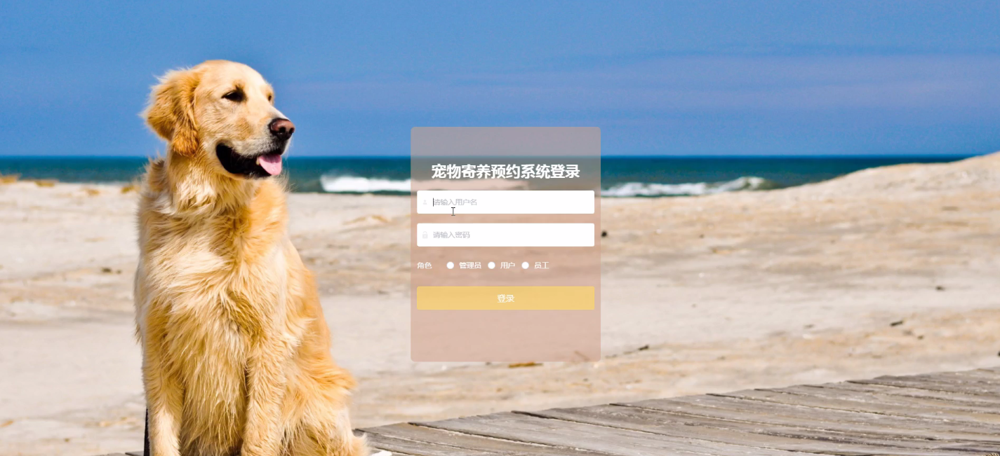
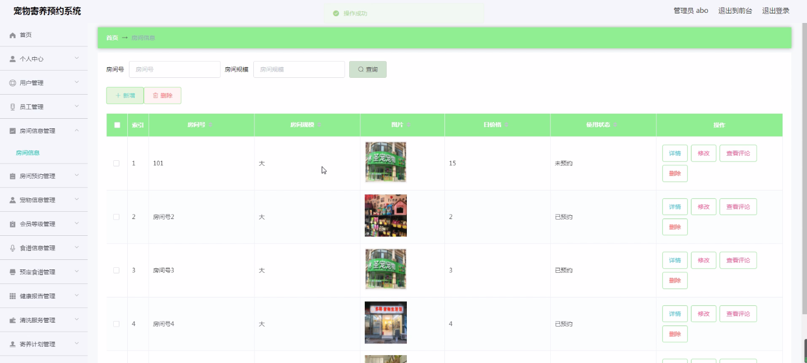
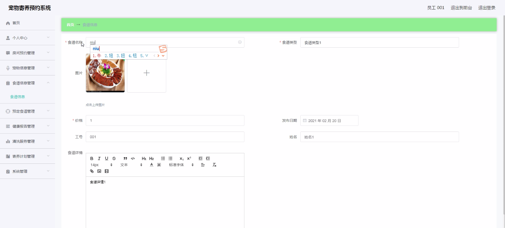
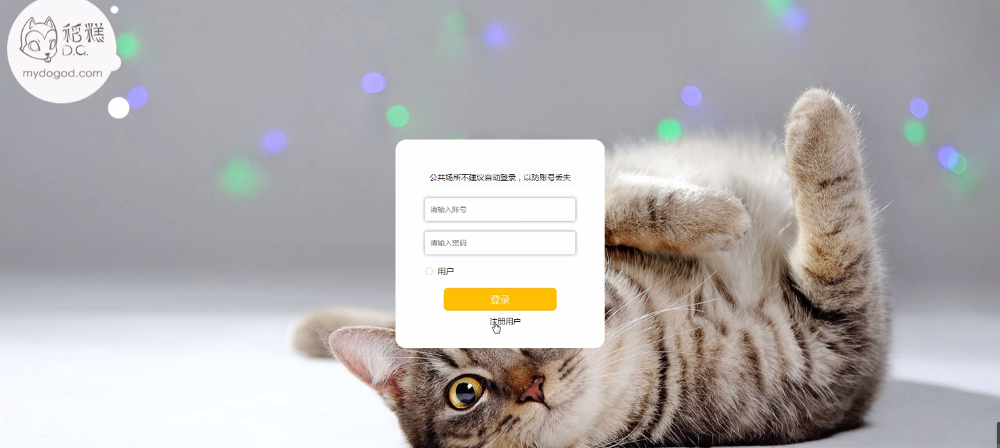
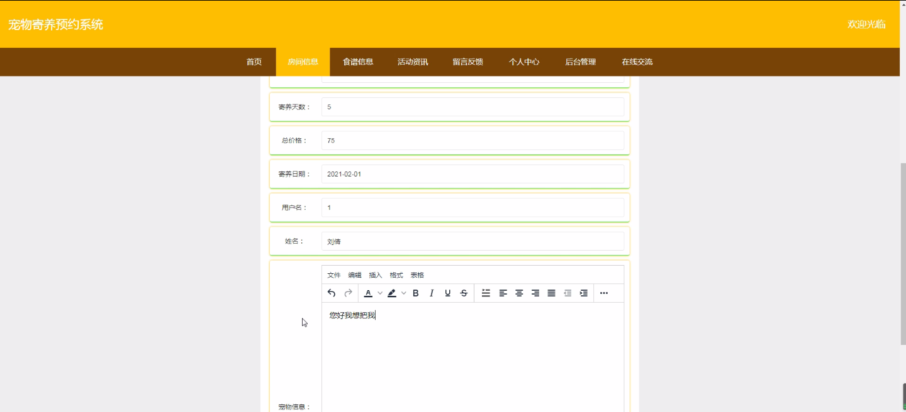
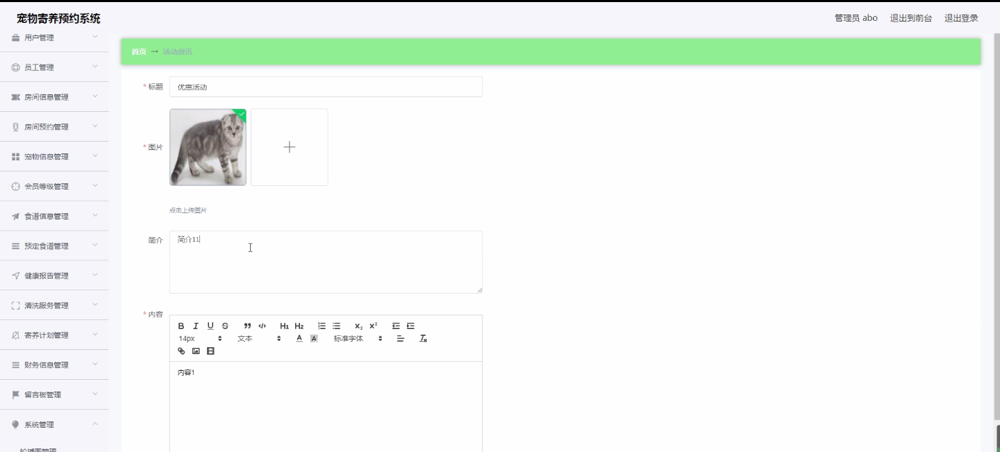
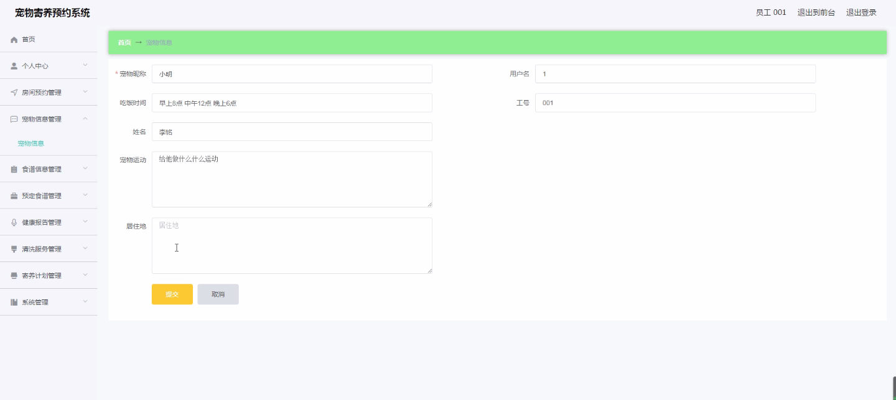

****本项目包含程序+源码+数据库+LW+调试部署环境，文末可获取一份本项目的java源码和数据库参考。****

## ******开题报告******

研究背景：
随着人们生活水平的提高和宠物养殖业的发展，越来越多的人选择饲养宠物。然而，由于工作、旅行等原因，主人无法时刻照顾自己的宠物，这就给宠物寄养业务带来了机会。宠物寄养服务可以为主人提供一个安全、舒适的环境，同时也能够满足宠物的日常需求。然而，目前市场上的宠物寄养预约系统存在一些问题，如预约流程繁琐、信息不透明等，因此有必要进行相关研究。

研究意义：
宠物寄养预约系统的研究对于提升宠物寄养服务的质量和效率具有重要意义。通过建立一个完善的预约系统，可以方便主人预订寄养服务，并且提供详细的宠物信息和房间信息，使主人更加放心地将宠物寄养在该机构。同时，系统还可以提供健康报告、清洗服务等增值功能，进一步提升用户体验。因此，研究宠物寄养预约系统可以促进宠物寄养行业的发展，满足人们对于宠物寄养服务的需求。

研究目的：
本研究旨在设计和开发一套高效、便捷的宠物寄养预约系统，以提升宠物寄养服务的质量和用户体验。具体目标包括：简化预约流程，提供全面的宠物信息和房间信息，增加健康报告、清洗服务等功能，提高系统的可用性和用户满意度。

研究内容： 本研究将围绕宠物寄养预约系统的各个功能模块展开研究，主要包括以下内容：

  1. 用户管理：设计用户注册、登录、个人信息管理等功能，方便用户使用系统。

  2. 员工管理：实现员工信息管理、排班管理等功能，确保寄养服务的顺利进行。

  3. 房间信息管理：建立房间信息数据库，包括房间类型、容纳宠物数量等，方便用户选择合适的房间。

  4. 房间预约：设计预约流程，包括选择日期、时间、房间等，确保用户能够方便地预订寄养服务。

  5. 宠物信息管理：建立宠物信息数据库，包括宠物种类、年龄、健康状况等，方便员工提供个性化的寄养服务。

  6. 会员等级管理：设计会员制度，根据用户的消费情况和信用评价等因素，设定不同的会员等级，提供相应的优惠和特权。

  7. 食谱信息管理：建立食谱信息数据库，包括宠物适宜的食物种类、营养成分等，方便员工为宠物提供合理的饮食。

  8. 预定食谱：用户可以根据宠物的喜好和需求，预定特定的食谱，确保宠物在寄养期间得到适当的营养。

  9. 健康报告：员工可以记录宠物的健康状况，并及时向主人提供健康报告，增加主人对于宠物寄养服务的信任。

  10. 清洗服务：提供宠物清洗服务，确保宠物的卫生和舒适。

  11. 寄养计划：根据宠物的需求和主人的要求，制定个性化的寄养计划，提供全面的寄养服务。

  12. 财务信息管理：记录寄养服务的收入和支出情况，方便机构进行财务管理和统计分析。

拟解决的主要问题：

  1. 预约流程繁琐：通过简化预约流程，提供一键预约功能，减少用户操作步骤，提高预约效率。

  2. 信息不透明：建立完善的宠物信息和房间信息数据库，确保用户能够清楚了解寄养环境和宠物情况。

  3. 用户体验不佳：增加健康报告、清洗服务等功能，提升用户体验，增加用户满意度。

  4. 数据管理困难：设计合理的数据管理系统，确保各个功能模块之间的数据共享和一致性。

研究方案和预期成果：
本研究将采用软件开发方法，结合用户需求调研和系统设计原则，设计和开发一套宠物寄养预约系统。预期成果包括一个功能完善、界面友好的系统，能够提供便捷的预约服务，全面的宠物信息和房间信息，以及增值功能如健康报告、清洗服务等。通过实际应用和用户反馈，验证系统的可行性和有效性，为宠物寄养业务提供技术支持和改进方向。

进度安排：

2022年9月至10月：需求分析和规划，明确系统功能和目标，制定项目计划。

2022年11月至2023年1月：系统设计和编码，完成详细的系统设计并开始编写代码。

2023年2月至3月：用户界面开发和数据库开发，开发用户友好的界面和设计数据库结构。

2023年4月至5月：功能测试、文档编写和上线部署，对系统进行全面的功能测试并编写用户手册。

2023年5月：维护和升级，定期对系统进行维护和升级，修复bug和添加新功能。

参考文献：

[1]邱小群,邓丽艳,陈海潮.基于B/S的信息管理系统设计和实现[J].信息与电脑(理论版),2022,(20):146-148.

[2]谢霜.基于Java技术的网络管理体系结构的应用[J].网络安全技术与应用,2022,(10):14-15.

[3]宋锦华.高职院校Java程序设计课程改革研究[J].科技视界,2022,(20):133-135.

[4]曹嵩彭,王鹏宇.浅析Java语言在软件开发中的应用[J].信息记录材料,2022,(03):114-116.

[5]朱澈,余俊达.武汉东湖学院.基于Java的软硬件信息管理系统V1.0[Z].项目立项编号.鉴定单位.鉴定日期:

****以上是本项目程序开发之前开题报告内容，最终成品以下面界面为准，大家可以酌情参考使用。要源码参考请在文末进行获取！！****

## ******本项目的界面展示******

