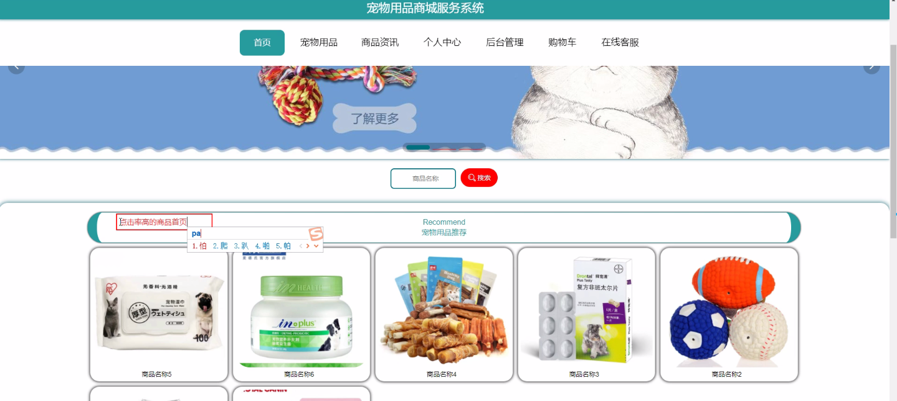

****本项目包含程序+源码+数据库+LW+调试部署环境，文末可获取一份本项目的java源码和数据库参考。****

## ******开题报告******

研究背景：
随着人们生活水平的提高和宠物养殖观念的改变，宠物用品市场呈现出蓬勃发展的态势。越来越多的人开始将宠物视为家庭的一员，并愿意为宠物提供更好的生活条件和关怀。因此，宠物用品商店作为满足人们对宠物需求的重要渠道，也面临着日益增长的市场竞争压力。在这样的背景下，深入研究宠物用品商店的运营模式和用户需求，具有重要的理论和实践意义。

研究意义：
通过对宠物用品商店的研究，可以更好地了解消费者对宠物用品的需求和购买行为，为商店提供科学的经营决策依据。同时，研究还可以揭示宠物用品市场的发展趋势和潜在机会，为商店的创新和发展提供指导。此外，研究还可以促进宠物用品行业的规范化和标准化，提升整个行业的竞争力和可持续发展能力。

研究目的：
本研究旨在深入探讨宠物用品商店的运营模式和用户需求，以及相关的市场竞争策略。具体目标包括：1.分析宠物用品市场的发展趋势和潜在机会；2.了解消费者对宠物用品的需求和购买行为；3.探索宠物用品商店的运营模式和管理方法；4.提出针对宠物用品商店的市场竞争策略和推广方案。

研究内容： 本研究将围绕以下系统功能展开研究：

  1. 用户：调查用户对宠物用品的需求、购买偏好和消费行为，分析不同用户群体的特点和需求差异。
  2. 商品分类：研究宠物用品的分类方式和标准，优化商品分类体系，提高用户的购物体验和便利性。
  3. 品牌：分析宠物用品市场上的主要品牌和品牌形象，探讨品牌对用户购买决策的影响因素。
  4. 宠物用品：研究宠物用品的产品特点、质量标准和创新趋势，推动宠物用品的科技创新和品质提升。
  5. 订单评价：分析用户对宠物用品商店的评价和反馈，改进服务质量和用户满意度。

拟解决的主要问题：

  1. 宠物用品市场的发展趋势和潜在机会是什么？
  2. 消费者对宠物用品的需求和购买行为有哪些特点？
  3. 宠物用品商店的运营模式和管理方法如何优化？
  4. 如何制定针对宠物用品商店的市场竞争策略和推广方案？
  5. 如何提高宠物用品商店的服务质量和用户满意度？

研究方案和预期成果：
本研究将采用问卷调查、实地观察和数据分析等方法，收集相关数据并进行深入分析。预期成果包括：1.对宠物用品市场的发展趋势和潜在机会的全面把握；2.对消费者需求和购买行为的深入理解；3.针对宠物用品商店的运营模式和管理方法的优化建议；4.具有针对性的市场竞争策略和推广方案；5.提高宠物用品商店的服务质量和用户满意度的具体措施和建议。

进度安排：

2022年9月至10月：需求分析和规划，明确系统功能和目标，制定项目计划。

2022年11月至2023年1月：系统设计和编码，完成详细的系统设计并开始编写代码。

2023年2月至3月：用户界面开发和数据库开发，开发用户友好的界面和设计数据库结构。

2023年4月至5月：功能测试、文档编写和上线部署，对系统进行全面的功能测试并编写用户手册。

2023年5月：维护和升级，定期对系统进行维护和升级，修复bug和添加新功能。

参考文献：

[1]邱小群,邓丽艳,陈海潮.基于B/S的信息管理系统设计和实现[J].信息与电脑(理论版),2022,(20):146-148.

[2]谢霜.基于Java技术的网络管理体系结构的应用[J].网络安全技术与应用,2022,(10):14-15.

[3]宋锦华.高职院校Java程序设计课程改革研究[J].科技视界,2022,(20):133-135.

[4]曹嵩彭,王鹏宇.浅析Java语言在软件开发中的应用[J].信息记录材料,2022,(03):114-116.

[5]朱澈,余俊达.武汉东湖学院.基于Java的软硬件信息管理系统V1.0[Z].项目立项编号.鉴定单位.鉴定日期:

****以上是本项目程序开发之前开题报告内容，最终成品以下面界面为准，大家可以酌情参考使用。要源码参考请在文末进行获取！！****

## ******本项目的界面展示******

