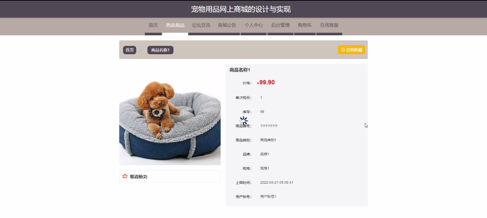
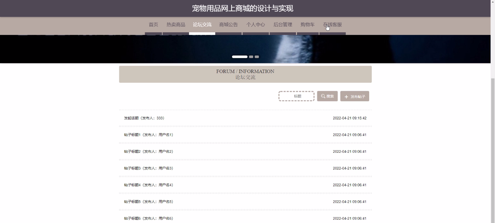
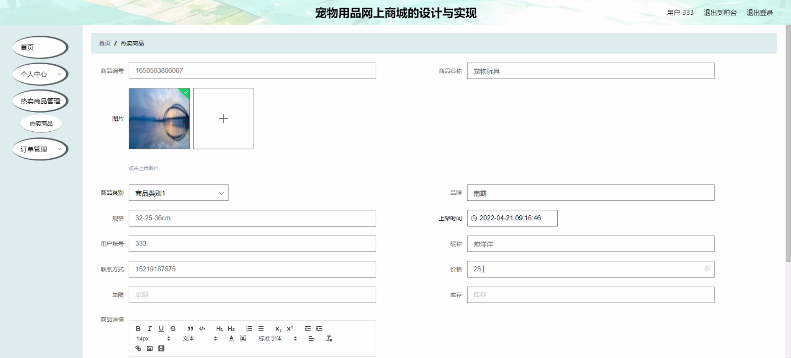
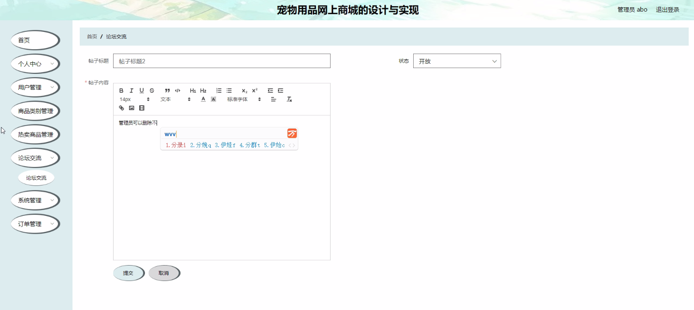

****本项目包含程序+源码+数据库+LW+调试部署环境，文末可获取一份本项目的java源码和数据库参考。****

## ******开题报告******

研究背景：
随着互联网的快速发展，电子商务成为了人们购物的主要方式之一。而宠物用品作为一个庞大的市场，也逐渐受到了人们的关注和需求。然而，传统的实体店面存在着空间限制、运营成本高等问题，无法满足消费者多样化的需求。因此，设计和实现一个宠物用品网上商城成为了迫切需要解决的问题。

研究意义：
宠物用品网上商城的设计与实现具有重要的意义。首先，它可以提供给消费者一个便捷、高效的购物平台，使得他们可以随时随地购买所需的宠物用品。其次，通过网上商城的建设，可以促进宠物用品行业的发展，推动行业的升级和转型。最后，宠物用品网上商城还可以为宠物用品生产企业提供一个更广阔的销售渠道，增加企业的收入和影响力。

研究目的：
本研究的目的是设计和实现一个功能完善、用户友好的宠物用品网上商城。通过该网上商城，消费者可以方便地浏览和购买各类宠物用品，同时也可以享受到更多的优惠和服务。此外，该网上商城还将提供给宠物用品生产企业一个展示和销售产品的平台，促进行业的发展。

研究内容： 本研究的主要内容包括以下几个方面：

  1. 用户系统功能：设计和实现用户注册、登录、个人信息管理等功能，使得用户可以方便地进行购物和交流。

  2. 商品类别系统功能：建立完善的商品分类体系，使得用户可以快速找到所需的宠物用品，并提供搜索和筛选功能，提高用户的购物体验。

  3. 热卖商品系统功能：根据用户的购买记录和评价，推荐热卖商品给用户，提高销售量和用户满意度。

  4. 订单管理系统功能：设计和实现订单生成、支付、配送等功能，确保用户的购物过程顺利进行。

  5. 售后服务系统功能：建立完善的售后服务体系，包括退换货、投诉处理等，提供良好的用户体验和解决用户问题的能力。

拟解决的主要问题： 在设计和实现宠物用品网上商城的过程中，需要解决以下主要问题：

  1. 如何设计一个用户友好的界面，使得用户可以方便地进行购物和交流。

  2. 如何建立一个完善的商品分类体系，使得用户可以快速找到所需的宠物用品。

  3. 如何根据用户的购买记录和评价，推荐热卖商品给用户，提高销售量和用户满意度。

  4. 如何设计和实现订单管理系统，确保用户的购物过程顺利进行。

  5. 如何建立一个良好的售后服务体系，解决用户的问题并提供满意的解决方案。

研究方案和预期成果： 本研究将采用以下方案进行设计和实现宠物用品网上商城：

  1. 进行市场调研，了解消费者的需求和行业的发展趋势。

  2. 设计和开发网上商城的各个功能模块，并进行系统集成和测试。

  3. 上线运营网上商城，并进行用户反馈和改进。

预期成果包括：

  1. 完善的宠物用品网上商城系统，具备用户注册、登录、个人信息管理、商品分类、热卖商品推荐、订单管理、售后服务等功能。

  2. 提供给消费者一个便捷、高效的购物平台，满足他们多样化的需求。

  3. 促进宠物用品行业的发展，推动行业的升级和转型。

  4. 为宠物用品生产企业提供一个更广阔的销售渠道，增加企业的收入和影响力。

  5. 提高用户的购物体验和满意度，建立良好的用户口碑。

进度安排：

2022年9月至10月：需求分析和规划，进行用户需求调研和分析，确定系统功能和目标。

2022年11月至2023年1月：系统设计和开发，完成系统架构设计和技术选型，并开始编写代码。

2023年2月至3月：测试和优化，进行单元测试和集成测试，修复问题并优化系统性能。

2023年4月至5月：文档编写和培训，编写用户手册和系统文档，并进行相关人员的培训。

2023年5月：上线部署和维护，将系统部署到生产环境中，并定期进行维护和升级。

参考文献：

[1]王振华.SpringBoot在教学效果评估系统中的应用[J].电子技术,2023,(05):67-69.

[2]王明泉.基于SpringBoot远程热部署的探索和应用[J].信息与电脑(理论版),2023,(07):1-4.

[3]王亚东,李晓霞,陈强强,剡美娜.基于SpringBoot的需求发布平台设计[J].信息与电脑(理论版),2023,(01):105-107.

[4]陈新府豪.基于SpringBoot和Vue框架的创新方法推理系统的设计与实现[D].导师：黄静.浙江理工大学,2022.

[5]霍福华,韩慧.基于SpringBoot微服务架构下前后端分离的MVVM模型[J].电子技术与软件工程,2022,(01):73-76.

[6]韩策,张娜,王松亭,张凯,何方,袁峰.SpringBoot OPC客户端设计与研究[J].电子世界,2021,(19):25-26.

****以上是本项目程序开发之前开题报告内容，最终成品以下面界面为准，大家可以酌情参考使用。要源码参考请在文末进行获取！！****

## ******本项目的界面展示******

