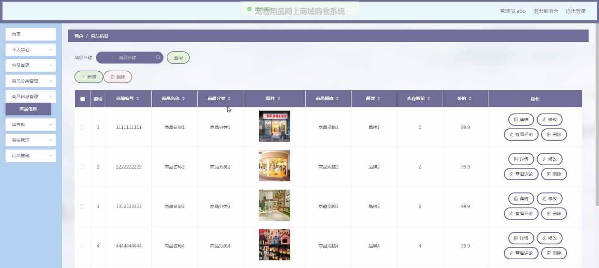
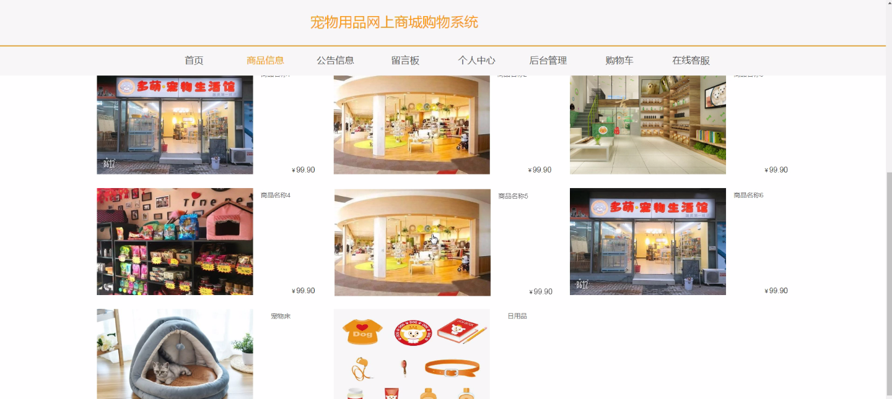
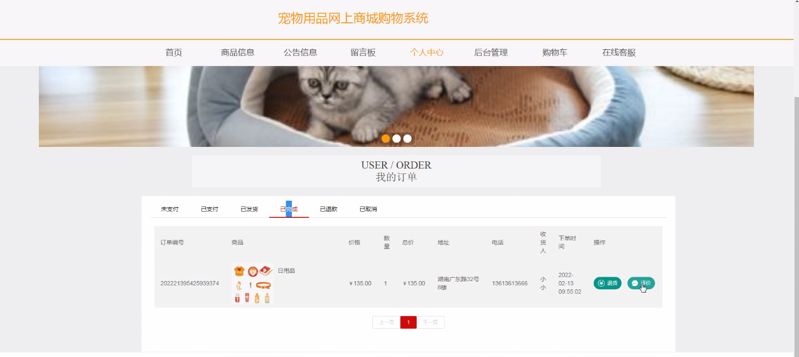

****本项目包含程序+源码+数据库+LW+调试部署环境，文末可获取一份本项目的java源码和数据库参考。****

## ******开题报告******

研究背景：
随着互联网的快速发展和普及，电子商务成为了人们购物的主要方式之一。而宠物用品作为一个庞大的市场，也逐渐受到了人们的关注和需求。然而，传统的实体店面存在着空间限制、时间限制以及商品种类有限等问题，无法满足消费者多样化的需求。因此，建立一个宠物用品网上商城购物系统具有重要的现实意义。

研究意义：
宠物用品网上商城购物系统的建立将为消费者提供一个便捷、高效、多样化的购物平台。消费者可以通过该系统随时随地浏览和购买各类宠物用品，不再受限于时间和地点。同时，该系统还能够提供个性化的推荐服务，根据消费者的购买记录和偏好，为其推荐更加符合其需求的商品，提升购物体验。

研究目的：
本研究旨在设计和开发一个功能完善的宠物用品网上商城购物系统，以满足消费者对宠物用品的多样化需求，并提升其购物体验。通过该系统，消费者可以方便地浏览和购买各类宠物用品，同时享受个性化的推荐服务，提高购物效率和满意度。

研究内容： 本研究的主要内容包括以下系统功能：会员系统、商品分类系统和商品信息系统。

  1. 会员系统：该系统将实现用户注册、登录、个人信息管理等功能。用户可以通过注册成为会员，享受更多的优惠和特权。同时，会员系统还可以记录用户的购买历史和偏好，为其提供个性化的推荐服务。

  2. 商品分类系统：该系统将对宠物用品进行分类，方便用户快速找到所需商品。通过合理的分类体系和标签，用户可以根据自己的需求进行筛选和搜索，提高购物效率。

  3. 商品信息系统：该系统将提供详细的商品信息，包括商品名称、价格、规格、图片等。用户可以通过查看商品信息了解商品的具体情况，并进行比较和选择。

拟解决的主要问题：
本研究旨在解决传统实体店面存在的空间限制、时间限制以及商品种类有限等问题。通过建立一个宠物用品网上商城购物系统，消费者可以随时随地浏览和购买各类宠物用品，不再受限于实体店面的局限性。

研究方案和预期成果：
本研究将采用软件开发的方法，设计和开发一个功能完善的宠物用品网上商城购物系统。通过需求分析、系统设计、编码实现和测试等步骤，最终完成一个稳定、安全、易用的系统。预期成果包括一个具备会员系统、商品分类系统和商品信息系统的宠物用品网上商城购物系统，能够满足消费者的多样化需求，并提升其购物体验。

进度安排：

2022年9月至10月：开题报告编写和提交，完成开题报告的撰写并提交给指导教师进行审核。

2022年11月至2023年1月：系统设计和开发，根据开题报告的要求，进行系统设计和编码工作。

2023年2月至3月：论文撰写和初稿完成，开始撰写论文，并在这个阶段完成论文的初稿。

2023年4月至5月：论文修改和最终定稿，根据指导教师的意见对论文进行修改，并完成最终的定稿。

2023年5月：论文答辩和提交，参加论文答辩并根据答辩结果进行修改，最后将论文提交给学院或学校。

参考文献：

[1]喻佳,吴丹新.基于SpringBoot的Web快速开发框架[J].电脑编程技巧与维护,2021,(09):31-33.

[2]李鹏.基于SpringBoot快速开发平台的实现[J].电子技术与软件工程,2021,(12):36-37.

[3]叶开平,蔡维晟,陈家敏,邓斯妮.基于SpringBoot的综测可视化管理系统的研究与设计[J].电脑知识与技术,2021,(12):100-104.

[4]江健锋,徐振平.Springboot最小系统的设计与实现[J].电脑知识与技术,2021,(04):62-63.

[5]赵炯,司圣杰,周奇才,熊肖磊.通用信息获取系统设计与实现[J].起重运输机械,2020,(16):89-97.

[6]吴英宾.一种内外网数据交互系统的设计与实现[J].软件工程,2020,(08):25-27.

****以上是本项目程序开发之前开题报告内容，最终成品以下面界面为准，大家可以酌情参考使用。要源码参考请在文末进行获取！！****

## ******本项目的界面展示******

