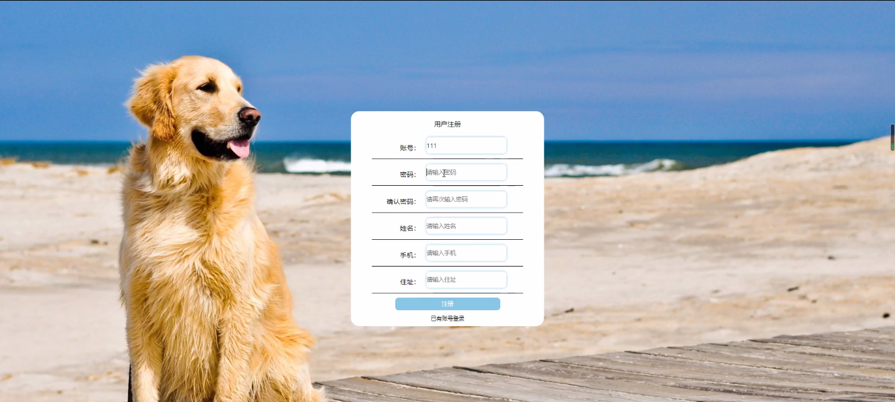
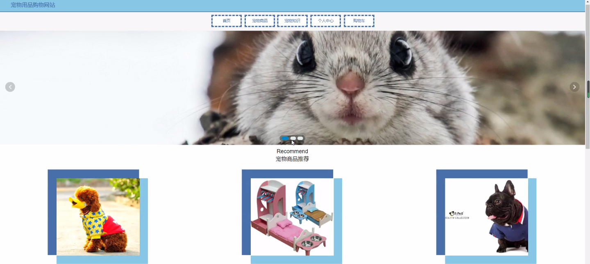
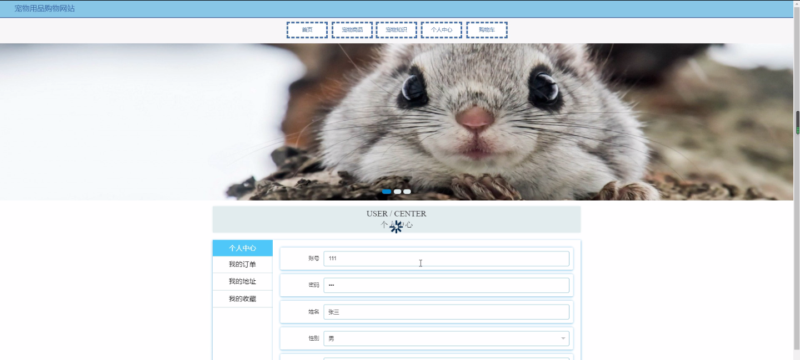
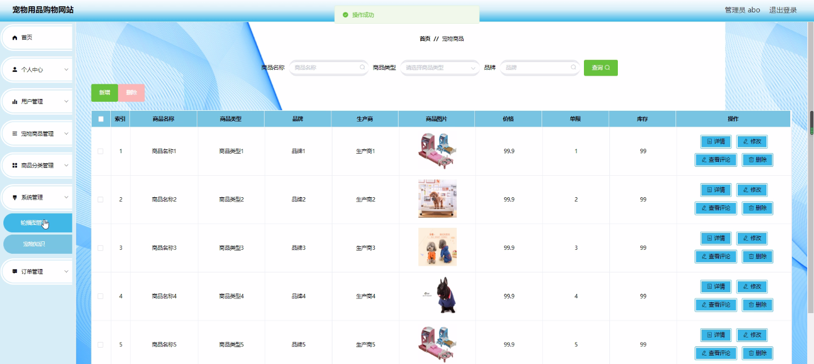

****本项目包含程序+源码+数据库+LW+调试部署环境，文末可获取一份本项目的java源码和数据库参考。****

## ******开题报告******

研究背景：
随着人们生活水平的提高和宠物养殖观念的改变，越来越多的家庭选择养宠物作为家庭成员。宠物市场逐渐兴起，宠物用品的需求也日益增长。然而，传统的实体店购物方式存在一些问题，如时间限制、地域限制以及商品种类有限等。因此，建立一个方便、快捷、多样化的宠物用品购物网站具有重要意义。

研究意义：
宠物用品购物网站的建立将为广大宠物主人提供一个便利的购物平台，满足他们对宠物用品的需求。同时，该网站还可以促进宠物用品行业的发展，推动相关产业链的完善和优化。此外，通过对用户行为数据的分析，可以为商家提供精准的营销策略，提升销售效果。

研究目的：
本研究旨在构建一个功能完善、用户友好的宠物用品购物网站，为用户提供便捷的购物体验，并为商家提供有效的销售渠道。通过研究用户、宠物商品和商品分类等系统功能，探索如何优化网站的设计和运营，提高用户满意度和购物体验。

研究内容： 本研究的主要内容包括以下几个方面：

  1. 用户系统功能：研究用户注册、登录、个人信息管理、购物车、订单管理等功能，以提供个性化的服务和便捷的购物流程。

  2. 宠物商品系统功能：研究宠物商品的展示、搜索、筛选、详情页等功能，以提供丰富多样的商品选择和详尽的商品信息。

  3. 商品分类系统功能：研究商品分类的设计、标签管理、推荐算法等功能，以帮助用户快速找到所需商品，并提供个性化的推荐服务。

拟解决的主要问题： 在构建宠物用品购物网站的过程中，我们将重点解决以下问题：

  1. 如何设计一个简洁直观、易于操作的用户界面，提高用户的使用体验和购物效率？

  2. 如何建立一个完善的商品数据库，确保商品信息的准确性和及时更新？

  3. 如何通过数据分析和挖掘，为商家提供精准的用户画像和个性化的推荐服务？

研究方案和预期成果：
本研究将采用用户调研、竞品分析、原型设计和系统开发等方法，逐步完善宠物用品购物网站的功能和用户体验。预期成果包括一个具备核心功能的原型系统，并通过用户测试和反馈不断优化改进，最终实现一个高效、便捷、个性化的宠物用品购物网站。

进度安排：

2022年9月至10月：开题报告编写和提交，完成开题报告的撰写并提交给指导教师进行审核。

2022年11月至2023年1月：系统设计和开发，根据开题报告的要求，进行系统设计和编码工作。

2023年2月至3月：论文撰写和初稿完成，开始撰写论文，并在这个阶段完成论文的初稿。

2023年4月至5月：论文修改和最终定稿，根据指导教师的意见对论文进行修改，并完成最终的定稿。

2023年5月：论文答辩和提交，参加论文答辩并根据答辩结果进行修改，最后将论文提交给学院或学校。

参考文献：

[1]喻佳,吴丹新.基于SpringBoot的Web快速开发框架[J].电脑编程技巧与维护,2021,(09):31-33.

[2]李鹏.基于SpringBoot快速开发平台的实现[J].电子技术与软件工程,2021,(12):36-37.

[3]叶开平,蔡维晟,陈家敏,邓斯妮.基于SpringBoot的综测可视化管理系统的研究与设计[J].电脑知识与技术,2021,(12):100-104.

[4]江健锋,徐振平.Springboot最小系统的设计与实现[J].电脑知识与技术,2021,(04):62-63.

[5]赵炯,司圣杰,周奇才,熊肖磊.通用信息获取系统设计与实现[J].起重运输机械,2020,(16):89-97.

[6]吴英宾.一种内外网数据交互系统的设计与实现[J].软件工程,2020,(08):25-27.

****以上是本项目程序开发之前开题报告内容，最终成品以下面界面为准，大家可以酌情参考使用。要源码参考请在文末进行获取！！****

## ******本项目的界面展示******

