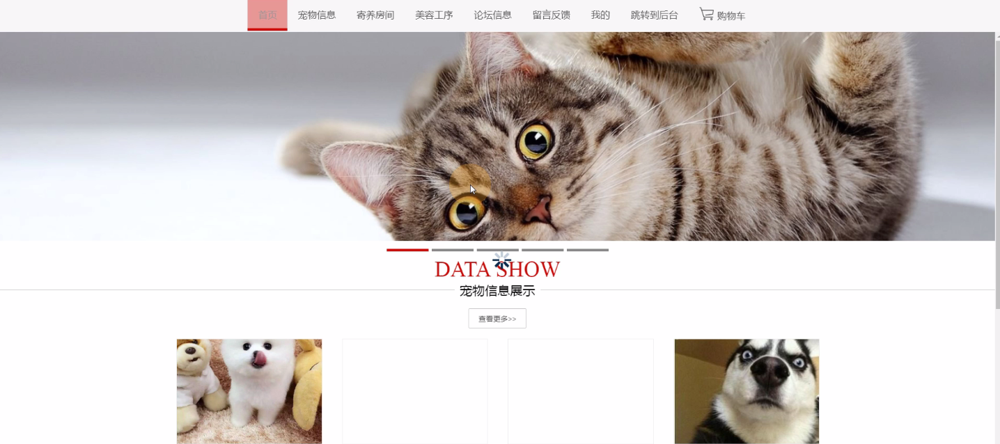

****本项目包含程序+源码+数据库+LW+调试部署环境，文末可获取一份本项目的java源码和数据库参考。****

## ******开题报告******

研究背景：
随着人们生活水平的提高和生活方式的改变，宠物已经成为现代社会中越来越重要的一部分。越来越多的人选择养宠物作为伴侣和家庭成员，这也导致了宠物管理的需求日益增长。然而，目前市场上的宠物管理系统存在一些问题，如信息不全、操作复杂、服务不规范等，这给宠物主人和宠物店经营者带来了很多困扰。

研究意义：
针对宠物管理系统存在的问题，开发一个高效、便捷、可靠的宠物管理系统具有重要的实际意义。该系统可以帮助宠物主人更好地管理和照顾自己的宠物，提供全面的宠物信息和服务，同时也能够帮助宠物店经营者提高管理效率和服务质量，满足用户需求，促进宠物行业的健康发展。

研究目的：
本研究旨在设计和开发一种功能完善、易于操作的宠物管理系统，以解决目前宠物管理系统存在的问题。通过该系统，宠物主人可以方便地查询宠物信息、购买宠物用品、预约美容服务等，而宠物店经营者可以更好地管理宠物信息、提供个性化的服务，并实现业务的规范化和高效化。

研究内容： 本研究的主要内容包括以下系统功能：

  1. 会员管理：建立宠物主人的会员档案，记录其基本信息、宠物信息、消费记录等，方便进行个性化服务和管理。

  2. 宠物信息管理：记录宠物的基本信息、健康状况、养育需求等，方便宠物主人了解和管理自己的宠物。

  3. 宠物用品管理：提供宠物用品的购买渠道和推荐，方便宠物主人购买适合自己宠物的用品。

  4. 宠物购买：提供宠物购买的渠道和信息，帮助宠物主人选择合适的宠物。

  5. 消费信息管理：记录宠物主人的消费信息，方便宠物店经营者进行统计和分析，提供更好的服务。

  6. 寄养房间管理：提供宠物寄养的房间管理，方便宠物主人安排宠物的寄养需求。

  7. 日租房租赁：提供宠物日租房的租赁服务，方便宠物主人短期寄养宠物。

  8. 钟点房租赁：提供宠物钟点房的租赁服务，方便宠物主人灵活安排宠物的寄养时间。

  9. 美容师管理：记录美容师的基本信息和工作安排，方便宠物店经营者进行美容服务的预约和管理。

  10. 美容工序管理：记录美容的具体工序和流程，方便美容师进行操作和宠物主人了解美容过程。

  11. 美容预约：提供美容服务的预约功能，方便宠物主人预约美容服务。

拟解决的主要问题：
通过开发一个功能完善、易于操作的宠物管理系统，我们将解决目前宠物管理系统存在的信息不全、操作复杂、服务不规范等问题。该系统将提供全面的宠物管理功能，方便宠物主人和宠物店经营者进行信息查询、购买、预约等操作，提高管理效率和服务质量。

研究方案和预期成果：
本研究将采用软件开发的方法，设计和开发一款宠物管理系统，并进行测试和优化。预期成果包括一个功能完善、易于操作的宠物管理系统，能够满足宠物主人和宠物店经营者的需求，提高宠物管理的效率和质量。同时，该系统还将为宠物行业的发展提供参考和借鉴，促进行业的规范化和健康发展。

进度安排：

2022年9月至10月：开题报告编写和提交，完成开题报告的撰写并提交给指导教师进行审核。

2022年11月至2023年1月：系统设计和开发，根据开题报告的要求，进行系统设计和编码工作。

2023年2月至3月：论文撰写和初稿完成，开始撰写论文，并在这个阶段完成论文的初稿。

2023年4月至5月：论文修改和最终定稿，根据指导教师的意见对论文进行修改，并完成最终的定稿。

2023年5月：论文答辩和提交，参加论文答辩并根据答辩结果进行修改，最后将论文提交给学院或学校。

参考文献：

[1]喻佳,吴丹新.基于SpringBoot的Web快速开发框架[J].电脑编程技巧与维护,2021,(09):31-33.

[2]李鹏.基于SpringBoot快速开发平台的实现[J].电子技术与软件工程,2021,(12):36-37.

[3]叶开平,蔡维晟,陈家敏,邓斯妮.基于SpringBoot的综测可视化管理系统的研究与设计[J].电脑知识与技术,2021,(12):100-104.

[4]江健锋,徐振平.Springboot最小系统的设计与实现[J].电脑知识与技术,2021,(04):62-63.

[5]赵炯,司圣杰,周奇才,熊肖磊.通用信息获取系统设计与实现[J].起重运输机械,2020,(16):89-97.

[6]吴英宾.一种内外网数据交互系统的设计与实现[J].软件工程,2020,(08):25-27.

****以上是本项目程序开发之前开题报告内容，最终成品以下面界面为准，大家可以酌情参考使用。要源码参考请在文末进行获取！！****

## ******本项目的界面展示******

