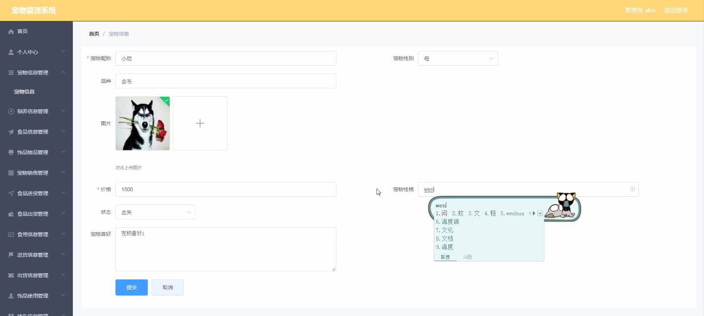
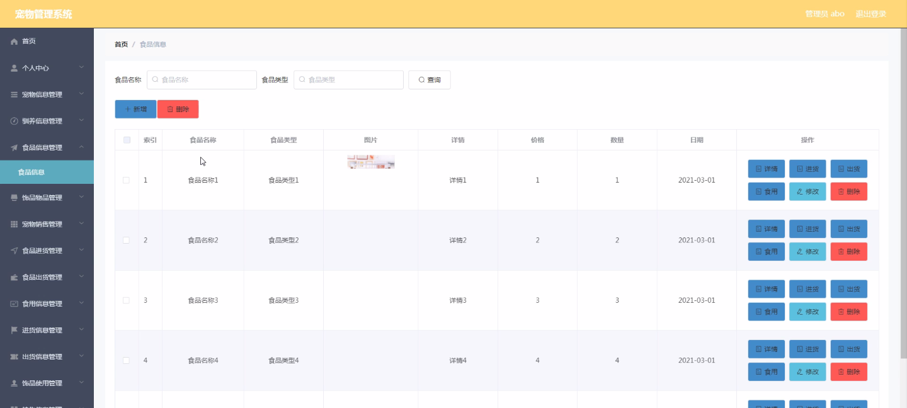
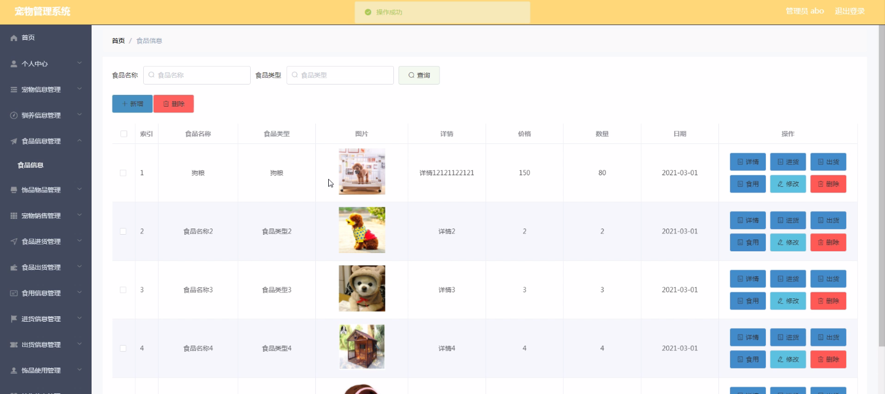
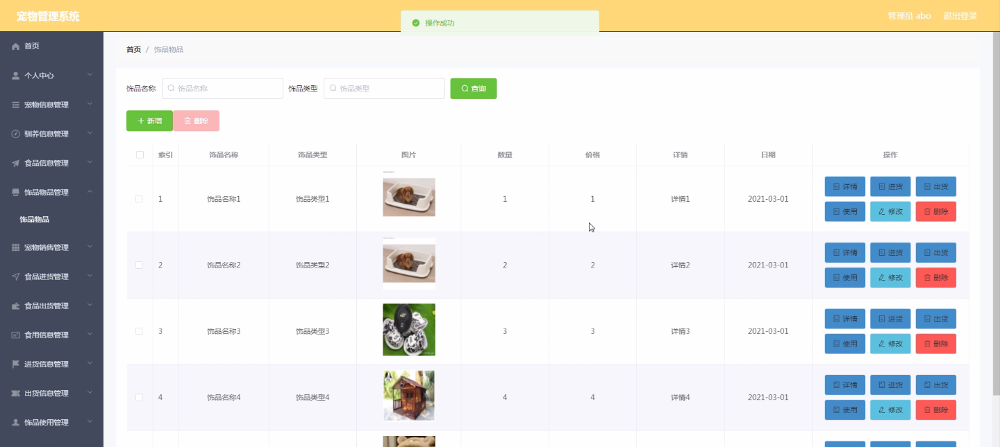
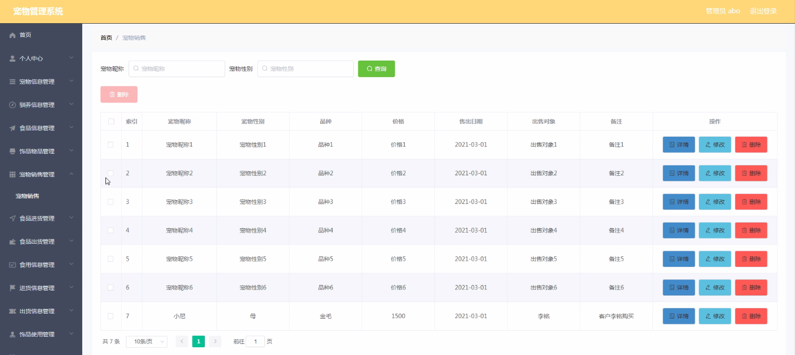

****本项目包含程序+源码+数据库+LW+调试部署环境，文末可获取一份本项目的java源码和数据库参考。****

## ******开题报告******

研究背景：
随着人们生活水平的提高和生活方式的改变，宠物已经成为现代社会中越来越受欢迎的伴侣。然而，随之而来的是对宠物管理的需求也日益增长。传统的宠物管理方式已经无法满足人们对于宠物养护、驯养、销售等方面的需求。因此，开发一种全面、高效的宠物管理系统具有重要的研究意义和实际应用价值。

研究意义：
宠物管理系统的开发将为宠物主人和宠物店提供一个集宠物信息管理、驯养指导、食品饰品管理、销售管理等功能于一体的综合性平台。这将极大地方便了宠物主人的宠物养护工作，提升了宠物店的管理效率，同时也促进了宠物市场的健康发展。此外，通过对宠物管理系统的研究，还可以为相关领域的学术研究提供数据支持和参考。

研究目的：
本研究旨在开发一种基于宠物管理系统的全面解决方案，以满足人们对于宠物管理的需求。具体目标包括但不限于：提供宠物信息管理功能，方便宠物主人记录和查看宠物的基本信息、健康状况等；提供驯养指导功能，帮助宠物主人了解宠物的行为习惯、训练方法等；提供食品饰品管理功能，方便宠物主人购买和使用适合宠物的食品和饰品；提供宠物销售管理功能，方便宠物店进行宠物的销售和交易管理；提供食品进货和出货管理功能，方便宠物店进行食品的采购和销售；提供宠物挂失信息管理功能，帮助宠物主人寻找丢失的宠物。

研究内容： 本研究将围绕宠物管理系统的各项功能展开研究，包括但不限于以下内容：

  1. 宠物信息管理：设计并实现宠物信息的录入、查询、修改和删除功能，以及宠物健康状况的监测和提醒功能。
  2. 驯养信息管理：提供宠物驯养指导和培训计划，帮助宠物主人了解宠物的行为特点和训练方法。
  3. 食品信息管理：建立食品库存管理系统，包括进货、出货、库存监控等功能，确保宠物食品的质量和供应充足。
  4. 饰品物品管理：提供宠物饰品的选择和使用指导，帮助宠物主人为宠物提供适合的饰品。
  5. 宠物销售管理：设计并实现宠物销售流程的管理，包括宠物展示、交易记录、支付方式等功能。
  6. 挂失信息管理：建立宠物挂失信息数据库，提供宠物丢失后的寻找和发布功能。

拟解决的主要问题：

  1. 传统宠物管理方式效率低下，无法满足人们对于宠物管理的需求。
  2. 宠物主人缺乏全面的宠物驯养知识和指导。
  3. 宠物店的食品和饰品管理不够规范和高效。
  4. 宠物销售过程中存在信息不透明和管理混乱的问题。
  5. 宠物丢失后寻找困难，缺乏有效的挂失信息管理系统。

研究方案和预期成果：
本研究将采用软件开发的方法，结合数据库技术和网络技术，设计并实现一套全面的宠物管理系统。预期成果包括但不限于：开发出功能完善、操作简便的宠物管理系统；提供宠物信息管理、驯养指导、食品饰品管理、销售管理等多个功能模块；为宠物主人和宠物店提供便捷、高效的宠物管理解决方案；促进宠物市场的健康发展和宠物养护水平的提升。

进度安排：

2022年9月至10月：需求分析和规划，明确系统功能和目标，制定项目计划。

2022年11月至2023年1月：系统设计和编码，完成详细的系统设计并开始编写代码。

2023年2月至3月：用户界面开发和数据库开发，开发用户友好的界面和设计数据库结构。

2023年4月至5月：功能测试、文档编写和上线部署，对系统进行全面的功能测试并编写用户手册。

2023年5月：维护和升级，定期对系统进行维护和升级，修复bug和添加新功能。

参考文献：

[1]邱小群,邓丽艳,陈海潮.基于B/S的信息管理系统设计和实现[J].信息与电脑(理论版),2022,(20):146-148.

[2]谢霜.基于Java技术的网络管理体系结构的应用[J].网络安全技术与应用,2022,(10):14-15.

[3]宋锦华.高职院校Java程序设计课程改革研究[J].科技视界,2022,(20):133-135.

[4]曹嵩彭,王鹏宇.浅析Java语言在软件开发中的应用[J].信息记录材料,2022,(03):114-116.

[5]朱澈,余俊达.武汉东湖学院.基于Java的软硬件信息管理系统V1.0[Z].项目立项编号.鉴定单位.鉴定日期:

****以上是本项目程序开发之前开题报告内容，最终成品以下面界面为准，大家可以酌情参考使用。要源码参考请在文末进行获取！！****

## ******本项目的界面展示******

