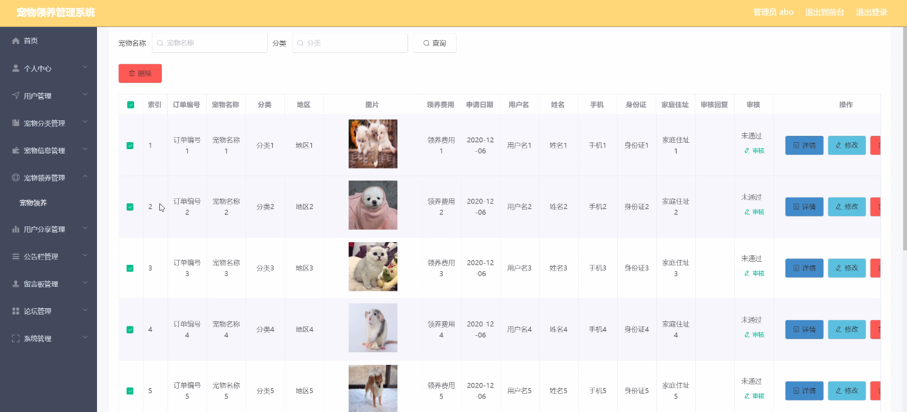

****本项目包含程序+源码+数据库+LW+调试部署环境，文末可获取一份本项目的java源码和数据库参考。****

## ******开题报告******

研究背景：
随着人们生活水平的提高和生活方式的改变，宠物已经成为现代社会中越来越受欢迎的伴侣。然而，随之而来的是对宠物管理的需求也日益增长。传统的宠物管理方式已经无法满足人们的需求，因此需要开发一种更加高效、便捷的宠物管理系统。

研究意义：
宠物管理系统的开发具有重要的现实意义。首先，它可以帮助宠物主人更好地管理和照顾自己的宠物，提供宠物分类、商品分类、宠物用品等功能，方便宠物主人购买所需的宠物用品，并及时了解宠物的健康状况。其次，宠物管理系统还可以提供宠物商店、宠物领养等功能，方便用户寻找合适的宠物并进行领养。此外，宠物管理系统还可以提供宠物寄存、宠物挂失等功能，帮助用户解决宠物丢失或无法照顾宠物的问题。

研究目的：
本研究旨在开发一种全面、高效的宠物管理系统，以满足人们对宠物管理的需求。通过该系统，用户可以方便地进行宠物分类、商品购买、宠物领养等操作，提高宠物管理的效率和便捷性。同时，该系统还将解决宠物丢失、无法照顾宠物等问题，为用户提供更好的宠物管理体验。

研究内容：
本研究的主要内容包括宠物分类、商品分类、宠物用品、宠物商店、宠物领养、用户、宠物寄存、用户领养、宠物挂失、订单评价等系统功能。具体而言，宠物分类功能将根据不同的宠物种类进行分类管理；商品分类功能将根据不同的商品类型进行分类管理；宠物用品功能将提供宠物所需的各类用品供用户选择购买；宠物商店功能将提供宠物销售服务；宠物领养功能将帮助用户找到合适的宠物并进行领养；用户功能将提供用户注册、登录、个人信息管理等服务；宠物寄存功能将提供宠物寄存服务；用户领养功能将帮助用户找到需要领养的宠物；宠物挂失功能将帮助用户寻找丢失的宠物；订单评价功能将允许用户对购买的商品或领养的宠物进行评价。

拟解决的主要问题：

  1. 如何实现宠物分类功能，使得用户可以方便地查找和管理不同种类的宠物？
  2. 如何实现商品分类功能，使得用户可以方便地查找和购买不同类型的宠物用品？
  3. 如何实现宠物商店功能，提供宠物销售服务，并确保宠物的质量和健康状况？
  4. 如何实现宠物领养功能，帮助用户找到合适的宠物并进行领养？
  5. 如何实现宠物寄存功能，为用户提供宠物寄存服务，并确保宠物的安全和健康？

研究方案和预期成果：
本研究将采用软件开发的方法，设计和开发一套完整的宠物管理系统。通过需求分析、系统设计、编码实现和测试验证等步骤，逐步完成系统的开发工作。预期成果包括一个功能完善、操作简便的宠物管理系统，能够满足用户的各类需求，并提供良好的用户体验。同时，该系统还将解决宠物管理过程中的一系列问题，提高宠物管理的效率和便捷性。

进度安排：

2022年9月至10月：需求分析和规划，进行用户需求调研和分析，确定系统功能和目标。

2022年11月至2023年1月：系统设计和开发，完成系统架构设计和技术选型，并开始编写代码。

2023年2月至3月：测试和优化，进行单元测试和集成测试，修复问题并优化系统性能。

2023年4月至5月：文档编写和培训，编写用户手册和系统文档，并进行相关人员的培训。

2023年5月：上线部署和维护，将系统部署到生产环境中，并定期进行维护和升级。

参考文献：

[1]王振华.SpringBoot在教学效果评估系统中的应用[J].电子技术,2023,(05):67-69.

[2]王明泉.基于SpringBoot远程热部署的探索和应用[J].信息与电脑(理论版),2023,(07):1-4.

[3]王亚东,李晓霞,陈强强,剡美娜.基于SpringBoot的需求发布平台设计[J].信息与电脑(理论版),2023,(01):105-107.

[4]陈新府豪.基于SpringBoot和Vue框架的创新方法推理系统的设计与实现[D].导师：黄静.浙江理工大学,2022.

[5]霍福华,韩慧.基于SpringBoot微服务架构下前后端分离的MVVM模型[J].电子技术与软件工程,2022,(01):73-76.

[6]韩策,张娜,王松亭,张凯,何方,袁峰.SpringBoot OPC客户端设计与研究[J].电子世界,2021,(19):25-26.

****以上是本项目程序开发之前开题报告内容，最终成品以下面界面为准，大家可以酌情参考使用。要源码参考请在文末进行获取！！****

## ******本项目的界面展示******

