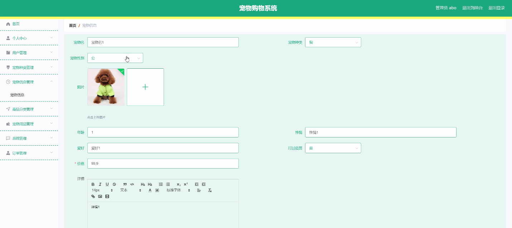
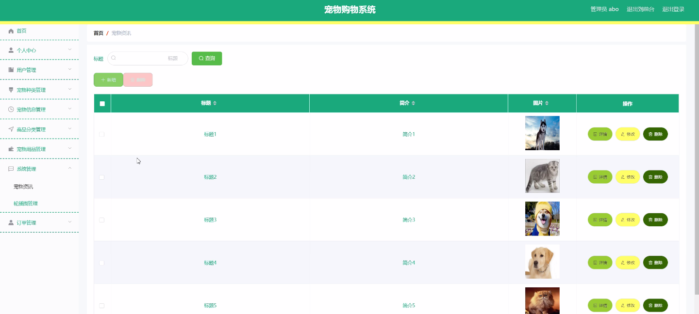
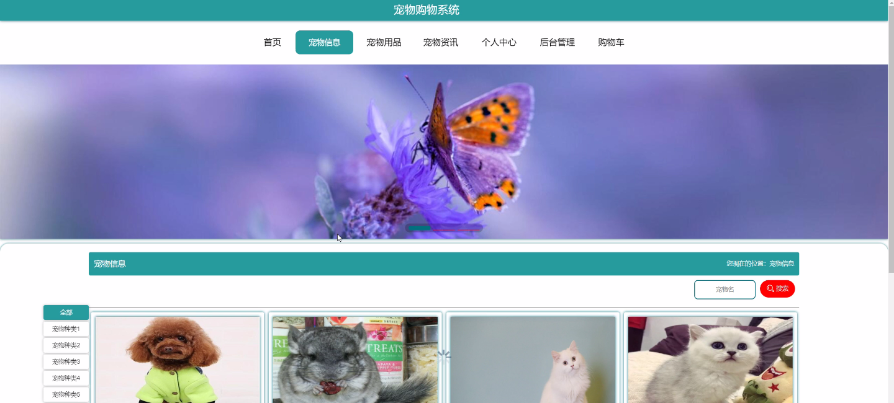
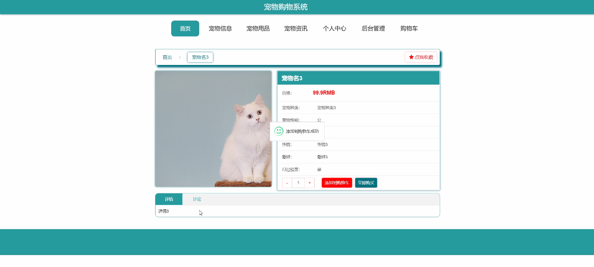
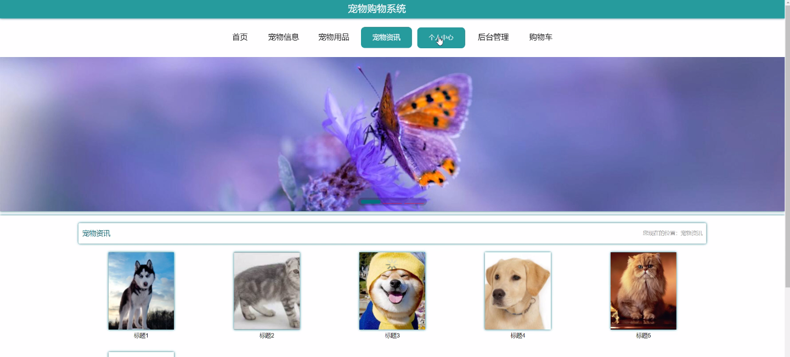
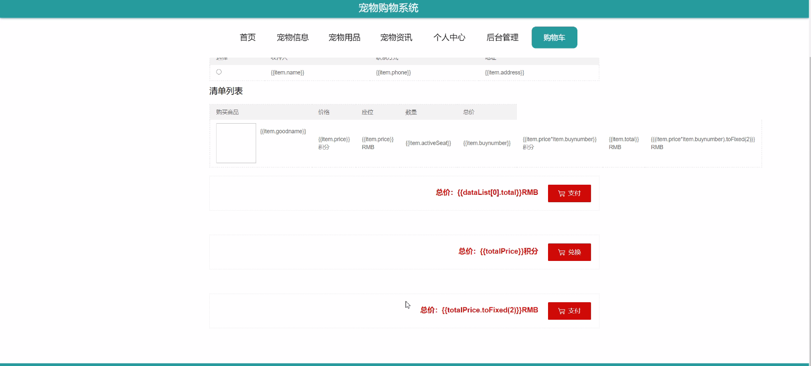

****本项目包含程序+源码+数据库+LW+调试部署环境，文末可获取一份本项目的java源码和数据库参考。****

## ******开题报告******

研究背景：
随着人们生活水平的提高和对宠物的需求增加，宠物购物系统成为了一个重要的领域。传统的宠物购物方式存在一些问题，比如购买渠道有限、信息不透明、交易不便等。因此，开发一个全面、便捷、高效的宠物购物系统具有重要的现实意义。

研究意义：
宠物购物系统的建立将为用户提供一个方便快捷的购物平台，使用户能够更好地选择和购买宠物及相关用品。同时，该系统还可以促进宠物市场的发展，提升宠物行业的规范化水平，推动宠物产业的健康发展。

研究目的：
本研究旨在设计和开发一种功能完善、用户友好的宠物购物系统，以满足用户对宠物及相关用品的购买需求。通过该系统，用户可以方便地浏览、筛选和购买各类宠物及其用品，提高购物的便利性和效率。

研究内容： 本研究的主要内容包括以下系统功能：

  1. 用户管理：设计用户注册、登录、个人信息管理等功能，确保用户身份的合法性和安全性。

  2. 宠物种类管理：建立宠物种类的数据库，包括猫、狗、鸟类等各类宠物，提供详细的宠物信息和图片展示。

  3. 宠物信息管理：为每个宠物建立详细的信息页面，包括品种、年龄、性别、健康状况等，方便用户了解和选择。

  4. 商品分类管理：将宠物用品按照不同的分类进行管理，如食品、玩具、保健品等，方便用户浏览和购买。

  5. 宠物用品管理：为每个宠物用品建立详细的信息页面，包括品牌、规格、价格等，方便用户选择和购买。

拟解决的主要问题：
本研究旨在解决传统宠物购物方式存在的购买渠道有限、信息不透明、交易不便等问题。通过建立一个全面、便捷、高效的宠物购物系统，用户可以更方便地选择和购买宠物及相关用品，提高购物的便利性和效率。

研究方案和预期成果：
本研究将采用软件开发的方法，结合数据库技术和网络技术，设计和开发一个功能完善、用户友好的宠物购物系统。预期成果包括一个可用的宠物购物系统原型，能够满足用户对宠物及相关用品的购买需求，并提供便捷、高效的购物体验。

进度安排：

2022年9月至10月：需求分析和规划，进行用户需求调研和分析，确定系统功能和目标。

2022年11月至2023年1月：系统设计和开发，完成系统架构设计和技术选型，并开始编写代码。

2023年2月至3月：测试和优化，进行单元测试和集成测试，修复问题并优化系统性能。

2023年4月至5月：文档编写和培训，编写用户手册和系统文档，并进行相关人员的培训。

2023年5月：上线部署和维护，将系统部署到生产环境中，并定期进行维护和升级。

参考文献：

[1]王振华.SpringBoot在教学效果评估系统中的应用[J].电子技术,2023,(05):67-69.

[2]王明泉.基于SpringBoot远程热部署的探索和应用[J].信息与电脑(理论版),2023,(07):1-4.

[3]王亚东,李晓霞,陈强强,剡美娜.基于SpringBoot的需求发布平台设计[J].信息与电脑(理论版),2023,(01):105-107.

[4]陈新府豪.基于SpringBoot和Vue框架的创新方法推理系统的设计与实现[D].导师：黄静.浙江理工大学,2022.

[5]霍福华,韩慧.基于SpringBoot微服务架构下前后端分离的MVVM模型[J].电子技术与软件工程,2022,(01):73-76.

[6]韩策,张娜,王松亭,张凯,何方,袁峰.SpringBoot OPC客户端设计与研究[J].电子世界,2021,(19):25-26.

****以上是本项目程序开发之前开题报告内容，最终成品以下面界面为准，大家可以酌情参考使用。要源码参考请在文末进行获取！！****

## ******本项目的界面展示******

