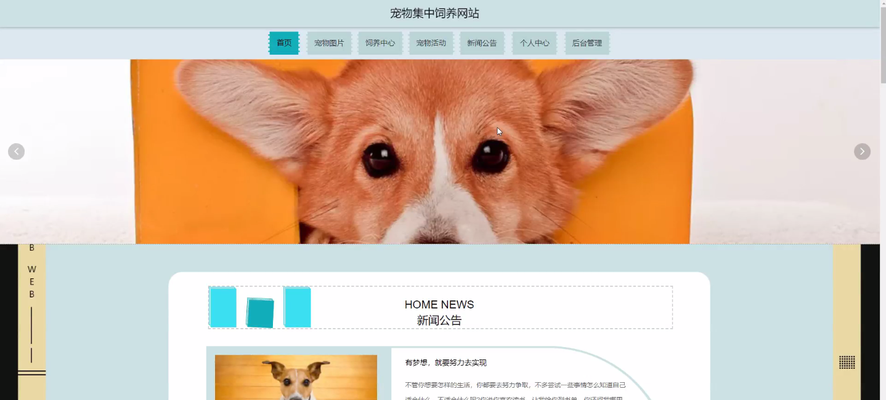
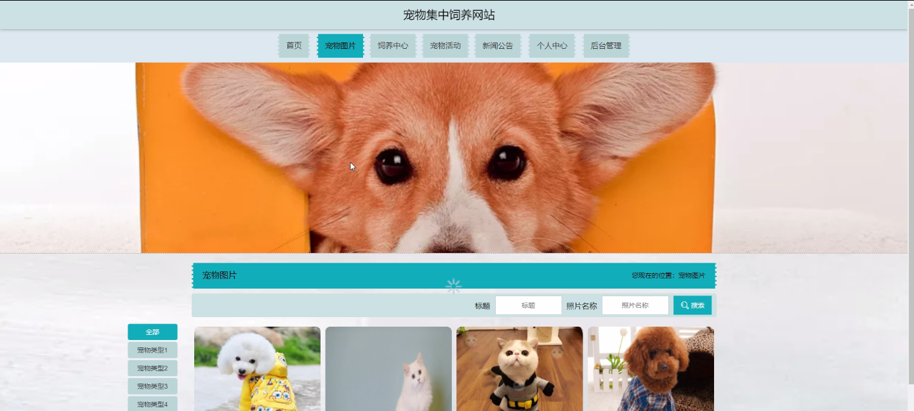
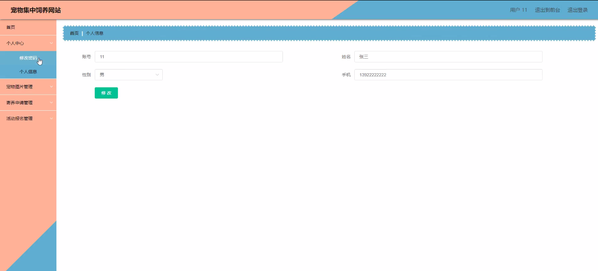
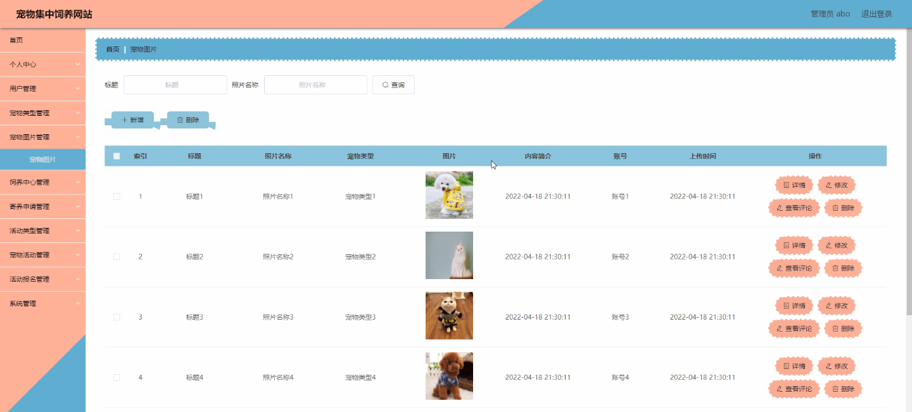
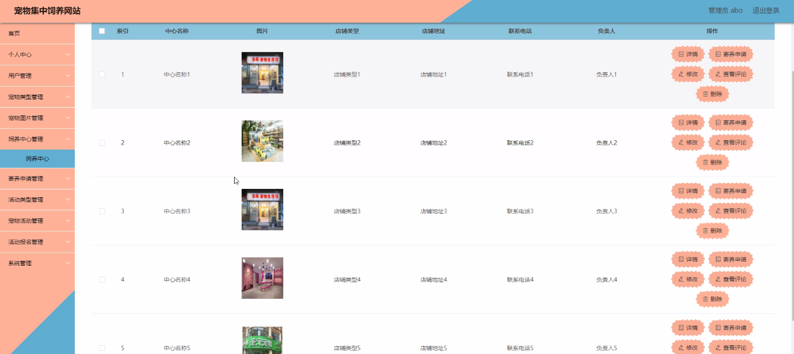
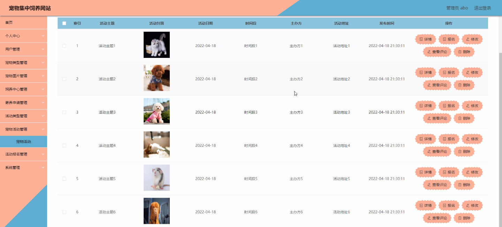

****本项目包含程序+源码+数据库+LW+调试部署环境，文末可获取一份本项目的java源码和数据库参考。****

## ******开题报告******

研究背景：
随着人们生活水平的提高和生活方式的改变，越来越多的人选择养宠物作为伴侣和家庭成员。然而，宠物饲养过程中面临的问题也逐渐增多，例如宠物寄养、宠物活动等方面的需求日益增长。为了满足这些需求，宠物集中饲养网站应运而生。

研究意义：
宠物集中饲养网站的出现对于宠物饲养行业具有重要意义。首先，它为宠物主人提供了一个方便快捷的平台，使他们能够更好地管理和照顾自己的宠物。其次，它为宠物饲养中心提供了一个展示和推广自身服务的机会，帮助宠物饲养中心吸引更多的用户和客户。此外，宠物集中饲养网站还可以促进宠物社交和交流，让宠物主人之间建立联系，分享经验和知识。

研究目的：
本研究旨在设计和开发一种宠物集中饲养网站，以满足宠物主人和宠物饲养中心的需求。通过该网站，宠物主人可以方便地寻找合适的宠物饲养中心、申请宠物寄养服务，并参与各种宠物活动。同时，宠物饲养中心可以通过该网站展示自己的服务和设施，吸引更多的用户和客户。

研究内容：
本研究的主要内容包括以下系统功能：用户管理、宠物类型管理、宠物图片管理、饲养中心管理、寄养申请管理、活动类型管理、宠物活动管理和活动报名管理。具体而言，用户管理功能用于注册和登录用户账号，宠物类型管理功能用于分类和管理不同种类的宠物，宠物图片管理功能用于上传和展示宠物的照片，饲养中心管理功能用于展示和推广宠物饲养中心的信息，寄养申请管理功能用于处理用户的宠物寄养申请，活动类型管理功能用于分类和管理不同类型的宠物活动，宠物活动管理功能用于发布和管理宠物活动的信息，活动报名管理功能用于处理用户对宠物活动的报名。

拟解决的主要问题：
本研究旨在解决宠物饲养过程中的一些痛点和难题。首先，通过宠物集中饲养网站，宠物主人可以方便地找到合适的宠物饲养中心，解决了寻找宠物寄养服务的问题。其次，宠物集中饲养网站提供了丰富多样的宠物活动信息，让宠物主人能够更好地参与社交和交流，解决了宠物社交的问题。此外，宠物集中饲养网站还提供了方便快捷的报名功能，解决了宠物活动报名的问题。

研究方案和预期成果：
本研究将采用软件开发的方法，设计和开发一种宠物集中饲养网站。通过需求分析、系统设计、编码实现和测试验证等步骤，最终完成一个功能完善、用户友好的宠物集中饲养网站。预期成果包括一个可用的网站原型和相应的后台管理系统，能够满足宠物主人和宠物饲养中心的需求，并提供良好的用户体验。

进度安排：

2022年9月至10月：开题报告编写和提交，完成开题报告的撰写并提交给指导教师进行审核。

2022年11月至2023年1月：系统设计和开发，根据开题报告的要求，进行系统设计和编码工作。

2023年2月至3月：论文撰写和初稿完成，开始撰写论文，并在这个阶段完成论文的初稿。

2023年4月至5月：论文修改和最终定稿，根据指导教师的意见对论文进行修改，并完成最终的定稿。

2023年5月：论文答辩和提交，参加论文答辩并根据答辩结果进行修改，最后将论文提交给学院或学校。

参考文献：

[1]喻佳,吴丹新.基于SpringBoot的Web快速开发框架[J].电脑编程技巧与维护,2021,(09):31-33.

[2]李鹏.基于SpringBoot快速开发平台的实现[J].电子技术与软件工程,2021,(12):36-37.

[3]叶开平,蔡维晟,陈家敏,邓斯妮.基于SpringBoot的综测可视化管理系统的研究与设计[J].电脑知识与技术,2021,(12):100-104.

[4]江健锋,徐振平.Springboot最小系统的设计与实现[J].电脑知识与技术,2021,(04):62-63.

[5]赵炯,司圣杰,周奇才,熊肖磊.通用信息获取系统设计与实现[J].起重运输机械,2020,(16):89-97.

[6]吴英宾.一种内外网数据交互系统的设计与实现[J].软件工程,2020,(08):25-27.

****以上是本项目程序开发之前开题报告内容，最终成品以下面界面为准，大家可以酌情参考使用。要源码参考请在文末进行获取！！****

## ******本项目的界面展示******

