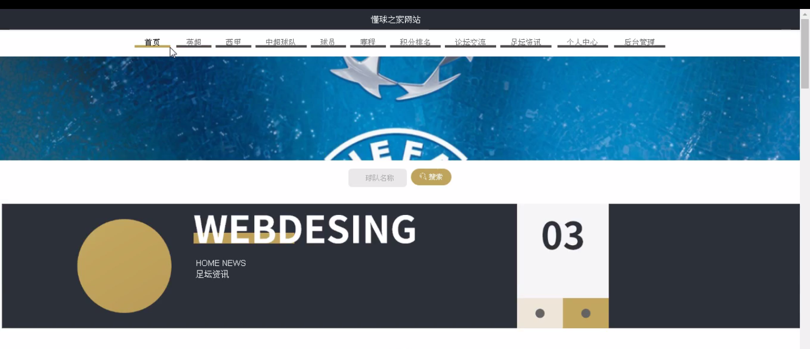
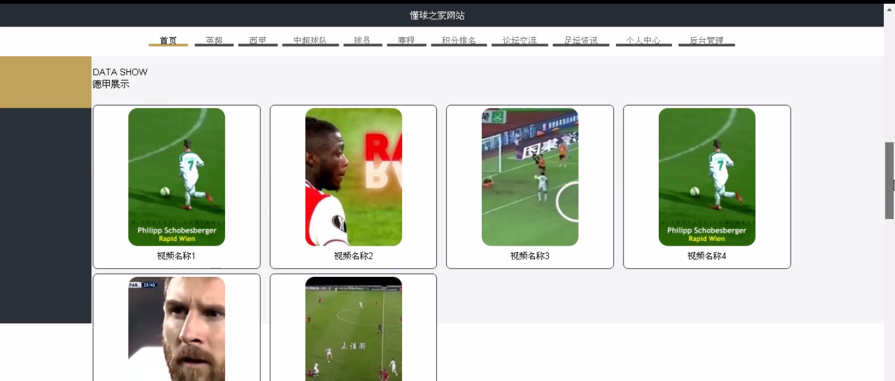
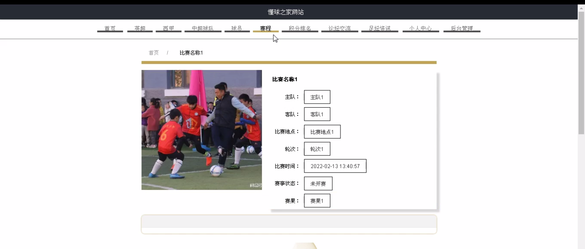
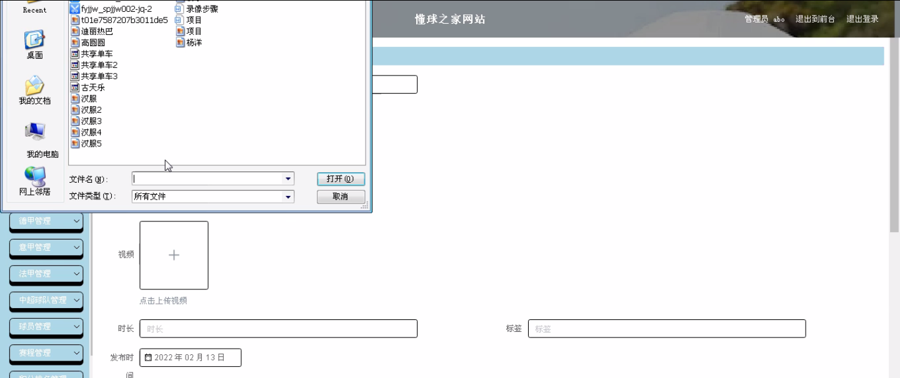
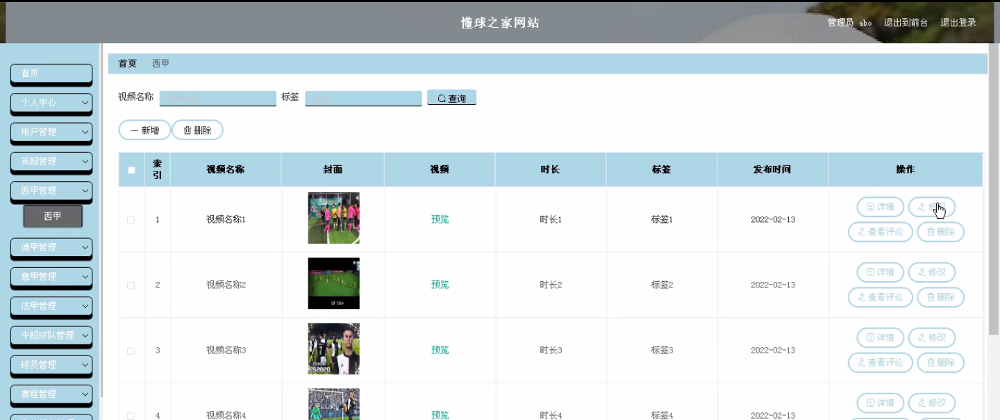
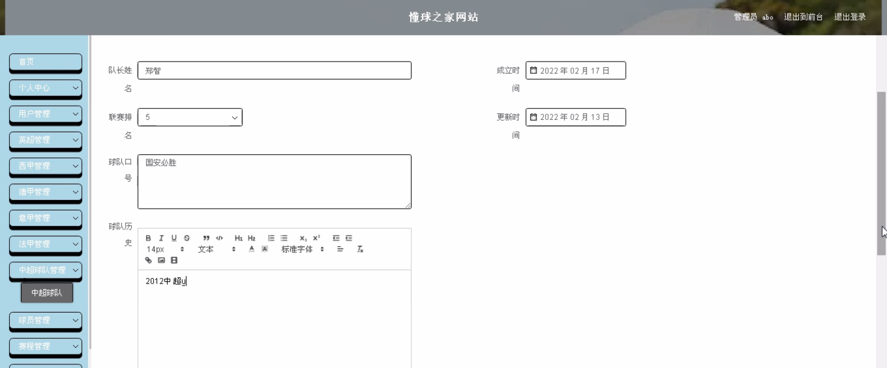
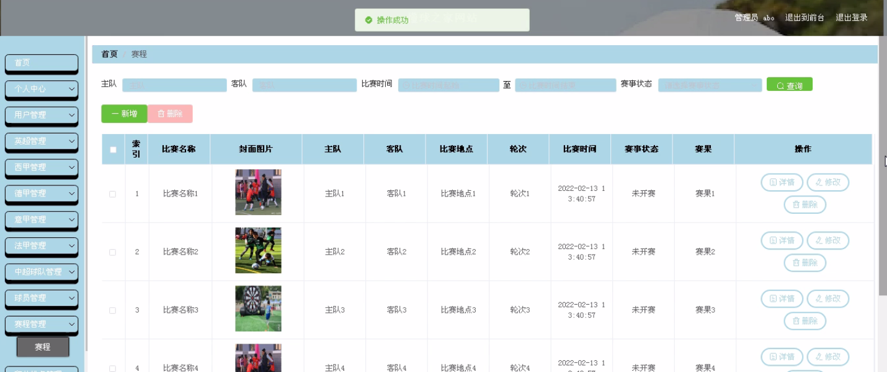

****本项目包含程序+源码+数据库+LW+调试部署环境，文末可获取一份本项目的java源码和数据库参考。****

## ******开题报告******

研究背景：
随着互联网的快速发展，越来越多的人通过网络获取体育信息。懂球之家作为一家专注于足球领域的网站，提供了丰富的足球相关内容，吸引了大量的用户。然而，在海量的信息中找到准确、有用的信息并不容易。因此，对懂球之家网站进行研究，探索其系统功能和用户需求之间的关系，具有重要的现实意义。

研究意义：
通过研究懂球之家网站，可以深入了解用户在足球领域的需求和偏好，为网站运营者提供有针对性的服务和内容推荐。同时，研究还可以帮助改进网站的功能设计和用户体验，提升用户满意度和忠诚度。此外，对于足球产业的发展也具有积极的促进作用。

研究目的：
本研究旨在分析懂球之家网站的系统功能，探讨用户对不同功能的需求和使用情况，进一步了解用户在足球领域的兴趣和关注点。通过研究结果，可以为网站运营者提供有针对性的改进建议，优化网站的功能设置和内容推荐，提升用户体验和满意度。

研究内容：
本研究将重点分析懂球之家网站的以下系统功能：用户、英超、西甲、德甲、意甲、法甲、中超球队、球员、赛程、积分排名等。通过收集和分析用户行为数据、用户反馈以及相关统计数据，深入了解用户对这些功能的使用情况、偏好和需求。同时，还将考虑不同用户群体的差异，探讨不同用户对功能的重要性和满意度的差异。

拟解决的主要问题：

  1. 用户对懂球之家网站的系统功能有哪些需求和偏好？
  2. 不同用户群体对各个功能的重要性和满意度是否存在差异？
  3. 网站的功能设置和内容推荐是否满足用户的需求？
  4. 如何通过优化系统功能和内容推荐提升用户体验和满意度？
  5. 如何利用研究结果为网站运营者提供有针对性的改进建议？

研究方案和预期成果：
本研究将采用定量和定性相结合的方法，通过问卷调查、用户行为分析和深度访谈等方式收集数据。利用统计分析和内容分析等方法对数据进行处理和解读，得出研究结论。预期成果包括对懂球之家网站系统功能与用户需求之间的关系的深入理解，为网站运营者提供有针对性的改进建议，提升用户体验和满意度，促进足球产业的发展。

进度安排：

2022年9月至10月：开题报告编写和提交，完成开题报告的撰写并提交给指导教师进行审核。

2022年11月至2023年1月：系统设计和开发，根据开题报告的要求，进行系统设计和编码工作。

2023年2月至3月：论文撰写和初稿完成，开始撰写论文，并在这个阶段完成论文的初稿。

2023年4月至5月：论文修改和最终定稿，根据指导教师的意见对论文进行修改，并完成最终的定稿。

2023年5月：论文答辩和提交，参加论文答辩并根据答辩结果进行修改，最后将论文提交给学院或学校。

参考文献：

[1]喻佳,吴丹新.基于SpringBoot的Web快速开发框架[J].电脑编程技巧与维护,2021,(09):31-33.

[2]李鹏.基于SpringBoot快速开发平台的实现[J].电子技术与软件工程,2021,(12):36-37.

[3]叶开平,蔡维晟,陈家敏,邓斯妮.基于SpringBoot的综测可视化管理系统的研究与设计[J].电脑知识与技术,2021,(12):100-104.

[4]江健锋,徐振平.Springboot最小系统的设计与实现[J].电脑知识与技术,2021,(04):62-63.

[5]赵炯,司圣杰,周奇才,熊肖磊.通用信息获取系统设计与实现[J].起重运输机械,2020,(16):89-97.

[6]吴英宾.一种内外网数据交互系统的设计与实现[J].软件工程,2020,(08):25-27.

****以上是本项目程序开发之前开题报告内容，最终成品以下面界面为准，大家可以酌情参考使用。要源码参考请在文末进行获取！！****

## ******本项目的界面展示******

