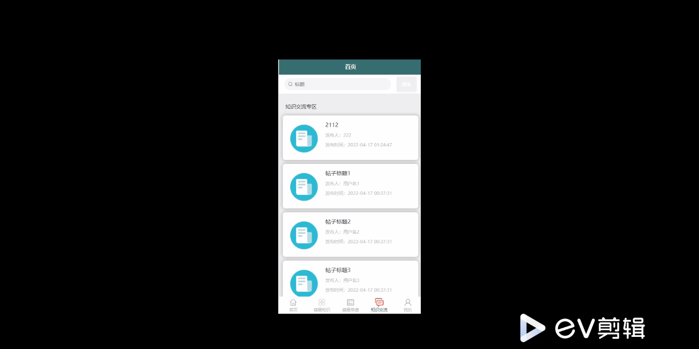

****本项目包含程序+源码+数据库+LW+调试部署环境，文末可获取一份本项目的java源码和数据库参考。****

## ******开题报告******

研究背景：
随着现代生活节奏的加快和工作压力的增大，人们对于健康管理的需求日益增长。然而，由于缺乏科学的指导和个性化的服务，很多人在进行健康管理时遇到了困惑和挑战。因此，开发一款成爱生活健康管理软件具有重要的研究意义。

研究意义：
成爱生活健康管理软件的开发旨在为用户提供全方位、个性化的健康管理服务，帮助用户更好地管理自己的健康。通过该软件，用户可以记录自己的饮食情况、获取健康知识、获得健康菜谱等功能，从而实现科学合理的饮食搭配和健康生活方式的养成。这将有助于改善人们的生活质量，预防和控制慢性疾病的发生，提高整体健康水平。

研究目的：
本研究的目的是开发一款功能完善、易于操作的成爱生活健康管理软件，以满足用户对于个性化健康管理的需求。通过该软件，用户可以方便地记录自己的饮食情况、获取健康知识、获得健康菜谱等功能，从而实现科学合理的饮食搭配和健康生活方式的养成。同时，通过数据分析和智能推荐等技术手段，为用户提供个性化的健康管理建议，帮助他们更好地管理自己的健康。

研究内容：
本研究的主要内容包括以下系统功能：用户管理、年龄段划分、饮食登记、健康知识、健康菜谱等。其中，用户管理功能用于注册和登录用户账号，并保存用户的个人信息；年龄段划分功能根据用户的年龄将其划分到相应的健康管理群体中；饮食登记功能用于记录用户的饮食情况，包括摄入的食物种类、数量和时间；健康知识功能提供相关的健康知识和科普文章，帮助用户了解健康知识；健康菜谱功能提供健康的食谱推荐，帮助用户制定科学合理的饮食计划。

拟解决的主要问题：
本研究旨在解决用户在健康管理过程中遇到的以下主要问题：缺乏科学的指导和个性化的服务、饮食搭配不合理、缺乏健康知识等。通过成爱生活健康管理软件的开发，我们希望能够提供科学的健康管理指导，帮助用户制定合理的饮食计划，并提供丰富的健康知识，以满足用户对于个性化健康管理的需求。

研究方案和预期成果：
本研究将采用软件开发的方法，结合数据分析和智能推荐技术，开发一款功能完善、易于操作的成爱生活健康管理软件。预期成果包括：用户管理系统、年龄段划分系统、饮食登记系统、健康知识系统、健康菜谱系统等。通过该软件，用户可以方便地记录自己的饮食情况、获取健康知识、获得健康菜谱等功能，从而实现科学合理的饮食搭配和健康生活方式的养成。同时，通过数据分析和智能推荐等技术手段，为用户提供个性化的健康管理建议，帮助他们更好地管理自己的健康。

进度安排：

2022年9月至10月：开题报告编写和提交，完成开题报告的撰写并提交给指导教师进行审核。

2022年11月至2023年1月：系统设计和开发，根据开题报告的要求，进行系统设计和编码工作。

2023年2月至3月：论文撰写和初稿完成，开始撰写论文，并在这个阶段完成论文的初稿。

2023年4月至5月：论文修改和最终定稿，根据指导教师的意见对论文进行修改，并完成最终的定稿。

2023年5月：论文答辩和提交，参加论文答辩并根据答辩结果进行修改，最后将论文提交给学院或学校。

参考文献：

[1]喻佳,吴丹新.基于SpringBoot的Web快速开发框架[J].电脑编程技巧与维护,2021,(09):31-33.

[2]李鹏.基于SpringBoot快速开发平台的实现[J].电子技术与软件工程,2021,(12):36-37.

[3]叶开平,蔡维晟,陈家敏,邓斯妮.基于SpringBoot的综测可视化管理系统的研究与设计[J].电脑知识与技术,2021,(12):100-104.

[4]江健锋,徐振平.Springboot最小系统的设计与实现[J].电脑知识与技术,2021,(04):62-63.

[5]赵炯,司圣杰,周奇才,熊肖磊.通用信息获取系统设计与实现[J].起重运输机械,2020,(16):89-97.

[6]吴英宾.一种内外网数据交互系统的设计与实现[J].软件工程,2020,(08):25-27.

****以上是本项目程序开发之前开题报告内容，最终成品以下面界面为准，大家可以酌情参考使用。要源码参考请在文末进行获取！！****

## ******本项目的界面展示******

