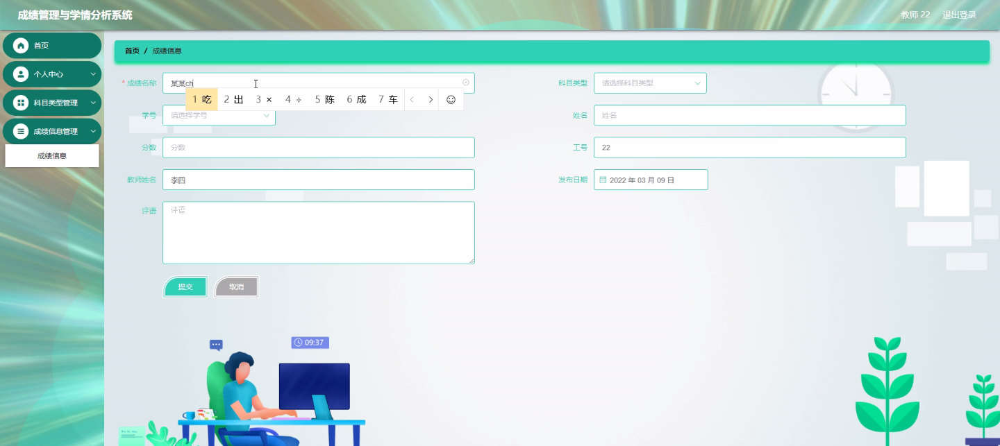
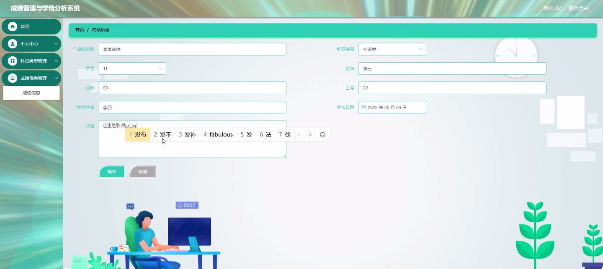
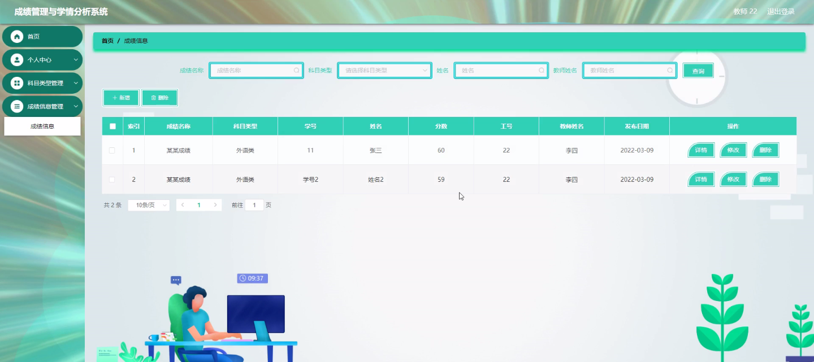
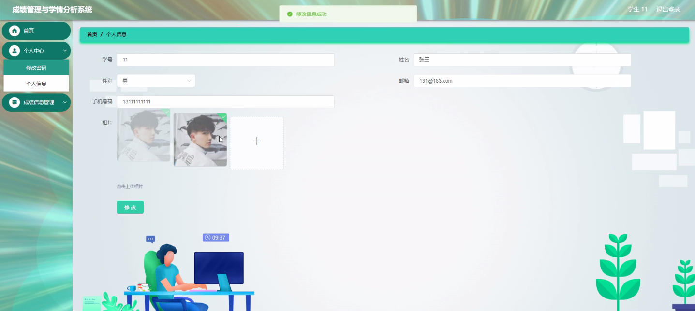
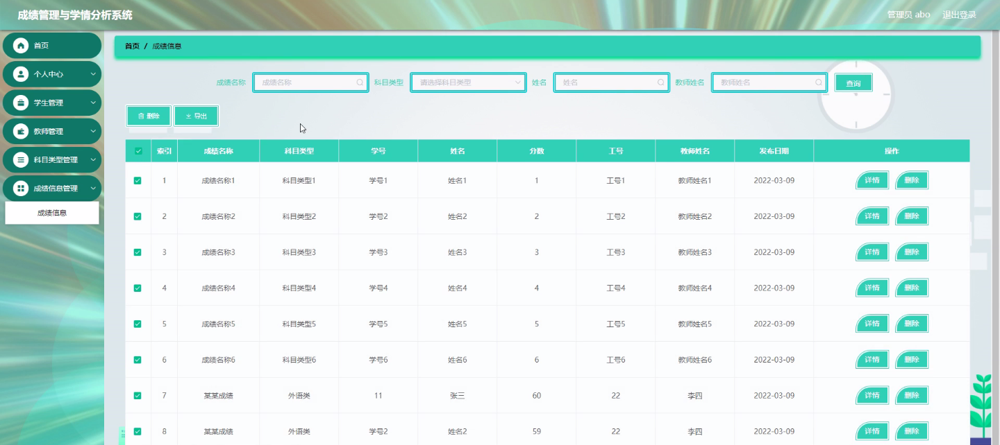

****本项目包含程序+源码+数据库+LW+调试部署环境，文末可获取一份本项目的java源码和数据库参考。****

## ******开题报告******

研究背景：
随着教育信息化的快速发展，学校和教育机构面临着大量的学生数据和成绩信息。这些数据包含了学生的个人信息、学习成绩、考试情况等，对于学校管理和教学改进具有重要意义。然而，传统的手工处理方式已经无法满足日益增长的数据量和复杂的分析需求。因此，开发一种成绩管理与学情分析系统是非常必要的。

研究意义：
成绩管理与学情分析系统的开发将为学校和教育机构提供一个高效、准确的数据管理和分析工具。通过该系统，教师可以更好地了解学生的学习情况，及时发现问题并采取相应的教学策略；学校管理者可以全面掌握学校的教学质量和学生的学习状况，为学校的教学改革和管理决策提供科学依据。

研究目的：
本研究旨在设计和开发一种成绩管理与学情分析系统，以实现对学生数据和成绩信息的集中管理、分析和挖掘。通过该系统，教师和学校管理者可以更好地了解学生的学习情况，提供个性化的教学辅导和管理决策，促进学生的全面发展。

研究内容：
本研究的主要内容包括以下系统功能：学生管理、教师管理、科目类型管理、成绩信息管理和分析信息管理。其中，学生管理功能用于录入和管理学生的基本信息；教师管理功能用于录入和管理教师的信息；科目类型管理功能用于定义和管理不同科目的分类；成绩信息管理功能用于录入和管理学生的成绩信息；分析信息管理功能用于对学生的成绩数据进行统计和分析。

拟解决的主要问题：
本研究旨在解决传统成绩管理方式存在的以下问题：数据管理效率低下、数据分析困难、教学反馈滞后等。通过开发成绩管理与学情分析系统，可以实现对学生数据和成绩信息的集中管理和快速分析，提高教学效果和管理水平。

研究方案：
本研究将采用软件工程的方法，结合数据库技术和数据挖掘算法，设计和开发成绩管理与学情分析系统。首先，进行需求分析和系统设计，明确系统功能和界面设计；然后，进行系统开发和测试，确保系统的稳定性和可用性；最后，进行系统部署和推广，让更多的学校和教育机构受益。

预期成果：
通过本研究，预期可以开发出一种功能完善、易于使用的成绩管理与学情分析系统。该系统将提供高效的数据管理和分析功能，帮助教师和学校管理者更好地了解学生的学习情况，提供个性化的教学辅导和管理决策，促进学生的全面发展。同时，该系统的推广应用将为教育信息化的发展做出积极贡献。

进度安排：

2022年9月至10月：开题报告编写和提交，完成开题报告的撰写并提交给指导教师进行审核。

2022年11月至2023年1月：系统设计和开发，根据开题报告的要求，进行系统设计和编码工作。

2023年2月至3月：论文撰写和初稿完成，开始撰写论文，并在这个阶段完成论文的初稿。

2023年4月至5月：论文修改和最终定稿，根据指导教师的意见对论文进行修改，并完成最终的定稿。

2023年5月：论文答辩和提交，参加论文答辩并根据答辩结果进行修改，最后将论文提交给学院或学校。

参考文献：

[1]喻佳,吴丹新.基于SpringBoot的Web快速开发框架[J].电脑编程技巧与维护,2021,(09):31-33.

[2]李鹏.基于SpringBoot快速开发平台的实现[J].电子技术与软件工程,2021,(12):36-37.

[3]叶开平,蔡维晟,陈家敏,邓斯妮.基于SpringBoot的综测可视化管理系统的研究与设计[J].电脑知识与技术,2021,(12):100-104.

[4]江健锋,徐振平.Springboot最小系统的设计与实现[J].电脑知识与技术,2021,(04):62-63.

[5]赵炯,司圣杰,周奇才,熊肖磊.通用信息获取系统设计与实现[J].起重运输机械,2020,(16):89-97.

[6]吴英宾.一种内外网数据交互系统的设计与实现[J].软件工程,2020,(08):25-27.

****以上是本项目程序开发之前开题报告内容，最终成品以下面界面为准，大家可以酌情参考使用。要源码参考请在文末进行获取！！****

## ******本项目的界面展示******

