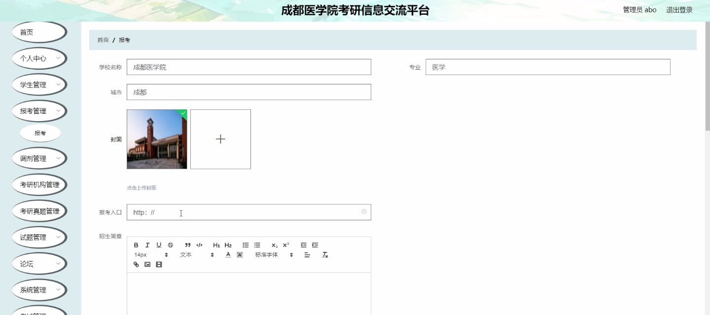
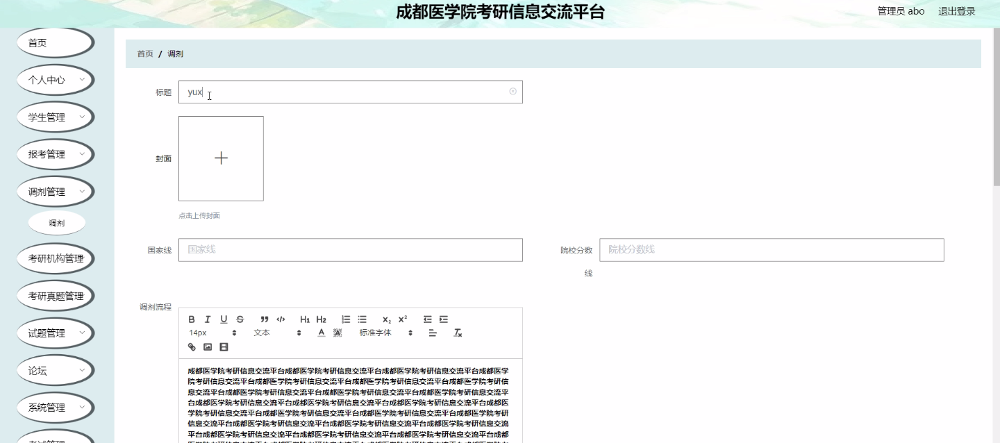
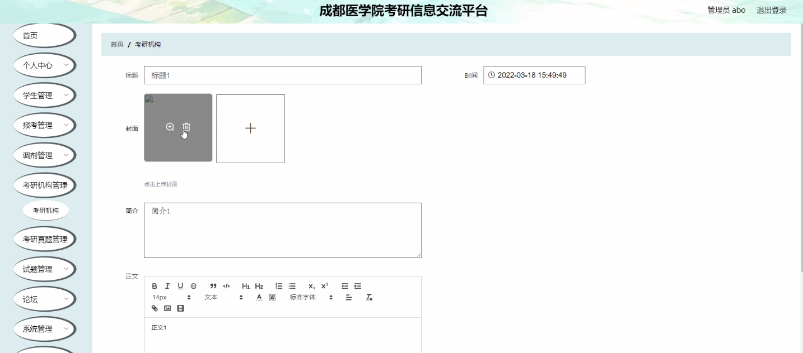
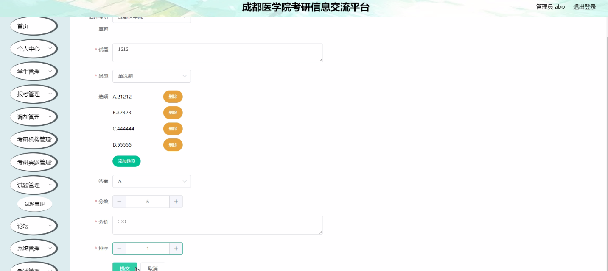
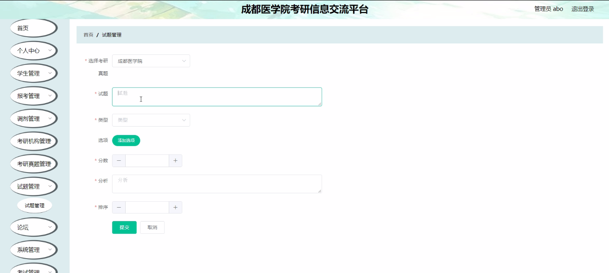
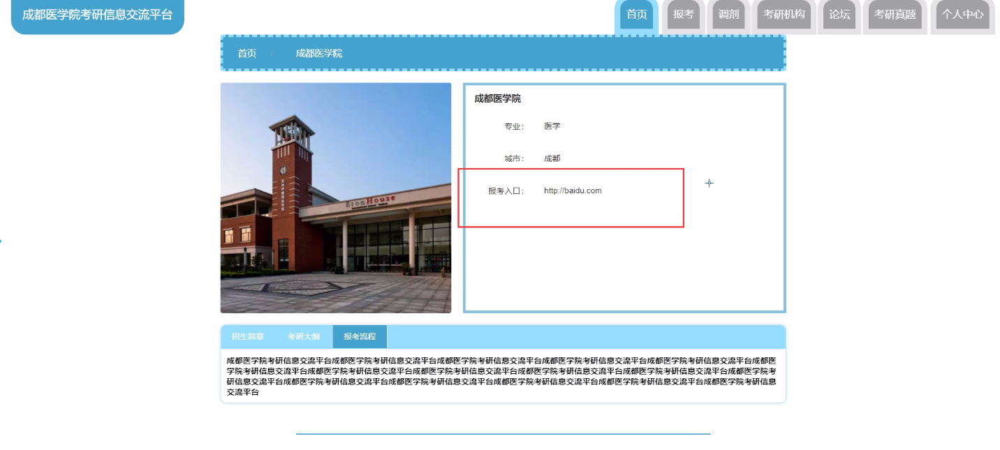
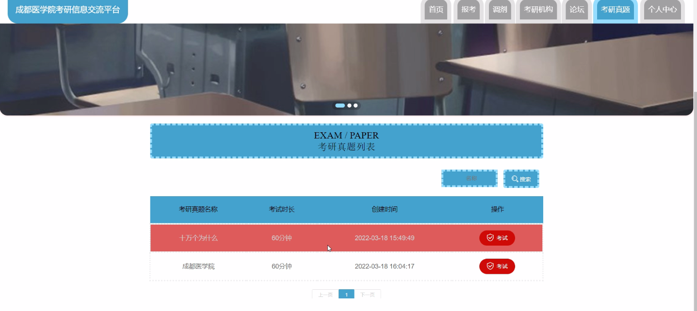

****本项目包含程序+源码+数据库+LW+调试部署环境，文末可获取一份本项目的java源码和数据库参考。****

## ******开题报告******

研究背景：
随着社会的发展和竞争的加剧，越来越多的学生选择考研究生来提升自己的学术水平和就业竞争力。然而，考研过程中存在着信息不对称、信息获取困难等问题，给考生带来了很大的困扰。因此，建立一个成都医学院考研信息交流平台具有重要的现实意义。

研究意义：
成都医学院考研信息交流平台的建立可以为广大考生提供一个便捷、高效的信息交流平台，使考生能够及时获取到最新的考研信息，提高他们的备考效率和成功率。同时，该平台还可以促进考生之间的互动和交流，搭建起一个相互支持、共同进步的学习平台。

研究目的：
本研究旨在通过构建成都医学院考研信息交流平台，解决考生在备考过程中面临的信息不对称、信息获取困难等问题，提高考生的备考效果和成功率。通过该平台，考生可以方便地获取到最新的考研资讯、报考指南、调剂信息等，从而更好地规划自己的备考计划和选择合适的考研机构。

研究内容：
本研究的主要内容包括学生管理、报考信息管理、调剂信息管理、考研机构管理等系统功能。具体而言，学生管理功能包括学生信息录入、学生信息查询、学生信息修改等；报考信息管理功能包括报考指南发布、报考信息查询、报考信息修改等；调剂信息管理功能包括调剂信息发布、调剂信息查询、调剂信息修改等；考研机构管理功能包括考研机构信息发布、考研机构信息查询、考研机构信息修改等。

拟解决的主要问题：
通过建立成都医学院考研信息交流平台，我们将解决考生在备考过程中面临的信息不对称、信息获取困难等问题。该平台将提供及时、准确的考研资讯，帮助考生更好地了解考试动态和报考指南；同时，平台还将提供调剂信息，方便考生根据自身情况进行调剂申请；此外，平台还将提供考研机构信息，帮助考生选择合适的培训机构。

研究方案和预期成果：
本研究将采用需求分析、系统设计和开发等方法，构建成都医学院考研信息交流平台。预期成果包括一个功能完善、操作简便的平台，能够满足考生的信息需求，并提供便捷的交流和互动功能。通过该平台，考生可以更好地获取到最新的考研资讯，提高备考效率和成功率。同时，该平台还将促进考生之间的互动和交流，搭建起一个相互支持、共同进步的学习平台。

进度安排：

2022年9月至10月：需求分析和规划，进行用户需求调研和分析，确定系统功能和目标。

2022年11月至2023年1月：系统设计和开发，完成系统架构设计和技术选型，并开始编写代码。

2023年2月至3月：测试和优化，进行单元测试和集成测试，修复问题并优化系统性能。

2023年4月至5月：文档编写和培训，编写用户手册和系统文档，并进行相关人员的培训。

2023年5月：上线部署和维护，将系统部署到生产环境中，并定期进行维护和升级。

参考文献：

[1]王振华.SpringBoot在教学效果评估系统中的应用[J].电子技术,2023,(05):67-69.

[2]王明泉.基于SpringBoot远程热部署的探索和应用[J].信息与电脑(理论版),2023,(07):1-4.

[3]王亚东,李晓霞,陈强强,剡美娜.基于SpringBoot的需求发布平台设计[J].信息与电脑(理论版),2023,(01):105-107.

[4]陈新府豪.基于SpringBoot和Vue框架的创新方法推理系统的设计与实现[D].导师：黄静.浙江理工大学,2022.

[5]霍福华,韩慧.基于SpringBoot微服务架构下前后端分离的MVVM模型[J].电子技术与软件工程,2022,(01):73-76.

[6]韩策,张娜,王松亭,张凯,何方,袁峰.SpringBoot OPC客户端设计与研究[J].电子世界,2021,(19):25-26.

****以上是本项目程序开发之前开题报告内容，最终成品以下面界面为准，大家可以酌情参考使用。要源码参考请在文末进行获取！！****

## ******本项目的界面展示******

