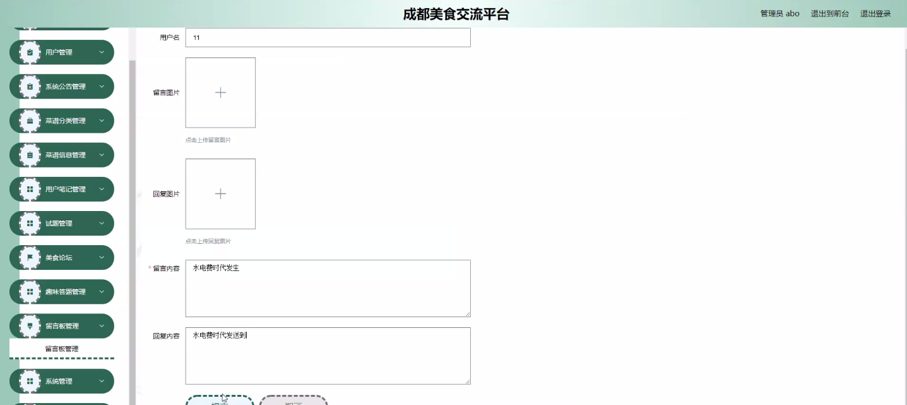

****本项目包含程序+源码+数据库+LW+调试部署环境，文末可获取一份本项目的java源码和数据库参考。****

## ******开题报告******

研究背景：
随着社会经济的发展和人们生活水平的提高，美食已经成为了人们日常生活中不可或缺的一部分。而作为中国四川省的省会城市，成都以其丰富多样的美食文化而闻名于世。然而，尽管成都拥有众多的美食资源，但目前还缺乏一个专门的交流平台来促进美食文化的传播和分享。因此，建立一个成都美食交流平台具有重要的现实意义。

研究意义：
成都美食交流平台的建立将有助于推动成都美食文化的传承和发展。通过该平台，人们可以方便地获取到各类美食信息，了解成都的特色菜品和独特的烹饪技巧。同时，用户还可以在平台上分享自己的美食心得和体验，与其他美食爱好者进行交流和互动。这将促进成都美食文化的多元化发展，增加人们对成都美食的认知和兴趣，进一步提升成都的知名度和影响力。

研究目的：
本研究旨在构建一个成都美食交流平台，通过整合用户、系统公告、菜谱分类、菜谱信息和用户笔记等功能，为用户提供一个全面、便捷的美食交流平台。具体目的包括：提供丰富的美食信息资源，方便用户了解成都的特色菜品和烹饪技巧；搭建用户交流互动的平台，促进美食文化的传播和分享；提供个性化的推荐服务，根据用户的口味和偏好推荐适合他们的美食内容。

研究内容： 本研究将主要围绕以下系统功能展开：

  1. 用户：设计用户注册、登录、个人信息管理等功能，使用户能够方便地使用平台，并与其他用户进行交流和互动。
  2. 系统公告：发布平台相关的公告和活动信息，及时向用户传达重要通知和更新。
  3. 菜谱分类：建立完善的菜谱分类体系，将成都的特色菜品按照不同的分类进行整理和展示，方便用户查找和浏览。
  4. 菜谱信息：提供详细的菜谱信息，包括菜品的制作步骤、所需材料和烹饪技巧等，帮助用户学习和尝试制作美食。
  5. 用户笔记：用户可以在平台上记录自己的美食心得和体验，与其他用户分享并进行交流。

拟解决的主要问题：

  1. 缺乏一个专门的成都美食交流平台，限制了成都美食文化的传播和分享。
  2. 用户获取美食信息不便，无法全面了解成都的特色菜品和烹饪技巧。
  3. 缺乏个性化推荐服务，用户难以找到符合自己口味和偏好的美食内容。

研究方案和预期成果：
本研究将采用Web开发技术，结合数据库管理系统，构建一个成都美食交流平台。通过用户需求调研和功能设计，实现用户、系统公告、菜谱分类、菜谱信息和用户笔记等功能模块的开发和集成。预期成果包括一个功能完善、界面友好的成都美食交流平台，能够满足用户对美食信息获取、交流互动和个性化推荐的需求。同时，该平台的建立将促进成都美食文化的传承和发展，提升成都的知名度和影响力。

进度安排：

2022年9月至10月：需求分析和规划，明确系统功能和目标，制定项目计划。

2022年11月至2023年1月：系统设计和编码，完成详细的系统设计并开始编写代码。

2023年2月至3月：用户界面开发和数据库开发，开发用户友好的界面和设计数据库结构。

2023年4月至5月：功能测试、文档编写和上线部署，对系统进行全面的功能测试并编写用户手册。

2023年5月：维护和升级，定期对系统进行维护和升级，修复bug和添加新功能。

参考文献：

[1]邱小群,邓丽艳,陈海潮.基于B/S的信息管理系统设计和实现[J].信息与电脑(理论版),2022,(20):146-148.

[2]谢霜.基于Java技术的网络管理体系结构的应用[J].网络安全技术与应用,2022,(10):14-15.

[3]宋锦华.高职院校Java程序设计课程改革研究[J].科技视界,2022,(20):133-135.

[4]曹嵩彭,王鹏宇.浅析Java语言在软件开发中的应用[J].信息记录材料,2022,(03):114-116.

[5]朱澈,余俊达.武汉东湖学院.基于Java的软硬件信息管理系统V1.0[Z].项目立项编号.鉴定单位.鉴定日期:

****以上是本项目程序开发之前开题报告内容，最终成品以下面界面为准，大家可以酌情参考使用。要源码参考请在文末进行获取！！****

## ******本项目的界面展示******

