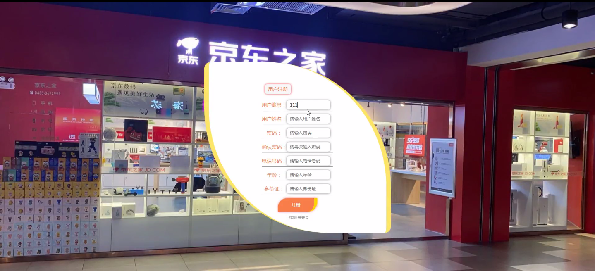
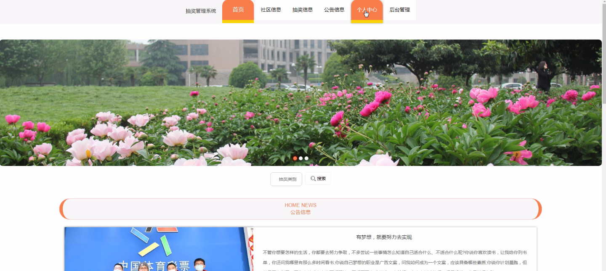
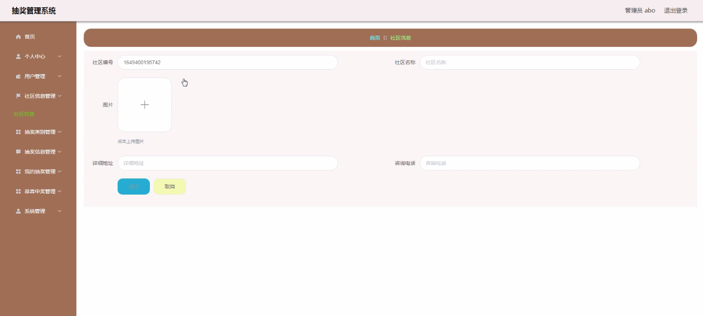
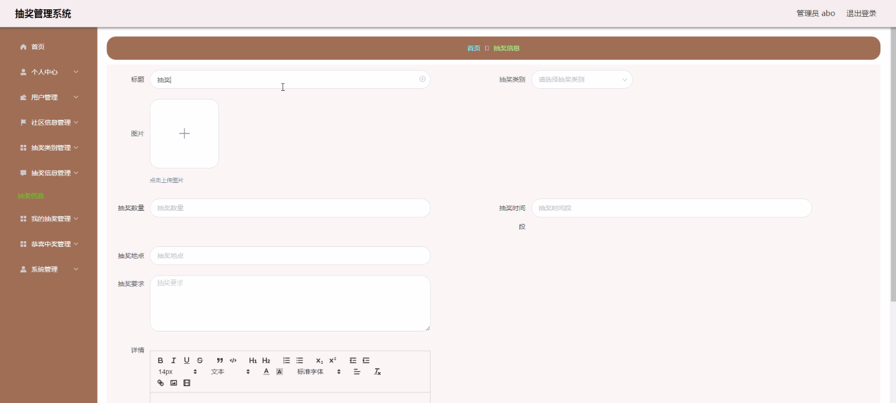
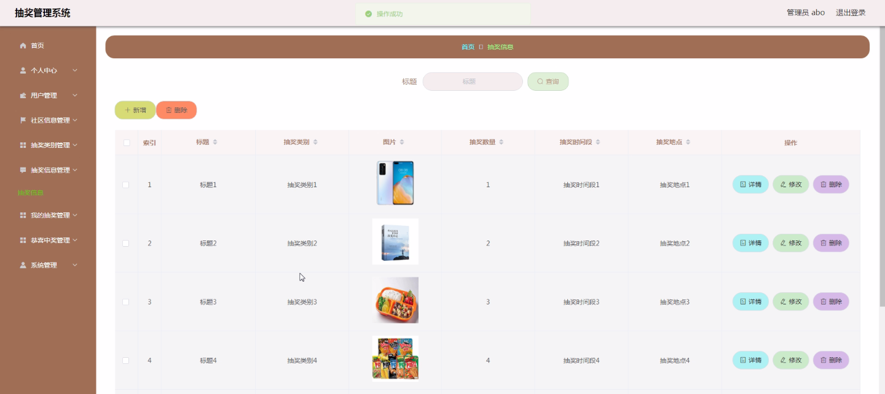
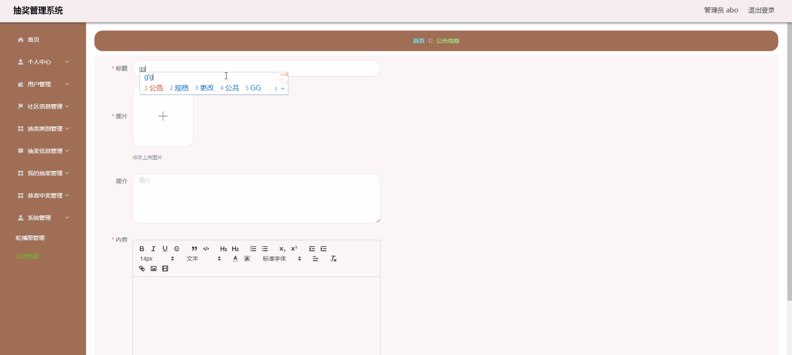
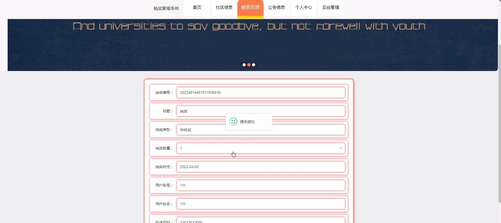

****本项目包含程序+源码+数据库+LW+调试部署环境，文末可获取一份本项目的java源码和数据库参考。****

## ******开题报告******

研究背景、意义和目的：

抽奖活动在现代社会中越来越受欢迎，无论是线上还是线下，各种类型的抽奖活动层出不穷。然而，随着抽奖活动的增多，管理抽奖活动变得越来越复杂。传统的手工管理方式已经无法满足大规模抽奖活动的需求，因此需要开发一种高效、可靠的抽奖管理系统。

该研究的目的是设计和开发一个全面的抽奖管理系统，以提供便捷、安全、公平的抽奖体验。通过引入计算机技术和信息管理方法，可以实现对抽奖活动的全面管理和监控，提高抽奖活动的效率和公正性。

该研究的意义主要体现在以下几个方面：

  1. 提升用户体验：抽奖管理系统可以为用户提供更加便捷、快速的参与抽奖活动的途径，提高用户的参与积极性和满意度。
  2. 简化管理流程：传统的抽奖活动管理需要大量的人力和物力投入，而抽奖管理系统可以自动化完成抽奖活动的各项任务，减少人力成本和管理难度。
  3. 提高抽奖公正性：抽奖管理系统可以通过算法和规则的设定，确保抽奖活动的公正性和公平性，杜绝作弊行为的发生，增加参与者的信任度。

研究内容：

根据系统功能，该抽奖管理系统的研究内容主要包括以下几个方面：

  1. 用户管理：设计用户注册、登录、信息修改等功能，实现用户身份验证和权限管理。
  2. 社区信息管理：建立社区信息数据库，包括用户信息、抽奖活动信息等，实现对社区信息的统一管理和查询。
  3. 抽奖类别管理：设计抽奖类别的创建、编辑、删除等功能，方便管理员对不同类型的抽奖活动进行分类管理。
  4. 抽奖信息管理：实现抽奖活动的发布、编辑、删除等功能，包括抽奖规则、奖品设置等。
  5. 我的抽奖管理：为用户提供查看已参与抽奖活动、中奖情况等功能，方便用户管理自己的抽奖记录。
  6. 恭喜中奖管理：设计中奖信息的展示和通知功能，及时向中奖用户发送中奖通知。

通过以上研究内容的实施，我们期望能够开发出一款功能完善、操作简便的抽奖管理系统，提供给广大用户和抽奖活动组织者使用。预期成果包括系统的设计与实现、用户体验的改善、管理流程的简化以及抽奖公正性的提升。

进度安排：

2022年9月至10月：需求分析和规划，进行用户需求调研和分析，确定系统功能和目标。

2022年11月至2023年1月：系统设计和开发，完成系统架构设计和技术选型，并开始编写代码。

2023年2月至3月：测试和优化，进行单元测试和集成测试，修复问题并优化系统性能。

2023年4月至5月：文档编写和培训，编写用户手册和系统文档，并进行相关人员的培训。

2023年5月：上线部署和维护，将系统部署到生产环境中，并定期进行维护和升级。

参考文献：

[1]王振华.SpringBoot在教学效果评估系统中的应用[J].电子技术,2023,(05):67-69.

[2]王明泉.基于SpringBoot远程热部署的探索和应用[J].信息与电脑(理论版),2023,(07):1-4.

[3]王亚东,李晓霞,陈强强,剡美娜.基于SpringBoot的需求发布平台设计[J].信息与电脑(理论版),2023,(01):105-107.

[4]陈新府豪.基于SpringBoot和Vue框架的创新方法推理系统的设计与实现[D].导师：黄静.浙江理工大学,2022.

[5]霍福华,韩慧.基于SpringBoot微服务架构下前后端分离的MVVM模型[J].电子技术与软件工程,2022,(01):73-76.

[6]韩策,张娜,王松亭,张凯,何方,袁峰.SpringBoot OPC客户端设计与研究[J].电子世界,2021,(19):25-26.

****以上是本项目程序开发之前开题报告内容，最终成品以下面界面为准，大家可以酌情参考使用。要源码参考请在文末进行获取！！****

## ******本项目的界面展示******

