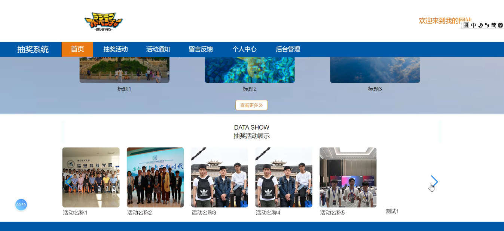
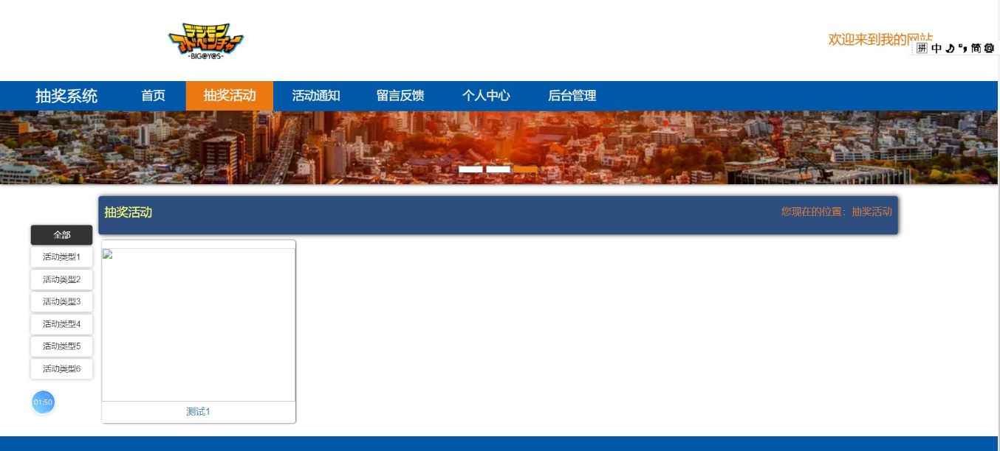
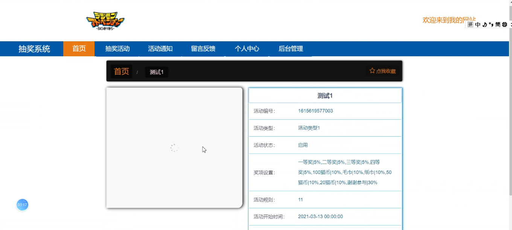
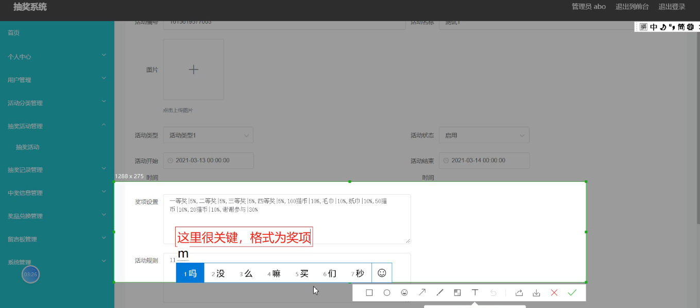
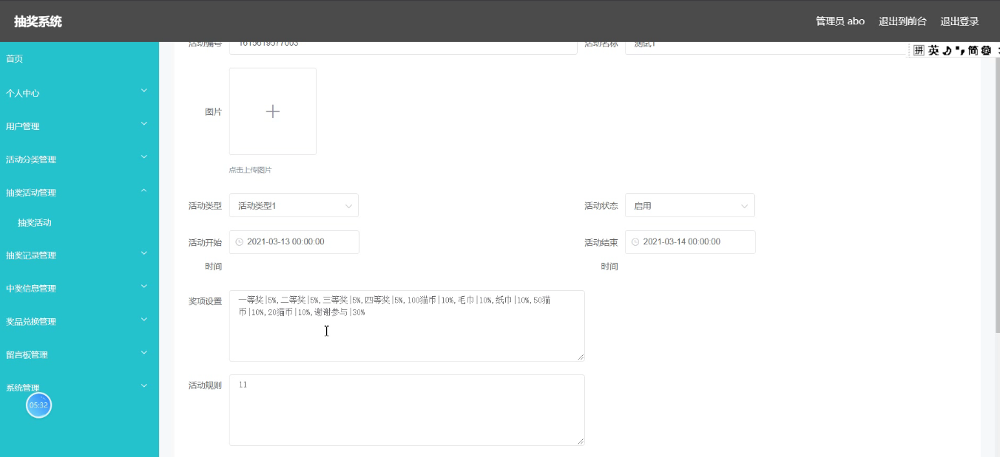
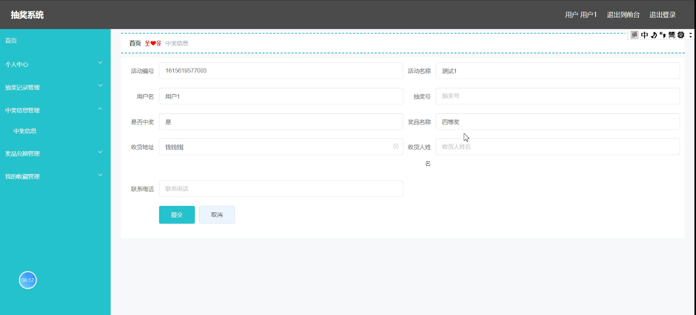

****本项目包含程序+源码+数据库+LW+调试部署环境，文末可获取一份本项目的java源码和数据库参考。****

## ******开题报告******

研究背景：
随着互联网的快速发展和普及，抽奖活动在各个领域中变得越来越常见。无论是电商平台、社交媒体还是线下活动，抽奖活动都成为吸引用户参与、增加用户粘性的重要手段之一。然而，目前存在的抽奖系统普遍存在一些问题，如抽奖结果不公平、操作复杂、数据管理困难等。因此，开发一个高效、公正、易用的抽奖系统具有重要的现实意义。

研究意义：
本研究旨在设计和开发一种全新的抽奖系统，以解决现有抽奖系统存在的问题，并提供更好的用户体验。通过优化抽奖算法、简化操作流程、完善数据管理等方面的改进，可以提高抽奖活动的公平性和可信度，增加用户的参与度和满意度，从而促进企业的品牌形象提升和市场竞争力的增强。

研究目的：
本研究的主要目的是构建一个功能完备、稳定可靠的抽奖系统，以满足不同行业和场景中的抽奖需求。通过深入分析用户需求和行业特点，结合现有技术和最佳实践，设计出一套高效、灵活、易用的抽奖系统，为企业和组织提供一个可靠的抽奖平台，同时为用户带来更好的抽奖体验。

研究内容： 本研究的主要内容包括以下系统功能：

  1. 用户管理：实现用户注册、登录、个人信息管理等功能，确保用户身份的真实性和安全性。
  2. 活动分类：根据不同的抽奖活动类型进行分类管理，方便用户浏览和参与感兴趣的活动。
  3. 抽奖活动：设计并实现各类抽奖活动的规则和流程，包括抽奖时间、参与条件、奖品设置等。
  4. 抽奖记录：记录用户参与抽奖的历史记录，包括参与活动、中奖情况等信息，方便用户查阅和回顾。
  5. 中奖信息：及时通知用户中奖结果，并提供相关的领奖方式和兑换流程，确保中奖用户能够顺利获得奖品。
  6. 奖品兑换：提供用户奖品兑换的渠道和方式，确保用户能够方便快捷地兑换所获得的奖品。

拟解决的主要问题：

  1. 抽奖结果不公平：通过优化抽奖算法，确保每个参与者有相等的中奖机会，提高抽奖活动的公正性。
  2. 操作复杂：简化用户操作流程，提供清晰易懂的界面和指引，降低用户参与抽奖的门槛。
  3. 数据管理困难：建立完善的数据管理系统，确保抽奖记录和中奖信息的准确性和可靠性，方便后续数据分析和业务运营。

研究方案和预期成果：
本研究将采用敏捷开发方法，结合用户需求调研和技术实现，逐步完成抽奖系统的设计、开发和测试工作。预期成果包括一个功能完备、稳定可靠的抽奖系统原型，并在实际应用场景中进行验证和优化。通过该系统的应用，预计能够提升抽奖活动的效果和用户体验，为企业和组织带来更多商业价值和竞争优势。

进度安排：

2022年9月至10月：开题报告编写和提交，完成开题报告的撰写并提交给指导教师进行审核。

2022年11月至2023年1月：系统设计和开发，根据开题报告的要求，进行系统设计和编码工作。

2023年2月至3月：论文撰写和初稿完成，开始撰写论文，并在这个阶段完成论文的初稿。

2023年4月至5月：论文修改和最终定稿，根据指导教师的意见对论文进行修改，并完成最终的定稿。

2023年5月：论文答辩和提交，参加论文答辩并根据答辩结果进行修改，最后将论文提交给学院或学校。

参考文献：

[1]喻佳,吴丹新.基于SpringBoot的Web快速开发框架[J].电脑编程技巧与维护,2021,(09):31-33.

[2]李鹏.基于SpringBoot快速开发平台的实现[J].电子技术与软件工程,2021,(12):36-37.

[3]叶开平,蔡维晟,陈家敏,邓斯妮.基于SpringBoot的综测可视化管理系统的研究与设计[J].电脑知识与技术,2021,(12):100-104.

[4]江健锋,徐振平.Springboot最小系统的设计与实现[J].电脑知识与技术,2021,(04):62-63.

[5]赵炯,司圣杰,周奇才,熊肖磊.通用信息获取系统设计与实现[J].起重运输机械,2020,(16):89-97.

[6]吴英宾.一种内外网数据交互系统的设计与实现[J].软件工程,2020,(08):25-27.

****以上是本项目程序开发之前开题报告内容，最终成品以下面界面为准，大家可以酌情参考使用。要源码参考请在文末进行获取！！****

## ******本项目的界面展示******

