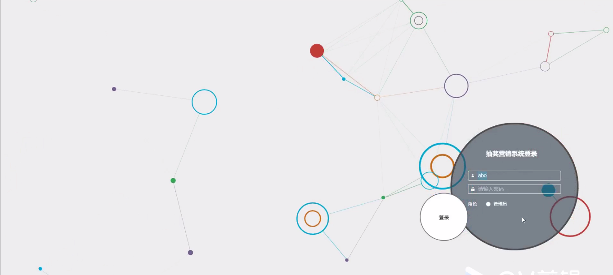

****本项目包含程序+源码+数据库+LW+调试部署环境，文末可获取一份本项目的java源码和数据库参考。****

## ******开题报告******

研究背景：
随着互联网的快速发展和智能手机的普及，抽奖营销活动在商业领域中变得越来越常见。抽奖营销系统作为一种有效的市场推广手段，已经被广泛应用于各行各业。通过抽奖活动，企业可以吸引用户参与，增加用户粘性，提高品牌知名度，并促进销售增长。然而，目前存在的抽奖营销系统仍然存在一些问题，如用户体验不佳、中奖规则不公平等，这些问题需要得到解决。

研究意义：
针对抽奖营销系统存在的问题，进行深入研究具有重要的实践意义。首先，优化抽奖营销系统的用户体验可以提升用户参与度和满意度，从而增加用户粘性和忠诚度。其次，建立公平合理的中奖规则可以增强用户对抽奖活动的信任感，提高活动的公信力和可持续性。此外，通过研究抽奖营销系统，可以为企业提供更准确的数据分析和决策支持，帮助企业制定更有效的市场推广策略。

研究目的： 本研究旨在通过对抽奖营销系统进行深入分析和优化，提升用户体验、改善中奖规则，并探索更有效的市场推广策略。具体目标包括：1.
提高抽奖营销系统的用户参与度和满意度；2. 建立公平合理的中奖规则，增强用户对抽奖活动的信任感；3.
提供准确的数据分析和决策支持，帮助企业制定更有效的市场推广策略。

研究内容： 本研究将围绕抽奖营销系统的以下功能展开研究：

  1. 用户管理：包括用户注册、登录、个人信息管理等；
  2. 中奖规则设计：根据不同的抽奖活动类型和目的，设计公平合理的中奖规则；
  3. 抽奖活动管理：包括抽奖活动的创建、编辑、发布等；
  4. 抽奖次数管理：设定用户每日或每周的抽奖次数限制；
  5. 保险产品管理：将保险产品与抽奖活动结合，提供更多的奖品选择；
  6. 保险订单管理：处理用户购买保险产品后的订单管理；
  7. 签到次数管理：设定用户签到获取抽奖次数的规则；
  8. 分享信息管理：记录用户分享抽奖活动的信息，以增加活动传播范围；
  9. 分享领抽奖：设定用户通过分享获得额外抽奖机会的规则；
  10. 抽奖记录管理：记录用户的抽奖历史和中奖情况；
  11. 中奖提醒：及时通知用户中奖信息。

拟解决的主要问题：

  1. 用户体验不佳：通过优化界面设计、提升系统响应速度等方式改善用户体验；
  2. 中奖规则不公平：设计公平合理的中奖规则，确保每个参与者有公平的中奖机会；
  3. 数据分析不准确：建立完善的数据分析系统，提供准确的数据支持；
  4. 市场推广策略不够有效：通过研究抽奖营销系统，为企业提供更有效的市场推广策略。

研究方案：
本研究将采用实证研究方法，结合文献综述和案例分析，对抽奖营销系统进行深入研究。首先，收集相关文献和案例，了解当前抽奖营销系统存在的问题和解决方案。然后，通过用户调研和数据分析，深入了解用户需求和行为特点。基于以上研究结果，设计并优化抽奖营销系统的功能和界面，制定公平合理的中奖规则，并提供准确的数据分析和决策支持。最后，通过实际应用和评估，验证研究方案的有效性。

预期成果：
本研究预期能够优化抽奖营销系统的用户体验，改善中奖规则，提供准确的数据分析和决策支持，并为企业制定更有效的市场推广策略提供参考。通过研究成果的应用，可以提升企业的品牌知名度、用户参与度和销售增长，进一步推动商业发展。

进度安排：

2022年9月至10月：需求分析和规划，明确系统功能和目标，制定项目计划。

2022年11月至2023年1月：系统设计和编码，完成详细的系统设计并开始编写代码。

2023年2月至3月：用户界面开发和数据库开发，开发用户友好的界面和设计数据库结构。

2023年4月至5月：功能测试、文档编写和上线部署，对系统进行全面的功能测试并编写用户手册。

2023年5月：维护和升级，定期对系统进行维护和升级，修复bug和添加新功能。

参考文献：

[1]邱小群,邓丽艳,陈海潮.基于B/S的信息管理系统设计和实现[J].信息与电脑(理论版),2022,(20):146-148.

[2]谢霜.基于Java技术的网络管理体系结构的应用[J].网络安全技术与应用,2022,(10):14-15.

[3]宋锦华.高职院校Java程序设计课程改革研究[J].科技视界,2022,(20):133-135.

[4]曹嵩彭,王鹏宇.浅析Java语言在软件开发中的应用[J].信息记录材料,2022,(03):114-116.

[5]朱澈,余俊达.武汉东湖学院.基于Java的软硬件信息管理系统V1.0[Z].项目立项编号.鉴定单位.鉴定日期:

****以上是本项目程序开发之前开题报告内容，最终成品以下面界面为准，大家可以酌情参考使用。要源码参考请在文末进行获取！！****

## ******本项目的界面展示******

