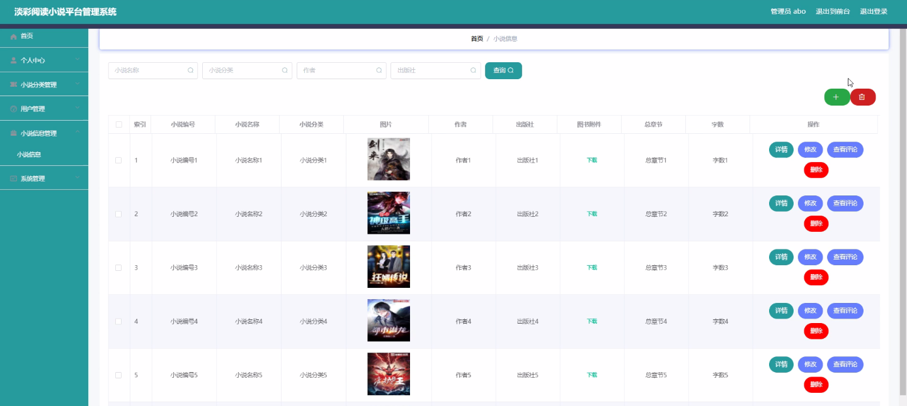
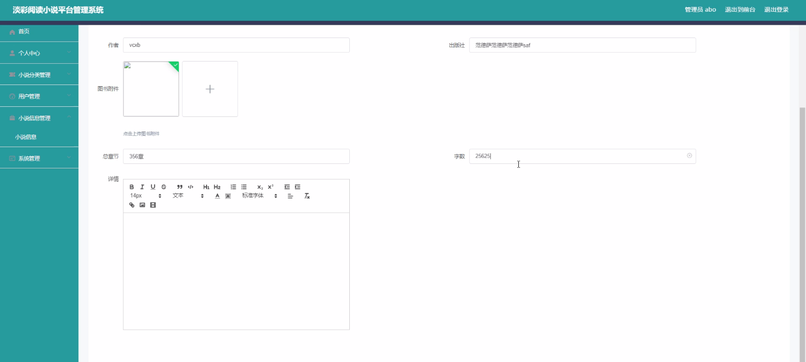
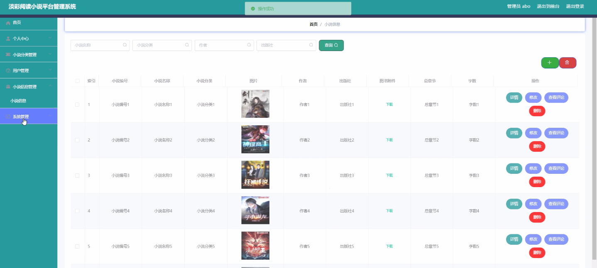
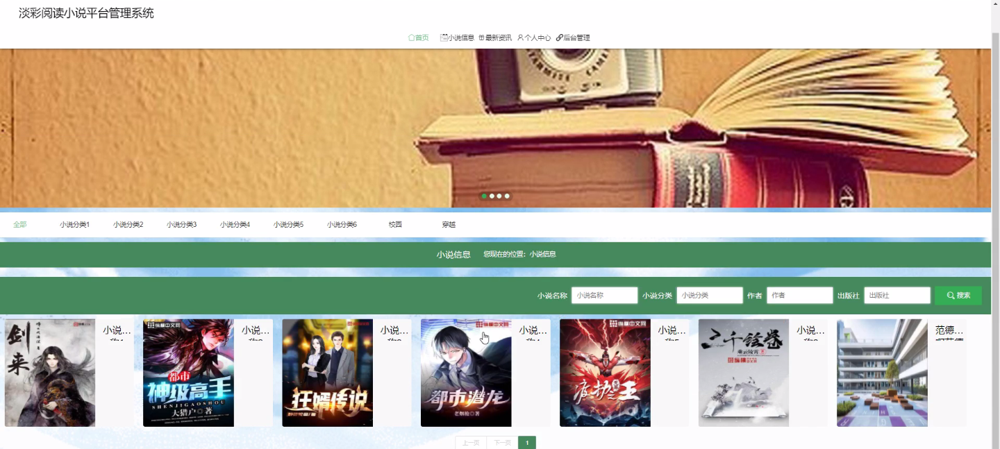
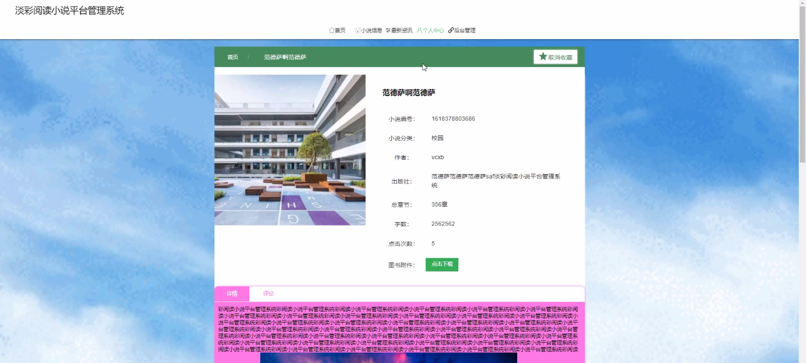
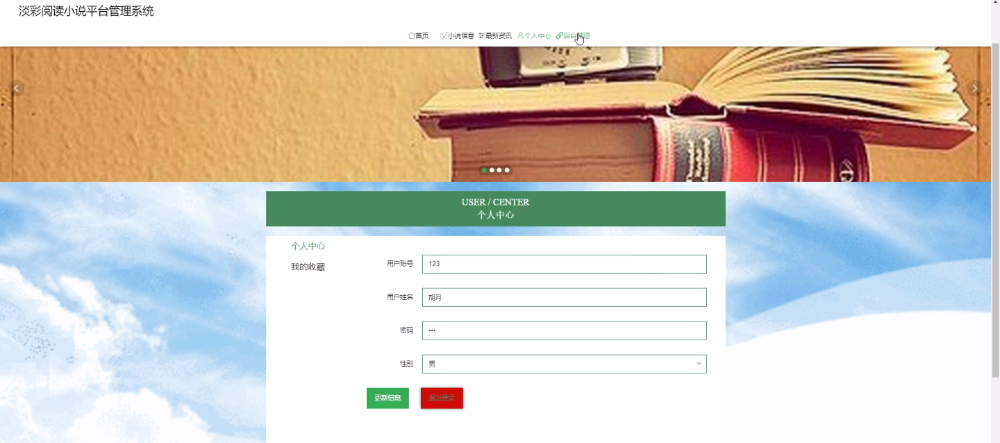

****本项目包含程序+源码+数据库+LW+调试部署环境，文末可获取一份本项目的java源码和数据库参考。****

## ******开题报告******

研究背景：
随着互联网的迅速发展，人们对于阅读方式的需求也在不断变化。传统的纸质书籍逐渐被电子书取代，而移动互联网的普及更是使得手机成为了人们主要的阅读工具之一。在这个背景下，阅读小说平台应运而生，为用户提供了便捷、多样化的阅读体验。然而，当前市场上的阅读小说平台存在一些问题，如分类不准确、用户体验不佳等，因此有必要进行深入研究和改进。

研究意义：
淡彩阅读小说平台管理系统的研究具有重要的现实意义。首先，通过对小说分类、用户管理和小说信息管理等系统功能的研究，可以提高小说平台的分类准确性，使用户能够更快速地找到自己感兴趣的作品，提升用户的阅读体验。其次，研究该系统可以为小说平台的运营者提供有效的管理工具，帮助他们更好地了解用户需求，优化平台的内容推荐和运营策略，提升平台的竞争力。

研究目的：
本研究的目的是设计和开发一套淡彩阅读小说平台管理系统，通过对小说分类、用户管理和小说信息管理等功能进行优化，提升用户的阅读体验，并为平台运营者提供有效的管理工具。通过该系统的研究，旨在解决当前阅读小说平台存在的问题，提高平台的服务质量和用户满意度。

研究内容：
本研究的主要内容包括小说分类、用户管理和小说信息管理等系统功能的研究和优化。具体而言，小说分类功能将通过建立准确、全面的分类体系，提高小说分类的准确性和精细度；用户管理功能将通过建立完善的用户信息管理系统，提供个性化的用户服务和推荐；小说信息管理功能将通过优化小说信息的采集、整理和展示方式，提供更丰富、准确的小说信息。

拟解决的主要问题：

  1. 小说分类不准确的问题：通过建立准确、全面的分类体系，提高小说分类的准确性和精细度。
  2. 用户体验不佳的问题：通过建立完善的用户信息管理系统，提供个性化的用户服务和推荐，改善用户的阅读体验。
  3. 小说信息不全面的问题：通过优化小说信息的采集、整理和展示方式，提供更丰富、准确的小说信息，满足用户的需求。

研究方案：

  1. 调研分析：对当前市场上的阅读小说平台进行调研和分析，了解用户需求和现有问题。
  2. 系统设计：根据调研结果，设计淡彩阅读小说平台管理系统的功能模块和架构。
  3. 功能优化：针对小说分类、用户管理和小说信息管理等功能，进行优化和改进，提升系统的性能和用户体验。
  4. 实施开发：基于设计方案，进行系统的开发和实施。
  5. 测试评估：对开发完成的系统进行测试和评估，验证系统的功能和性能。
  6. 成果总结：总结研究成果，撰写研究报告，并提出未来的改进和发展方向。

预期成果：
通过本研究，预期可以设计和开发一套功能完善、用户体验良好的淡彩阅读小说平台管理系统。该系统将具备准确的小说分类功能、个性化的用户管理功能和丰富的小说信息管理功能，提高用户的阅读体验，为平台运营者提供有效的管理工具。同时，研究成果还将为相关领域的学术研究和实践应用提供参考和借鉴，推动阅读小说平台的发展和创新。

进度安排：

2022年9月至10月：需求分析和规划，进行用户需求调研和分析，确定系统功能和目标。

2022年11月至2023年1月：系统设计和开发，完成系统架构设计和技术选型，并开始编写代码。

2023年2月至3月：测试和优化，进行单元测试和集成测试，修复问题并优化系统性能。

2023年4月至5月：文档编写和培训，编写用户手册和系统文档，并进行相关人员的培训。

2023年5月：上线部署和维护，将系统部署到生产环境中，并定期进行维护和升级。

参考文献：

[1]王振华.SpringBoot在教学效果评估系统中的应用[J].电子技术,2023,(05):67-69.

[2]王明泉.基于SpringBoot远程热部署的探索和应用[J].信息与电脑(理论版),2023,(07):1-4.

[3]王亚东,李晓霞,陈强强,剡美娜.基于SpringBoot的需求发布平台设计[J].信息与电脑(理论版),2023,(01):105-107.

[4]陈新府豪.基于SpringBoot和Vue框架的创新方法推理系统的设计与实现[D].导师：黄静.浙江理工大学,2022.

[5]霍福华,韩慧.基于SpringBoot微服务架构下前后端分离的MVVM模型[J].电子技术与软件工程,2022,(01):73-76.

[6]韩策,张娜,王松亭,张凯,何方,袁峰.SpringBoot OPC客户端设计与研究[J].电子世界,2021,(19):25-26.

****以上是本项目程序开发之前开题报告内容，最终成品以下面界面为准，大家可以酌情参考使用。要源码参考请在文末进行获取！！****

## ******本项目的界面展示******

