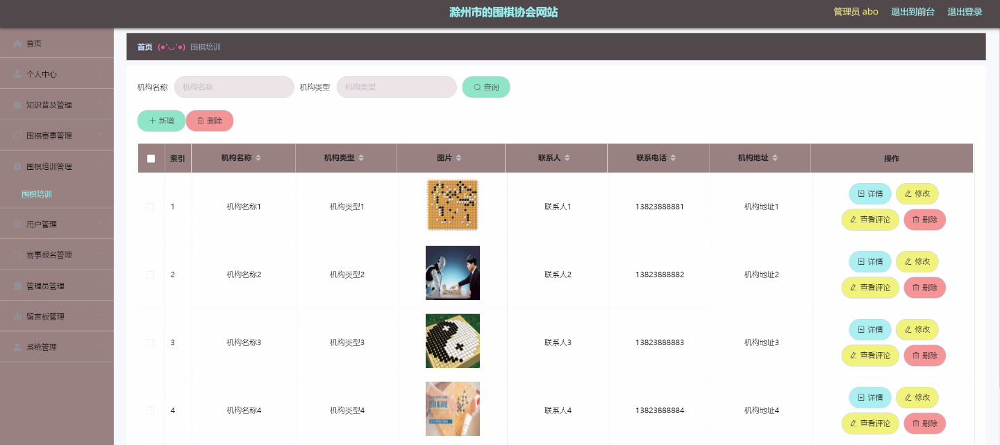

****本项目包含程序+源码+数据库+LW+调试部署环境，文末可获取一份本项目的java源码和数据库参考。****

## ******开题报告******

研究背景、意义和目的：

围棋作为一项古老而深奥的智力运动，具有悠久的历史和广泛的影响力。随着社会的发展和科技的进步，围棋在现代社会中的地位和作用也逐渐凸显出来。然而，围棋领域仍存在许多问题和挑战，需要进行深入的研究和探索。

首先，围棋的普及程度还不够高。尽管围棋在中国有着广泛的群众基础，但在其他国家和地区的普及程度相对较低。因此，我们需要通过系统化的知识普及活动，提高围棋的认知度和参与度，推动围棋在全球范围内的普及。

其次，围棋赛事的组织和管理面临一些挑战。围棋比赛的规模越来越大，参赛选手和观众的数量也在不断增加。因此，我们需要建立一个高效的围棋赛事系统，包括报名、排名、赛程安排等功能，以提供更好的赛事体验和管理服务。

再次，围棋培训是围棋发展的重要环节。培养优秀的围棋选手和教练员，提高围棋水平，对于推动围棋事业的发展具有重要意义。因此，我们需要建立一个全面的围棋培训系统，包括教学资源、培训课程、评估考核等内容，以提供更好的培训服务。

最后，用户体验和参与度也是围棋领域需要关注的问题。通过建立一个用户友好的围棋系统，提供便捷的操作界面、个性化的推荐服务和互动交流平台，可以吸引更多的用户参与围棋活动，促进围棋文化的传承和发展。

因此，本研究的目的是通过对围棋系统功能的研究和优化，提升围棋的普及程度、赛事管理效率、培训质量和用户体验，推动围棋事业的健康发展。

* * *

研究内容：

本研究将围绕以下系统功能展开研究：

  1. 知识普及：通过开展围棋知识普及活动，包括线上线下的讲座、培训班、教材编写等，提高围棋的认知度和参与度。

  2. 围棋赛事：建立一个高效的围棋赛事系统，包括赛事报名、排名、赛程安排等功能，提供更好的赛事体验和管理服务。

  3. 围棋培训：建立一个全面的围棋培训系统，包括教学资源、培训课程、评估考核等内容，提供更好的培训服务，培养优秀的围棋选手和教练员。

  4. 用户体验：通过建立用户友好的围棋系统，提供便捷的操作界面、个性化的推荐服务和互动交流平台，吸引更多的用户参与围棋活动，促进围棋文化的传承和发展。

  5. 其他系统功能：根据实际需求，还可以进一步研究和优化其他系统功能，以满足围棋领域的需求。

通过以上研究内容的探索和实践，我们期望能够解决围棋领域中的一些关键问题，提升围棋的普及程度、赛事管理效率、培训质量和用户体验，为围棋事业的健康发展做出贡献。

进度安排：

2022年9月至10月：需求分析和规划，明确系统功能和目标，制定项目计划。

2022年11月至2023年1月：系统设计和编码，完成详细的系统设计并开始编写代码。

2023年2月至3月：用户界面开发和数据库开发，开发用户友好的界面和设计数据库结构。

2023年4月至5月：功能测试、文档编写和上线部署，对系统进行全面的功能测试并编写用户手册。

2023年5月：维护和升级，定期对系统进行维护和升级，修复bug和添加新功能。

参考文献：

[1]邱小群,邓丽艳,陈海潮.基于B/S的信息管理系统设计和实现[J].信息与电脑(理论版),2022,(20):146-148.

[2]谢霜.基于Java技术的网络管理体系结构的应用[J].网络安全技术与应用,2022,(10):14-15.

[3]宋锦华.高职院校Java程序设计课程改革研究[J].科技视界,2022,(20):133-135.

[4]曹嵩彭,王鹏宇.浅析Java语言在软件开发中的应用[J].信息记录材料,2022,(03):114-116.

[5]朱澈,余俊达.武汉东湖学院.基于Java的软硬件信息管理系统V1.0[Z].项目立项编号.鉴定单位.鉴定日期:

****以上是本项目程序开发之前开题报告内容，最终成品以下面界面为准，大家可以酌情参考使用。要源码参考请在文末进行获取！！****

## ******本项目的界面展示******

