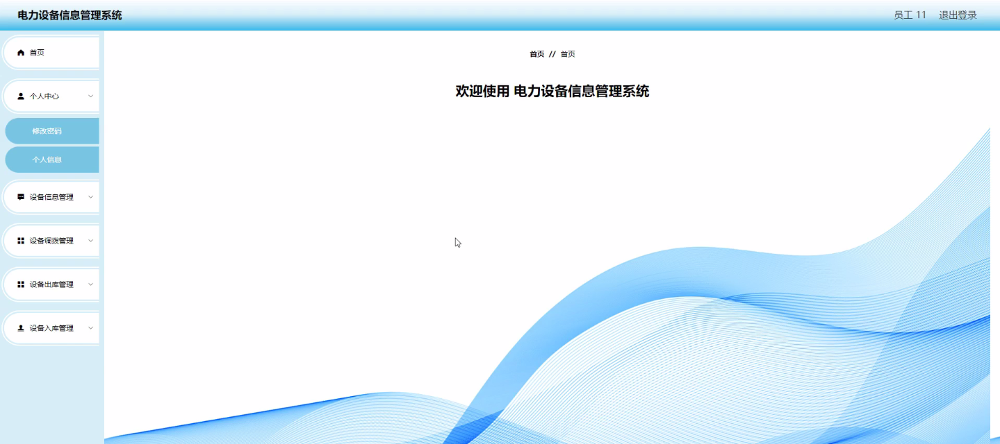
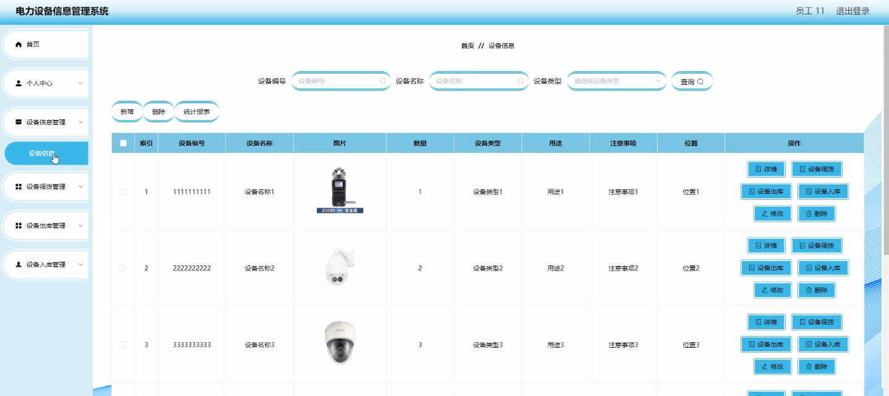
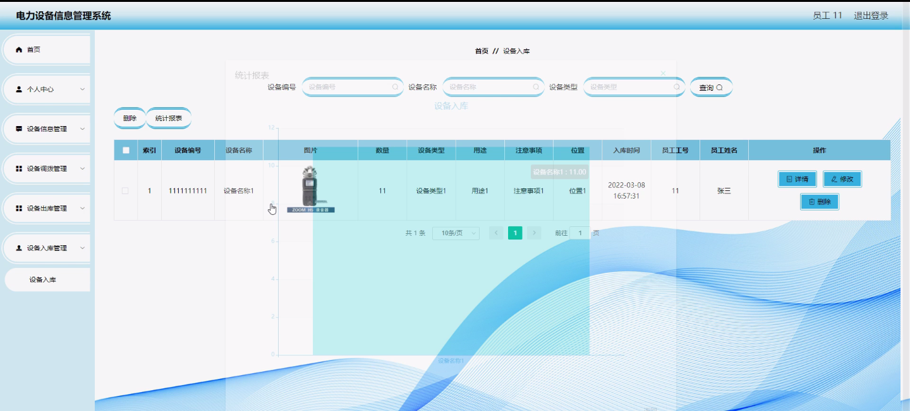
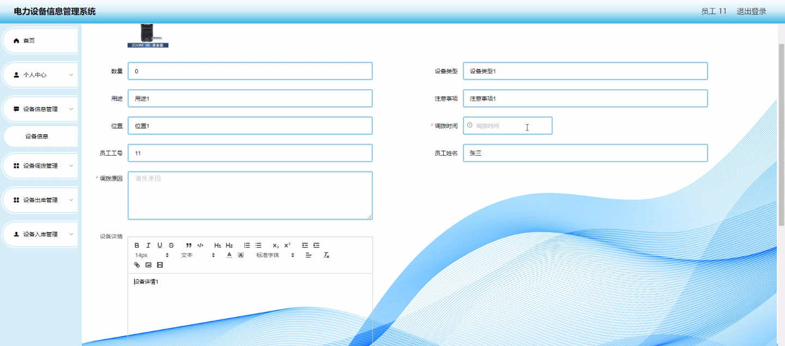
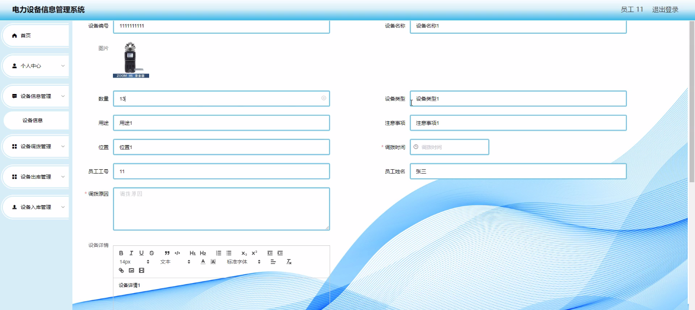
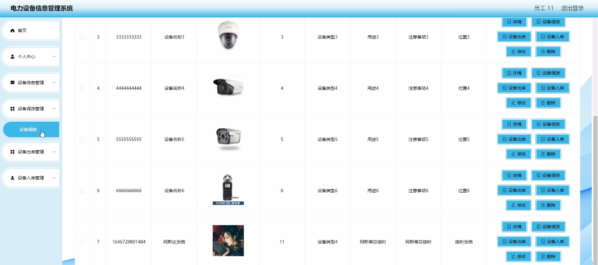
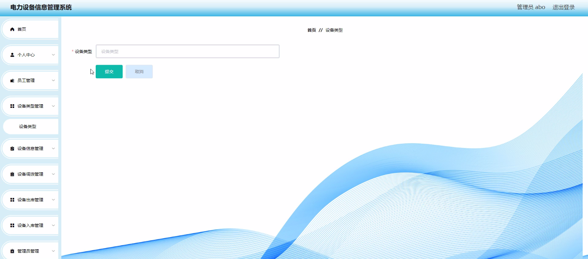

****本项目包含程序+源码+数据库+LW+调试部署环境，文末可获取一份本项目的java源码和数据库参考。****

## ******开题报告******

研究背景：
随着电力设备的不断发展和应用，电力设备信息管理成为了一个重要的课题。传统的手工记录和管理方式已经无法满足日益增长的电力设备数量和复杂的管理需求。因此，开发一种高效、准确、可靠的电力设备信息管理系统势在必行。

研究意义：
电力设备信息管理系统的建立对于提高电力设备管理的效率和精度具有重要意义。通过系统化的数据管理和信息交流，可以实现对电力设备的全面监控和及时维护，提高设备的可靠性和安全性。同时，该系统还能够优化设备调拨和库存管理，降低运营成本，提高资源利用效率。

研究目的：
本研究旨在设计和开发一种电力设备信息管理系统，以满足电力设备管理的实际需求。通过该系统，可以实现对员工、设备类型、设备信息、设备调拨、设备出库、设备入库等多个功能模块的集中管理和协同操作，提高管理效率和数据准确性。

研究内容： 本研究的主要内容包括以下几个方面：

  1. 员工管理：建立员工档案，包括员工基本信息、权限设置和操作记录等，实现对员工的管理和授权。

  2. 设备类型管理：建立设备类型库，包括设备名称、规格型号、生产厂家等信息，方便对不同类型设备的分类和查询。

  3. 设备信息管理：录入和维护设备的详细信息，包括设备编号、购置日期、保修期限、维修记录等，实现对设备的全面跟踪和管理。

  4. 设备调拨管理：记录设备的调拨流程和调拨人员，确保设备的安全移交和及时更新相关信息。

  5. 设备出库管理：记录设备的出库流程和领用人员，确保设备的合理使用和追踪。

  6. 设备入库管理：记录设备的入库流程和归还人员，实现对设备库存的准确掌控和管理。

拟解决的主要问题： 通过电力设备信息管理系统的设计和应用，可以解决以下主要问题：

  1. 传统手工记录方式存在数据不准确、易丢失等问题，无法满足电力设备管理的需求。

  2. 设备调拨、出库、入库等环节缺乏统一的管理平台，导致操作繁琐、效率低下。

  3. 设备信息无法及时共享和交流，影响设备维护和故障排除的效率。

研究方案：
本研究将采用系统分析、数据库设计、软件开发等方法，结合电力设备管理的实际需求，设计和开发一种电力设备信息管理系统。通过系统化的数据管理和信息交流，提高设备管理的效率和精度。

预期成果： 本研究的预期成果包括：

  1. 设计和开发一种电力设备信息管理系统，满足电力设备管理的实际需求。

  2. 实现对员工、设备类型、设备信息、设备调拨、设备出库、设备入库等功能模块的集中管理和协同操作。

  3. 提高电力设备管理的效率和精度，降低运营成本，提高资源利用效率。

  4. 为电力设备管理提供科学依据和决策支持，推动电力设备管理的现代化进程。

进度安排：

2022年9月至10月：需求分析和规划，进行用户需求调研和分析，确定系统功能和目标。

2022年11月至2023年1月：系统设计和开发，完成系统架构设计和技术选型，并开始编写代码。

2023年2月至3月：测试和优化，进行单元测试和集成测试，修复问题并优化系统性能。

2023年4月至5月：文档编写和培训，编写用户手册和系统文档，并进行相关人员的培训。

2023年5月：上线部署和维护，将系统部署到生产环境中，并定期进行维护和升级。

参考文献：

[1]王振华.SpringBoot在教学效果评估系统中的应用[J].电子技术,2023,(05):67-69.

[2]王明泉.基于SpringBoot远程热部署的探索和应用[J].信息与电脑(理论版),2023,(07):1-4.

[3]王亚东,李晓霞,陈强强,剡美娜.基于SpringBoot的需求发布平台设计[J].信息与电脑(理论版),2023,(01):105-107.

[4]陈新府豪.基于SpringBoot和Vue框架的创新方法推理系统的设计与实现[D].导师：黄静.浙江理工大学,2022.

[5]霍福华,韩慧.基于SpringBoot微服务架构下前后端分离的MVVM模型[J].电子技术与软件工程,2022,(01):73-76.

[6]韩策,张娜,王松亭,张凯,何方,袁峰.SpringBoot OPC客户端设计与研究[J].电子世界,2021,(19):25-26.

****以上是本项目程序开发之前开题报告内容，最终成品以下面界面为准，大家可以酌情参考使用。要源码参考请在文末进行获取！！****

## ******本项目的界面展示******

