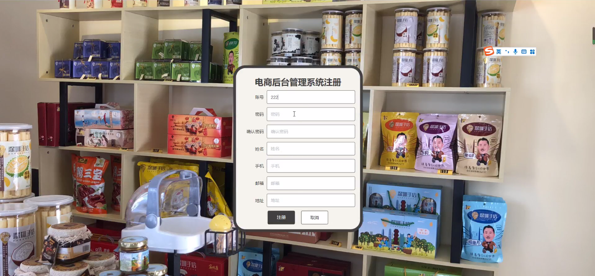
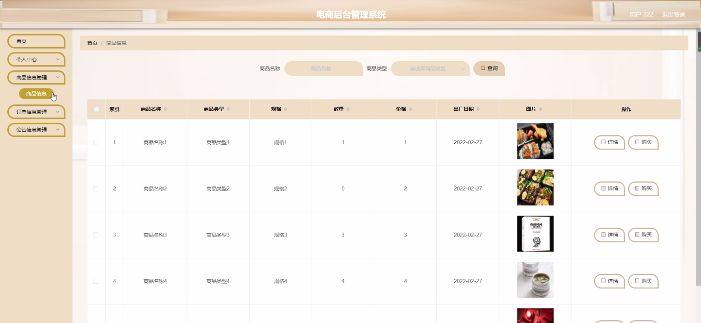
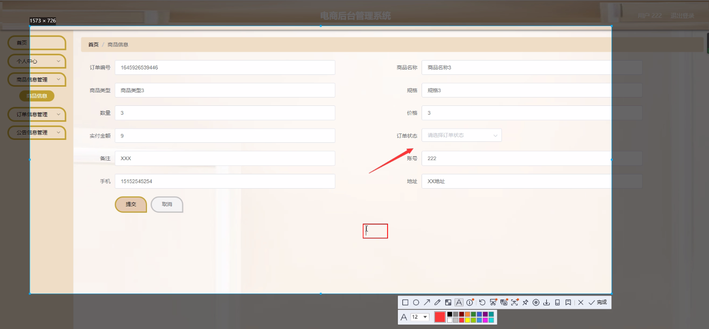
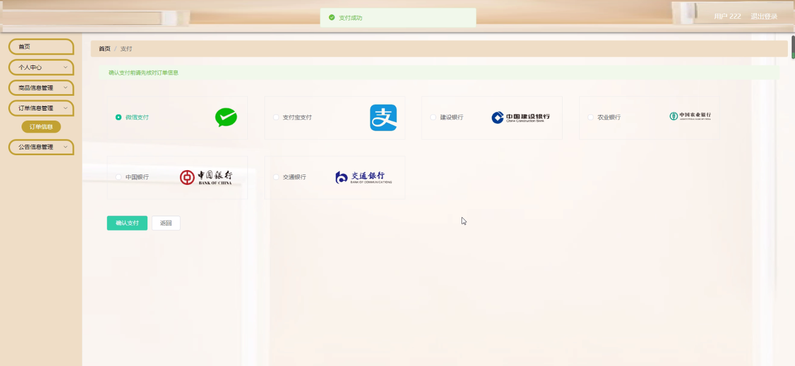
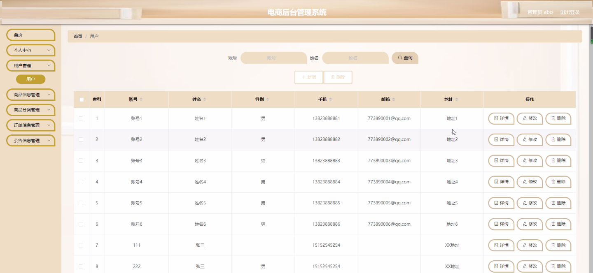
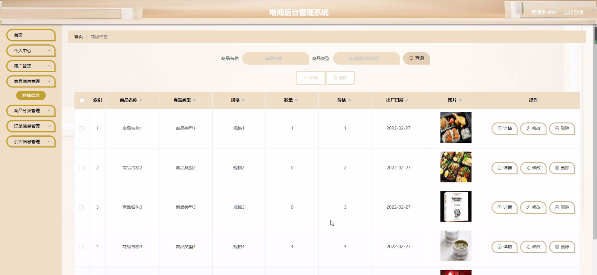
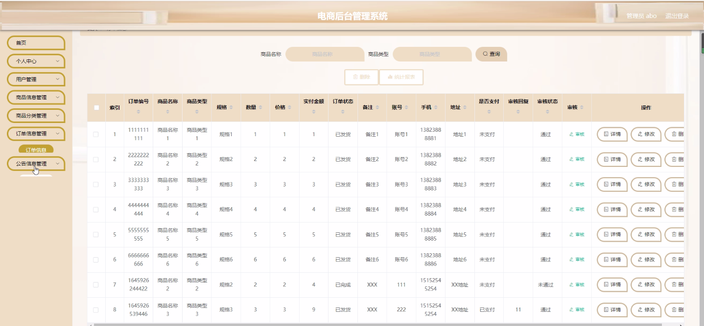

****本项目包含程序+源码+数据库+LW+调试部署环境，文末可获取一份本项目的java源码和数据库参考。****

## ******开题报告******

研究背景：
随着电子商务的快速发展，电商后台管理系统在电商平台中扮演着重要的角色。这些系统负责管理用户信息、商品信息、订单信息等重要数据，并提供各种功能和工具来支持电商运营和管理。然而，随着电商平台规模的不断扩大和业务复杂性的增加，传统的后台管理系统已经无法满足现代电商的需求。因此，对电商后台管理系统进行深入研究和改进变得尤为重要。

研究意义：
电商后台管理系统的优化和改进对于提高电商平台的运营效率、提升用户体验、增加销售额具有重要意义。通过研究后台管理系统，可以探索如何更好地管理用户信息，优化商品分类和推荐算法，提升订单处理效率，改善公告信息发布机制等方面的问题。这将有助于电商平台实现更好的用户管理、商品管理、订单管理和信息管理，从而提升整个电商生态系统的竞争力。

研究目的：
本研究旨在通过对电商后台管理系统的研究和改进，提高电商平台的运营效率和用户体验，增加销售额。具体目标包括但不限于：优化用户管理功能，提升用户注册和登录流程的便利性和安全性；改进商品信息管理功能，提高商品分类和推荐算法的准确性和个性化程度；优化订单处理功能，提升订单处理效率和客户满意度；改善公告信息发布机制，增加用户对重要信息的关注度和响应率。

研究内容： 本研究将主要围绕电商后台管理系统的以下功能展开研究：

  1. 用户管理：探索如何优化用户注册和登录流程，提升用户体验和安全性；研究如何设计有效的用户权限管理机制，保护用户隐私和数据安全。

  2. 商品信息管理：研究如何优化商品分类和推荐算法，提高商品搜索和推荐的准确性和个性化程度；探索如何设计商品信息展示界面，提升用户对商品的浏览和选择体验。

  3. 订单信息管理：研究如何优化订单处理流程，提高订单处理效率和客户满意度；探索如何设计订单状态跟踪机制，方便用户查询订单状态和物流信息。

  4. 公告信息管理：研究如何改善公告信息发布机制，增加用户对重要信息的关注度和响应率；探索如何设计个性化的公告推送机制，提高用户对公告信息的关注和阅读率。

拟解决的主要问题：
在研究过程中，我们将重点解决以下问题：如何提升电商后台管理系统的运营效率和用户体验；如何优化用户管理、商品信息管理、订单信息管理和公告信息管理等功能；如何设计合理的功能模块和界面交互，提高系统的易用性和可扩展性。

研究方案和预期成果：
为了达到上述目标，我们将采取多种研究方法，包括文献综述、需求调研、系统设计与开发等。通过对现有电商后台管理系统的分析和改进，我们预期可以提出一套完善的电商后台管理系统设计方案，并实现一个具备优化功能的原型系统。该系统将能够提高电商平台的运营效率和用户体验，增加销售额，为电商行业的发展做出积极贡献。

进度安排：

2022年9月至10月：需求分析和规划，进行用户需求调研和分析，确定系统功能和目标。

2022年11月至2023年1月：系统设计和开发，完成系统架构设计和技术选型，并开始编写代码。

2023年2月至3月：测试和优化，进行单元测试和集成测试，修复问题并优化系统性能。

2023年4月至5月：文档编写和培训，编写用户手册和系统文档，并进行相关人员的培训。

2023年5月：上线部署和维护，将系统部署到生产环境中，并定期进行维护和升级。

参考文献：

[1]王振华.SpringBoot在教学效果评估系统中的应用[J].电子技术,2023,(05):67-69.

[2]王明泉.基于SpringBoot远程热部署的探索和应用[J].信息与电脑(理论版),2023,(07):1-4.

[3]王亚东,李晓霞,陈强强,剡美娜.基于SpringBoot的需求发布平台设计[J].信息与电脑(理论版),2023,(01):105-107.

[4]陈新府豪.基于SpringBoot和Vue框架的创新方法推理系统的设计与实现[D].导师：黄静.浙江理工大学,2022.

[5]霍福华,韩慧.基于SpringBoot微服务架构下前后端分离的MVVM模型[J].电子技术与软件工程,2022,(01):73-76.

[6]韩策,张娜,王松亭,张凯,何方,袁峰.SpringBoot OPC客户端设计与研究[J].电子世界,2021,(19):25-26.

****以上是本项目程序开发之前开题报告内容，最终成品以下面界面为准，大家可以酌情参考使用。要源码参考请在文末进行获取！！****

## ******本项目的界面展示******

