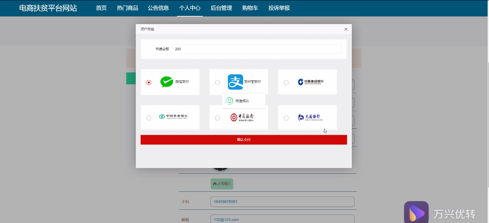
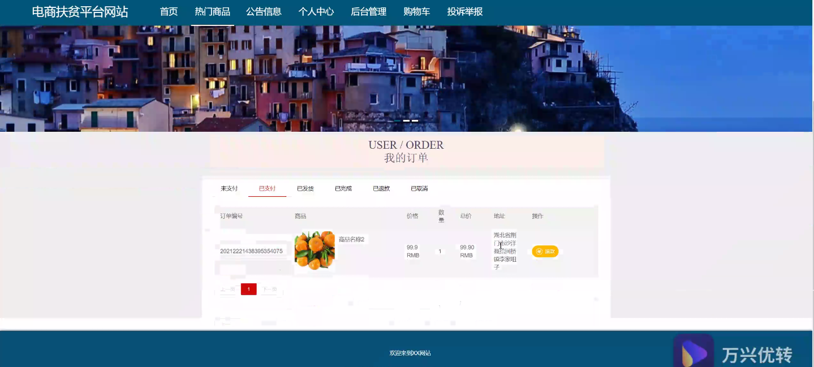
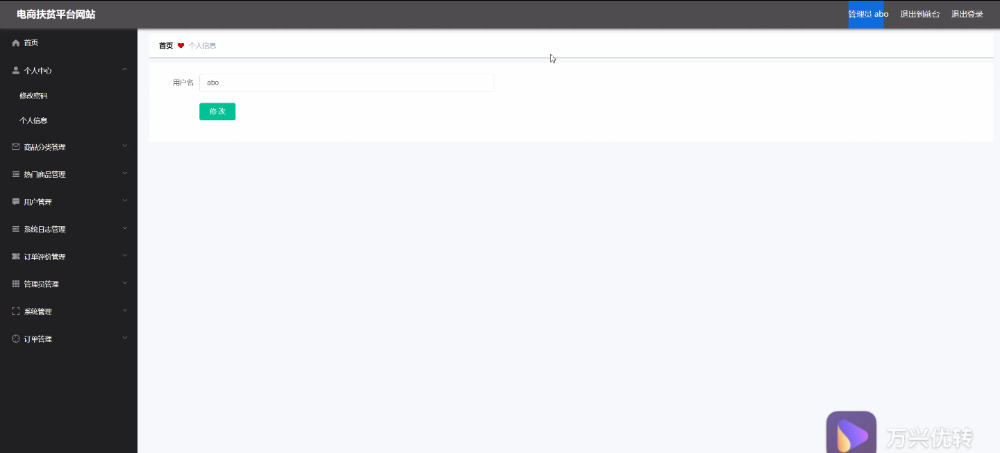
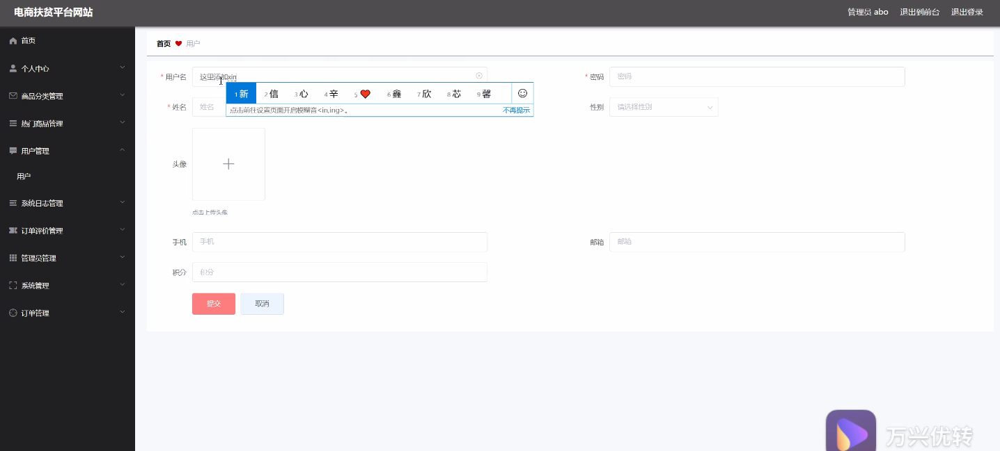
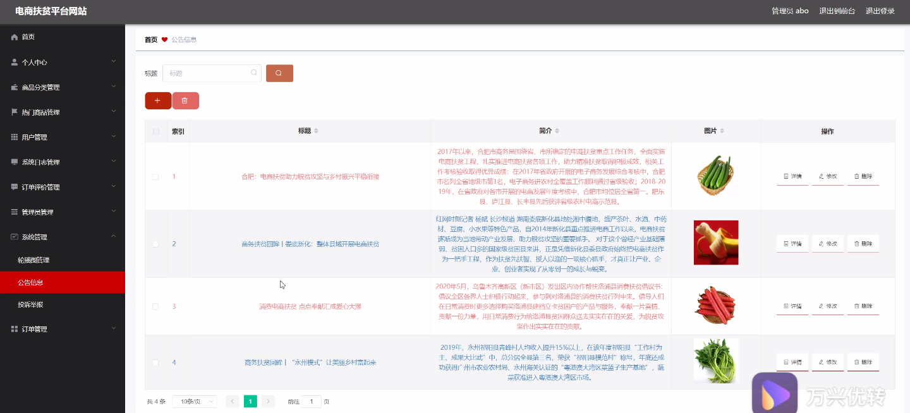
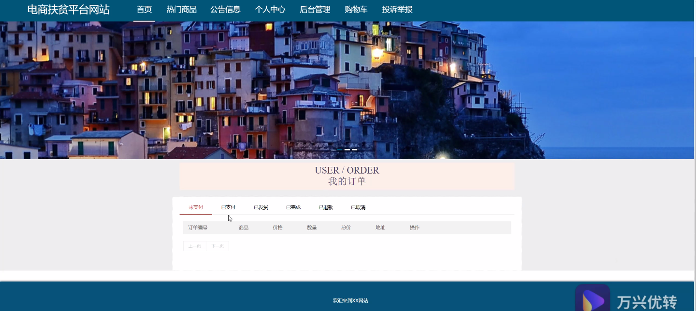
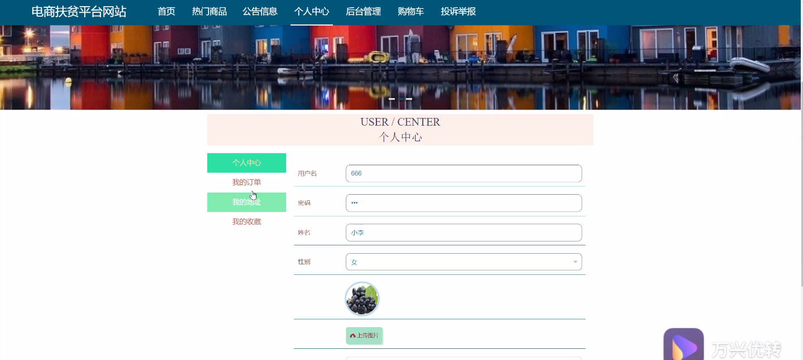
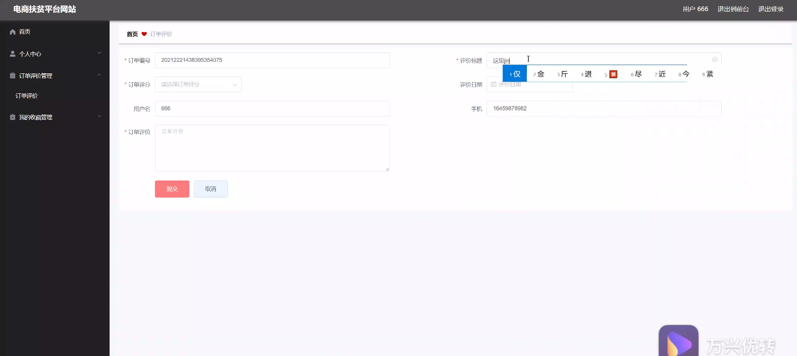

****本项目包含程序+源码+数据库+LW+调试部署环境，文末可获取一份本项目的java源码和数据库参考。****

## ******开题报告******

研究背景：
随着电子商务的迅速发展，电商平台已经成为人们购物的主要渠道之一。然而，在电商平台上，一些贫困地区的农产品和手工艺品往往面临销售困难，无法获得公平的市场竞争机会。为了解决这一问题，电商扶贫平台应运而生。电商扶贫平台旨在通过互联网技术和电商模式，将贫困地区的农产品和手工艺品推广销售，提高贫困地区居民的收入水平，促进贫困地区的经济发展。

研究意义：
电商扶贫平台的建设对于减少贫困地区的贫困程度、改善贫困地区居民的生活条件具有重要意义。通过电商扶贫平台，贫困地区的农产品和手工艺品可以直接与全国乃至全球的消费者进行交流和销售，打破了传统销售渠道的限制，提高了产品的曝光度和销售量。同时，电商扶贫平台还能够提供更多的就业机会，帮助贫困地区居民增加收入，改善生活状况。

研究目的：
本研究旨在探讨电商扶贫平台的建设和运营模式，以及其对贫困地区经济发展的影响。通过深入分析电商扶贫平台的功能和特点，提出相应的解决方案，为贫困地区的电商扶贫工作提供指导和支持。同时，通过研究电商扶贫平台的运营效果，评估其对贫困地区居民收入和生活水平的影响，为相关政策的制定和实施提供科学依据。

研究内容： 本研究将重点关注电商扶贫平台的以下系统功能：

  1. 商品分类：研究商品分类的设计和优化，以提高用户体验和购物效率。

  2. 热门商品：分析热门商品的销售趋势和消费者需求，为贫困地区的生产者提供市场参考。

  3. 用户：研究用户行为和偏好，为电商扶贫平台提供个性化推荐和精准营销策略。

  4. 系统日志：分析系统日志数据，监测平台运行情况和用户行为，及时发现和解决问题。

  5. 订单评价：研究订单评价的管理和运营策略，提高产品质量和服务水平。

拟解决的主要问题：
在电商扶贫平台的建设和运营过程中，存在一些问题需要解决。例如，如何确保贫困地区的农产品和手工艺品能够准确地展示和推广；如何提高用户对贫困地区产品的信任度和购买意愿；如何处理平台运营过程中出现的问题和纠纷等。本研究将针对这些问题提出相应的解决方案，并进行实证研究和评估。

研究方案和预期成果：
本研究将采用文献研究、案例分析、问卷调查等方法，结合实际情况进行综合研究。预期成果包括电商扶贫平台建设和运营模式的改进方案、相关政策的制定建议，以及对贫困地区经济发展的影响评估报告等。通过本研究的开展，有望为电商扶贫工作提供科学依据，促进贫困地区的经济发展和社会进步。

进度安排：

2022年9月至10月：需求分析和规划，明确系统功能和目标，制定项目计划。

2022年11月至2023年1月：系统设计和编码，完成详细的系统设计并开始编写代码。

2023年2月至3月：用户界面开发和数据库开发，开发用户友好的界面和设计数据库结构。

2023年4月至5月：功能测试、文档编写和上线部署，对系统进行全面的功能测试并编写用户手册。

2023年5月：维护和升级，定期对系统进行维护和升级，修复bug和添加新功能。

参考文献：

[1]邱小群,邓丽艳,陈海潮.基于B/S的信息管理系统设计和实现[J].信息与电脑(理论版),2022,(20):146-148.

[2]谢霜.基于Java技术的网络管理体系结构的应用[J].网络安全技术与应用,2022,(10):14-15.

[3]宋锦华.高职院校Java程序设计课程改革研究[J].科技视界,2022,(20):133-135.

[4]曹嵩彭,王鹏宇.浅析Java语言在软件开发中的应用[J].信息记录材料,2022,(03):114-116.

[5]朱澈,余俊达.武汉东湖学院.基于Java的软硬件信息管理系统V1.0[Z].项目立项编号.鉴定单位.鉴定日期:

****以上是本项目程序开发之前开题报告内容，最终成品以下面界面为准，大家可以酌情参考使用。要源码参考请在文末进行获取！！****

## ******本项目的界面展示******

