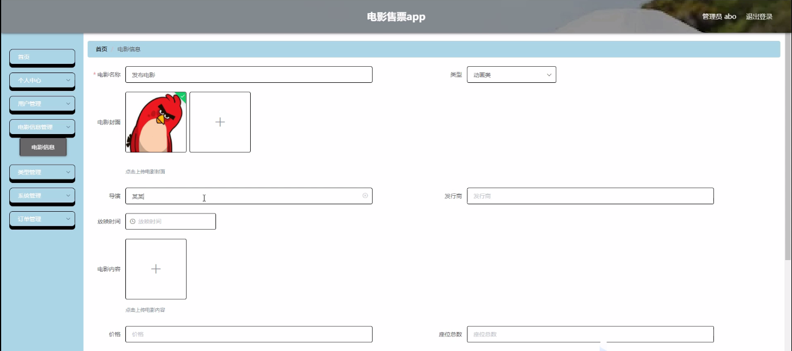
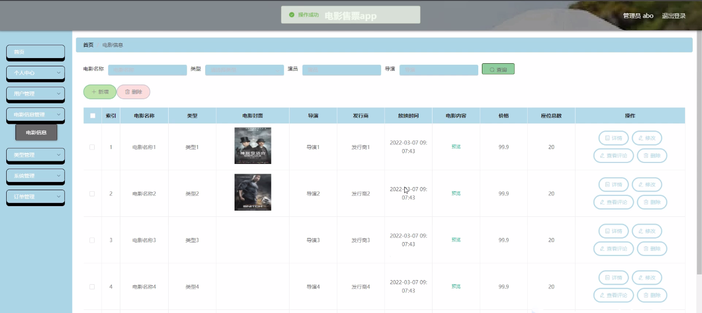
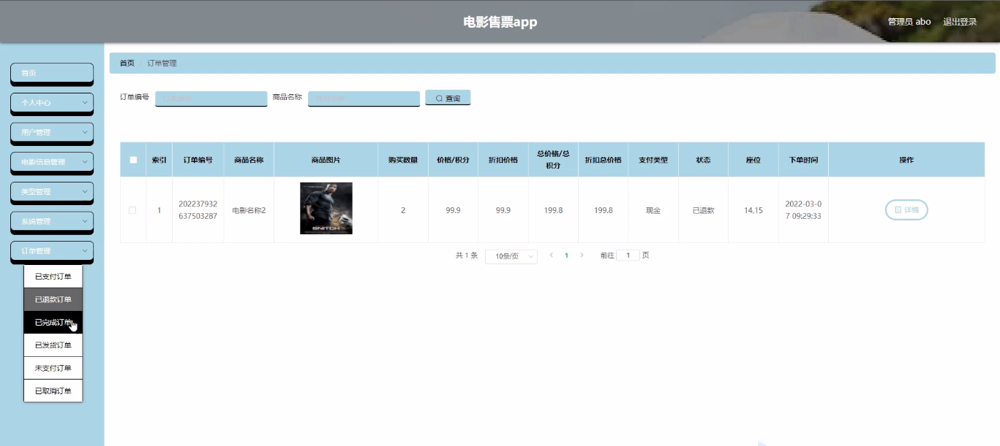

****本项目包含程序+源码+数据库+LW+调试部署环境，文末可获取一份本项目的java源码和数据库参考。****

## ******开题报告******

研究背景：
随着社会的不断发展和人们生活水平的提高，电影已经成为了人们娱乐休闲的重要方式之一。而电影售票作为电影产业链中的一个重要环节，对于电影院和观众来说都具有重要意义。然而，在传统的电影售票模式下，存在着一些问题，比如排队等候时间长、购票流程繁琐、信息不透明等，这些问题不仅给观众带来了不便，也制约了电影院的运营效率。因此，通过引入先进的技术手段，优化电影售票系统，将成为提升用户体验和提高电影院竞争力的重要途径。

研究意义：
本研究旨在探索并改进电影售票系统，以提供更加便捷、高效、智能化的服务，从而满足观众多样化的需求。通过引入现代化的技术手段，如移动支付、智能推荐等，可以大大提升用户的购票体验，减少购票过程中的等待时间和繁琐操作，增加用户的满意度和忠诚度。同时，优化电影售票系统还可以提高电影院的运营效率，降低人力成本，提升票务管理的准确性和可靠性，为电影院的发展和经营带来更大的商业价值。

研究目的：
本研究的目的是通过对电影售票系统进行深入研究和优化，提供一个更加智能、高效、便捷的购票平台，以满足观众多样化的需求，并提升电影院的竞争力。具体目标包括但不限于：提高用户购票体验，减少等待时间和操作复杂度；优化电影信息管理，提供准确、及时、全面的电影信息；引入智能推荐算法，为用户提供个性化的电影推荐；提高票务管理的准确性和可靠性，降低运营成本。

研究内容： 本研究将围绕电影售票系统的用户功能、电影信息功能和类型功能展开研究。具体内容包括但不限于以下几个方面：

  1. 用户功能：研究如何提供更加便捷、个性化的用户服务，包括注册登录、购票流程、订单管理等。通过引入移动支付、一键购票等技术手段，提高用户的购票体验和满意度。

  2. 电影信息功能：研究如何优化电影信息的管理和展示，包括电影排片、票价信息、场次安排等。通过建立完善的电影信息数据库，并结合智能推荐算法，为用户提供准确、及时、个性化的电影信息。

  3. 类型功能：研究如何根据用户的偏好和需求，提供个性化的电影推荐服务。通过分析用户的历史观影记录和评价，建立用户画像，并利用机器学习算法进行电影类型的智能推荐。

预期成果： 通过本研究，预期可以实现以下成果：

  1. 提供一个更加智能、高效、便捷的电影售票系统，改善用户购票体验，提高用户满意度和忠诚度。

  2. 建立一个准确、及时、全面的电影信息数据库，提供给用户最新、最全面的电影信息。

  3. 引入智能推荐算法，为用户提供个性化的电影推荐，提高用户观影体验。

  4. 提高票务管理的准确性和可靠性，降低电影院的运营成本，提升竞争力。

  5. 推动电影产业的数字化转型，促进电影市场的健康发展。

进度安排：

2022年9月至10月：开题报告编写和提交，完成开题报告的撰写并提交给指导教师进行审核。

2022年11月至2023年1月：系统设计和开发，根据开题报告的要求，进行系统设计和编码工作。

2023年2月至3月：论文撰写和初稿完成，开始撰写论文，并在这个阶段完成论文的初稿。

2023年4月至5月：论文修改和最终定稿，根据指导教师的意见对论文进行修改，并完成最终的定稿。

2023年5月：论文答辩和提交，参加论文答辩并根据答辩结果进行修改，最后将论文提交给学院或学校。

参考文献：

[1]喻佳,吴丹新.基于SpringBoot的Web快速开发框架[J].电脑编程技巧与维护,2021,(09):31-33.

[2]李鹏.基于SpringBoot快速开发平台的实现[J].电子技术与软件工程,2021,(12):36-37.

[3]叶开平,蔡维晟,陈家敏,邓斯妮.基于SpringBoot的综测可视化管理系统的研究与设计[J].电脑知识与技术,2021,(12):100-104.

[4]江健锋,徐振平.Springboot最小系统的设计与实现[J].电脑知识与技术,2021,(04):62-63.

[5]赵炯,司圣杰,周奇才,熊肖磊.通用信息获取系统设计与实现[J].起重运输机械,2020,(16):89-97.

[6]吴英宾.一种内外网数据交互系统的设计与实现[J].软件工程,2020,(08):25-27.

****以上是本项目程序开发之前开题报告内容，最终成品以下面界面为准，大家可以酌情参考使用。要源码参考请在文末进行获取！！****

## ******本项目的界面展示******

